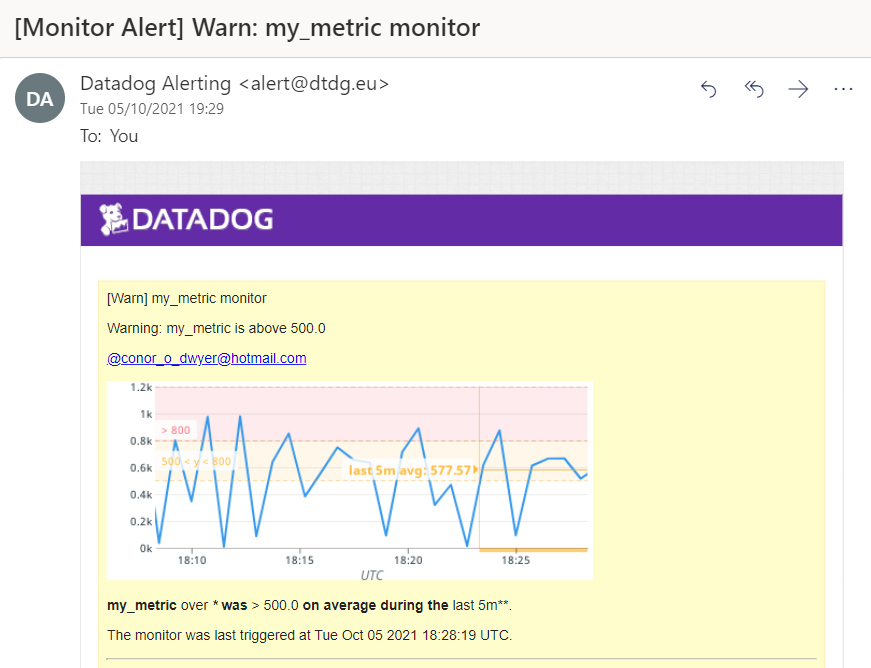

# Answers

## Environment

A Vagrant VM with Ubuntu 18.04 was set up and used for this exercise.

## Collecting Metrics:

**Add tags in the Agent config file and show us a screenshot of your host and its tags on the Host Map page in Datadog.**
```
tags:
    - environment:dev
    - foo:bar
    - name:datadog_technical_exercise
```


**Install a database on your machine (MongoDB, MySQL, or PostgreSQL) and then install the respective Datadog integration for that database.**

* MySQL version 5.7 was installed.
```
$ sudo apt update
$ sudo apt install mysql-server
$ sudo mysql_secure_installation
```
* A datadog user was created in the database.
```
mysql> CREATE USER 'datadog'@'localhost' IDENTIFIED BY '<PASSWORD>';
```
* The require database privileges for collecting metrics where then granted to the 'datadog' user.
```
mysql> GRANT REPLICATION CLIENT ON *.* TO 'datadog'@'localhost' WITH MAX_USER_CONNECTIONS 5;
mysql> GRANT PROCESS ON *.* TO 'datadog'@'localhost';
mysql> GRANT SELECT ON performance_schema.* TO 'datadog'@'localhost';
```
* The mysql.d/conf.yaml configuration file for the agent was updated to enable metrics and logging for MySQL.
```
instances:
  - server: 127.0.0.1
    user: datadog
    pass: <PASSWORD>
    port: 3306
    options:
      replication: false
      galera_cluster: true
      extra_status_metrics: true
      extra_innodb_metrics: true
      extra_performance_metrics: true
      schema_size_metrics: false
      disable_innodb_metrics: false

logs:
   - type: file
     path: /var/log/mysql/mysql.log
     source: mysql

   - type: file
     path: /var/log/mysql/mysql_error.log
     source: mysql

   - type: file
     path: /var/log/mysql/mysql_slow.log
     source: mysql
     log_processing_rules:
     - type: multi_line
       name: new_slow_query_log_entry
       pattern: '# Time:'
```
* The /etc/mysql/my.cnf file was updated to make the MySQL logs more accessible and specify the logging directory for general, error and slow query logs. The directories correspind to those configured for the logs in the mysql.d/conf.yaml file.
```
[mysqld_safe]
log_error = /var/log/mysql/mysql_error.log

[mysqld]
general_log = on
general_log_file = /var/log/mysql/mysql.log
log_error = /var/log/mysql/mysql_error.log
slow_query_log = on
slow_query_log_file = /var/log/mysql/mysql_slow.log
long_query_time = 2
```
* Finally, the datadog.yaml file was updated to enable logs.
```
logs_enabled: true
```
* After updating all configuration files, the datadog-agent service and the mysql service were restarted. The `sudo datadog-agent status` command was run to confirm that the MySQL checks were running for the agent.


* The MySQL integration on the Datadog platform was subsequently installed. The Metrics Explorer was used to confirm that the MySQL metrics were being tracked for the agent (the "host" tag for the agent was used as a filter to confirm).


**Create a custom Agent check that submits a metric named my_metric with a random value between 0 and 1000**
* A configuration file for the custom metric was created in the datadog-agent/conf.d directory called custom_check.yaml. This file contain only the following line
```
instances: [{}]
```
* A python check with the same name as the configuration file was also created, in the datadog-agent/checks.d directory. The python script first imports the AgentCheck library within a try/except block to ensure it is compatible with any Agent version. It then generates the random number between 0 and 1000 and sets it as the value for the "my_metric" metric, inheriting the tags from the Agent.
```
from random import randrange

try:
    from datadog_checks.base import AgentCheck
except ImportError:
    from checks import AgentCheck

__version__ = "1.0.0"

class CustomCheck(AgentCheck):
    def check(self, instance):
        check_value = randrange(1001)
        self.gauge('my_metric', check_value, tags=self.instance.get('tags', []))
```
* The Agent was then restarted and the status checked to ensure "my_metric" was successfully reporting.


* Finally, "my_metric" was viewed in Metrics Explorer to confirm the metric was being sent every 15 seconds (default) with a value between 0 and 1000.


**Change your check's collection interval so that it only submits the metric once every 45 seconds + (Bonus Question).**
* To change the collection interval for the custom metric, the custom_check.yaml file was updated to contain the following configuration. The python check file does not need to be updated to change the collection interval.
```
instances:
  - min_collection_interval: 45
```
* After the Agent was restarted, it is evident from the Metrics Explorer that the collection interval was successfully updated from 15 seconds to 45 (at time ~21:07 on the graph).


## Visualizing Data:
* To visualize the data in a Dashboard, the API Key and Application Key values were first obtained. An Application Key needed to be created for this purpose using the Datadog UI.
* A POST request was sent to the endpoint `https://api.datadoghq.eu/api/v1/dash?api_key=${api_key}&application_key=${app_key}` (using Postman) with the following request body to create the Dashboard. The `${api_key}` and `${app_key}` values in the URL were replaced by the values obtained in the step above.
```
{
      "title": "Datadog Technical Exercise",
      "graphs" : [{
          "title": "my_metric scoped by host",
          "definition": {
              "events": [],
              "requests": [
                  {"q": "avg:my_metric{host:vagrant}"}
              ],
              "viz": "timeseries"
          }
      }, {
          "title": "MySQL performance anomalies",
          "definition": {
              "events": [],
              "requests": [
                  {"q": "anomalies(avg:mysql.performance.queries{*}, 'basic', 2)"}
              ],
              "viz": "timeseries"
		  }
      }, {
          "title": "my_metric 1 hour rollup",
          "definition": {
              "events": [],
              "requests": [
                  {"q": "avg:my_metric{*}.rollup(sum, 3600)"}
              ],
              "viz": "table"
          }
      }]
}
```
* This API request created three graphs in the dashboard called "Datadog Technical Exercise"
    1. A timeseries graph showing the value of the "my_metric" metric scoped over the host: vagrant.
    2. (Bonus Answer) A timeseries graph showing anomalies in the mysql.performance.queries metric. This graph displays any deviations from the typical value which is reported by the metric. The value of the "basic" parameter specifies the anomaly detection algorithm used and the "2" parameter specifies how strict the range of acceptable values is before highlighting a value as an anomaly. The range of acceptable values is 1 to 6, with 1 being the strictest range and 6 the widest.
    3. A table showing the value for the sum of "my_metric" over the last hour. A table rather than a timeseries or other visualization was chosen as the output was only a single value, so displaying in a table was the easiest way to understand the data.


* Using the @ notation, I sent a snapshot of each of the graphs in the dashboard to myself via email. An example of the email received for the first graph is shown below.


## Monitoring Data
A Metric Monitor was configured for "my_metric" in the Datadog UI. The Metric Monitor watches the average value of "my_metric" and will alert if it’s above the following values over the past 5 minutes:
* Warning threshold of 500
* Alerting threshold of 800
* It will also alert if there is No Data for this query over the past 10 minutes.


Section 4 of the Metric Monitor configuration set the nofication to be sent and the recipients when the monitor triggers. The monitor:
* Sends a different messages based on whether the monitor is in an Alert, Warning, or No Data state.
* Includes the metric value that caused the monitor to trigger and host IP address when the Monitor triggers an Alert state.
```
  {{#is_alert}}
Alert: my_metric is above {{threshold}} for {{host.ip}} with value {{value}}
{{/is_alert}} 

{{#is_warning}}
Warning: my_metric is above {{warn_threshold}}
{{/is_warning}} 

{{#is_no_data}}
No data: my_metric has not sent data for 10 minutes
{{/is_no_data}} 

@conor_o_dwyer@hotmail.com
```
The following is an example of the email notification when the monitor triggered a warning.



**Bonus Question**

Scheduled downtimes were configured for the my_metric monitors.
* The first silenced it from 7pm to 9am daily from Monday to Friday.


* The second silenced it all day on Saturday and Sunday.


Downtime notification emails were sent when the downtime was scheduled in each case.


## Collecting APM Data
The following flask app was instrumented using Datadog's APM solution.
* ddtrace was installed using `pip install ddtrace`
* The following environment variables were set:
```bash
export DD_SERVICE=flask
export DD_ENV=dev
export DD_LOGS_INJECTION=true
```
* The datadog-agent service was restarted
* The below python flask app was saved as app.py and run using `python app.py` (ddtrace-run was not used as `patch_all()` in the python app performs the same function)

```python
from ddtrace import patch_all
patch_all()

from flask import Flask
import logging
import sys

# Have flask use stdout as the logger
main_logger = logging.getLogger()
main_logger.setLevel(logging.DEBUG)
c = logging.StreamHandler(sys.stdout)
formatter = logging.Formatter('%(asctime)s - %(name)s - %(levelname)s - %(message)s')
c.setFormatter(formatter)
main_logger.addHandler(c)

app = Flask(__name__)

@app.route('/')
def api_entry():
    return 'Entrypoint to the Application'

@app.route('/api/apm')
def apm_endpoint():
    return 'Getting APM Started'

@app.route('/api/trace')
def trace_endpoint():
    return 'Posting Traces'

if __name__ == '__main__':
    app.run(host='0.0.0.0', port='5050')
```
* A number of API calls were made to http://0.0.0.0:5050/ to trigger the trace metrics.

A dashboard was created in the Datadog UI to display the APM and infrastructure metrics.
* The dashboard displays the `trace.flask.request.hits` APM metric for the flask app. The filter for {service:flask} is applied, as set using the DD_SERVICE environment variable.
* The dashboard also displays the `system.cpu.user` infrastructure metric for the {host:vagrant} where the flask app is running.
* A shareable link for the dashboard was generated and a screenshot of the dashboard is shown.

https://p.datadoghq.eu/sb/c5188822-2163-11ec-8ebb-da7ad0900005-e0438de8bb2a85df55c4484526bafc20


**Bonus Question**

The difference between a service and a resource is that a service is a building block of a microservice architecture, which groups together resources, which represent a particular domain of a customer application such endpoints, queries, or background jobs.

[Reference][1]

[1]:https://docs.datadoghq.com/tracing/visualization/

## Final Question
A creative use for Datadog could be for monitoring the beer brewing process. Certain factors such as temperature and pH of a batch of beer can impact the outcome of the batch. Datadog could provide real-time monitoring and alerting capabilities so that any anomolies in these controlled values would be highlighted and corrective action could be taken where required. Temperature probes and pH sensors could be inserted in the fermentation vessel for a batch of beer, which would constantly stream temperature and pH readings to a connected device. The device could have a datadog-agent installed and configured to continuously report these values as metrics. Monitors could then be set up to sent alerts and warnings when the values are outside threshold values or if data is not being received.

Futhermore, a similar mechanism could be used to measure the % alcohol content of the batch of beer to know when the fermentation process is complete. The specific gravity measurement for beer determines the % alcohol. A sensor could be added to the beer during the fermentation process to constantly monitor this value and send a notification when the specific gravity reading has reached the desired value, thus eliminating the need for manual checks to be performed.


