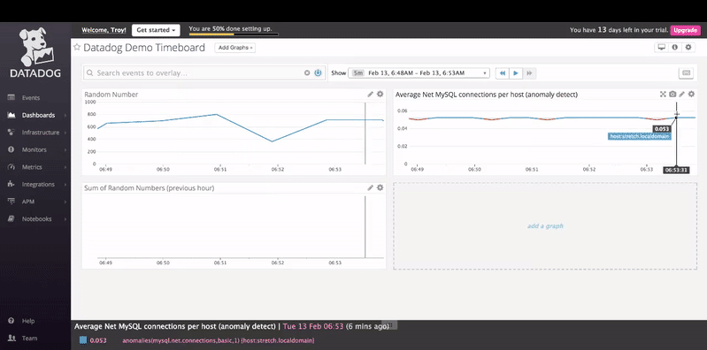
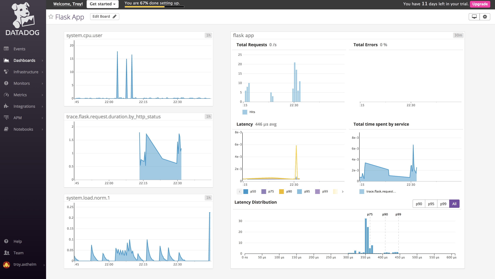

# Solutions Engineer Hiring Exercise
### Troy Axthelm

## Environment
This environment is setup using Vagrant running debian/stretch 64. Ansible and the Datadog Ansible role have been used for instance configuration. Configuration files as they were produced using Ansible can be found in the Ansible directory. 

### Environment Setup:

1. clone or download this repo to the sytem you wish to run on
2. install vagrant, see the [vagrnat installation guide](https://www.vagrantup.com/docs/installation/) for help
3. install Ansible, see the [ansible instalation guide](http://docs.Ansible.com/Ansible/latest/intro_installation.html) for help
4. install the Datadog Ansible role `Ansible-galaxy install Datadog.datadog`
5. from this directory, run the Vagrantfile to start your vm, `vagrant up` this may take some time initially as the debian stretch vagrant box will need to be downloaded
6. replace the Datadog API key placeholder in `./Ansible/demo-playbook.yml with your Datadog API key
7. from this directory, run the Ansible playbook on your newly provisioned vm `Ansible-playbook --private-key=.vagrant/machines/default/virtualbox/private_key --limit datadog-demo ./AnsibleFiles/demo-playbook.yml  -i ./AnsibleFiles/host`


## Collecting Metrics:

> Add tags in the Agent config file and show us a screenshot of your host and its tags on the Host Map page in Datadog.

Tags were added as datadog_config varaiables in the Ansible playbook. Ansible will use these values in datadog.conf and the agent will be restarted to start with the correct configuration options if any changes are made.
 
```
vars:
    datadog_api_key: "<DD_API_KEY>" # change api key to use your Datadog account
    datadog_agent_version: "1:5.21.2-1" # for apt-based platforms, use a `5.12.3-1` format on yum-based platforms
    datadog_config:
      tags: "role:datadog-demo, department:soloutions-engineering"
      log_level: INFO
      apm_enabled: "true"
      log_enabled: true
```
Once the tags are added to the playbook, and applied with an Ansible run, the tags will be associated with the Datadog agent. Below is a Host view showing information about the host. Under the "Tags" section of the host description, you see the newly configured tags.


> Install a database on your machine (MongoDB, MySQL, or PostgreSQL) and then install the respective Datadog integration for that database.

MySQL is installed and configured with the following tasks in the Ansible playbook. We also include the mysql-python library which allows configuration of the database through Ansible. We configure mysql with a MySQL user "datadog". This user has REPLICATION CLIENT and PROCESS priviledges which is all the datadog MySQL check will need.

```
  - name: Install mysql-server
    apt: name=mysql-server state=latest
  - name: Install mysql-python # allows us to use Ansible mysql_db module
    apt: name=python-mysqldb state=latest
  - name: Create datadog mysql user with privledges
    mysql_user:
      name: datadog
      password: datadogdemo
      priv: '*.*:REPLICATION CLIENT/*.*:PROCESS'
      state: present
```

In the variables section of the playbook, a `datadog_checks` section is added. This is where you can add conifguration options for checks that will be added using the Ansible Datadog Ansible role. In our case, the MySQL check is added. This configuration file includes a single MySQL instance running on localhost and will access the database as the datadog user we setup in the previous Ansible run.

```   
   datadog_checks:
      mysql:
        init_config:
        instances:
          - server: localhost
            user: datadog
            pass: datadogdemo
            port: 3306
```

Once the playbook is run with the new configuration, MySQL metrics will start being sent to Datadog. Below is a screen shot of the default MySQL dashboard. You can see this in you dashboard list after installing the MySQL Datadog integration.


> Create a custom Agent check that submits a metric named my_metric with a random value between 0 and 1000.

This is a simple custom agent that will submit a guage metric with a random value between 0 and 1000.

```
from checks import AgentCheck
from random import randint

class RandomCheck(AgentCheck):
	def check(self, instance):
		# get a random number and send it as a guaged metric to Datadog
		randnum=randint(0, 1000)
		self.gauge('agent.random.num', randnum)
```

It is also important to create a simple config file so the Datadog agent knows to run this check. In our case, there is no special configuration.

```
init_config:
instances:
        [{}]
```

> Change your check's collection interval so that it only submits the metric once every 45 seconds.

> **Bonus Question** Can you change the collection interval without modifying the Python check file you created?

By adding `min_collection_interval: 45` under the `init_config:` section of the randomcheck configuration file, we can ensure that this check will only submit one metric within a 45 second interval. It is good to note that this sets a minimum interval and does not mean the check is guarenteed run every 45 seconds.

## Visualizing Data:

> Utilize the Datadog API to create a Timeboard that contains:

> * Your custom metric scoped over your host.
> * Any metric from the Integration on your Database with the anomaly function applied.
> * Your custom metric with the rollup function applied to sum up all the points for the past hour into one bucket

> Please be sure, when submitting your hiring challenge, to include the script that you've used to create this Timemboard.

To generate this timeboard using the Datadog API, update `./Scripts/demoTimeboard.py` with your Datadog API key and Application key. Running the script will create a timeboard titled "Datadog Demo Timeboard" and will have the three graphs desribed above. 

> Once this is created, access the Dashboard from your Dashboard List in the UI:
> * Set the Timeboard's timeframe to the past 5 minutes
> * Take a snapshot of this graph and use the @ notation to send it to yourself.
> * **Bonus Question**: What is the Anomaly graph displaying?

The Timeboard's timeframe can be set to 5 minutes by selecting a range from the end of any graph on a time period within 5 minutes or less. This will select the minimum timerange which is 5 minutes. If you selected a 5 minute range but it does not end at the present time, you can use the shift forward button to shift the time range until it ends at the current time.

Sending snapshots of a graph can be done by hovering over the graph area, and clicking the "Annotate this graph" button (camera icon). You can write a comment and send the graph to someone using the @ notation.



The anomaly graph in this demo is displaying the average rate of MySQL connections to the server. In blue are the net connections that fall within the trending value based on a basic algorithm. In red are any of the net connections that fall outside of the expected trend based on the basic algorithm thus are detected as an anolmaly. In this demonstration we have set the bounds to 1 which is the narrowest tollerance making small variations trigger as anomalies.

## Monitoring Data

>Since you’ve already caught your test metric going above 800 once, you don’t want to have to continually watch this dashboard to be alerted when it goes above 800 again. So let’s make life easier by creating a monitor.

>Create a new Metric Monitor that watches the average of your custom metric (my_metric) and will alert if it’s above the following values over the past 5 minutes:

>* Warning threshold of 500
>* Alerting threshold of 800
>* And also ensure that it will notify you if there is No Data for this query over the past 10m.

>Please configure the monitor’s message so that it will:

>* Send you an email whenever the monitor triggers.
>* Create different messages based on whether the monitor is in an Alert, Warning, or No Data state.
>* Include the metric value that caused the monitor to trigger and host ip when the Monitor triggers an Alert state.
>* When this monitor sends you an email notification, take a screenshot of the email that it sends you.

This monitor was created using the GUI. You can see the metric and alert conditions set in the following screenshot.


Conditional variables allow us to create a custom notifications corresponding to triggerent event type. The use of template and tag variables provide detailed information in the notification to assist any responders that may be trying to resolve issues related to the monitor. 

In this demonstration monitor, outside of all of the conditional variables, is an email address that will recieve the notification any time the monitor is triggered, regardless of event type. You could also add the alert recipeints to individual condidtional variables if you do not want them to receive messages for every event type. Below is an example that will send notifications when an alert, warning, or no data threshold is reached. 

```
{{#is_alert}}
**Description:** A random number was generated on {{host.name}} with a value of {{value}} which is above {{threshold}}!
**Host:** {{host.name}}, **IP:** {{host.ip}}
{{/is_alert}} 
{{#is_warning}}
**Description:** A random number was generated on {{host.name}} with a value of {{value}} which is above {{warn_threshold}}! Just want to give you a heads up that is is getting high. If this value exceeds {{threshold}} and alert will be triggered.
**Host:** {{host.name}}, **IP:** {{host.ip}}
{{/is_warning}}
{{#is_no_data}}
**Description:** We have not received any random number metrics from {{host.name}} in the past 10 minutes. Please investigate.
**Host:** {{host.name}}, **IP:** {{host.ip}}
{{/is_no_data}} @troy.axthelm@gmail.com
```
When this monitor is triggered, the recipient specified using the @ notation will get an email notification.


>* **Bonus Question**: Since this monitor is going to alert pretty often, you don’t want to be alerted when you are out of the office. Set up two scheduled downtimes for this monitor:

>    * One that silences it from 7pm to 9am daily on M-F,
>    * And one that silences it all day on Sat-Sun.
>    * Make sure that your email is notified when you schedule the downtime and take a screenshot of that notification.

Scheduling downtime can be done through the web UI. Below is an example of scheduling downtime for every weekday between 7pm until 9am.


Once downtime is scheduled, you will get email notifications that inform you when the scheduled downtime will begin and end.


## Collecting APM Data:

> Given the following Flask app (or any Python/Ruby/Go app of your choice) instrument this using Datadog’s APM solution: 

>* **Note**: Using both ddtrace-run and manually inserting the Middleware has been known to cause issues. Please only use one or the other.

By installing the ddtrace python client we are able to instrument this flask application using `ddtrace-run`. This block in Ansible will setup the ddtrace pyhton client and run the flask application `flaskdemo.py` with traces instrumented.

>* **Bonus Question**: What is the difference between a Service and a Resource?

A service is a process that runs as a component of an application. In this demo, the flask app is the service. If we had a more complex app that interacted with the database created earlier, we would also see a MySQL service in our traces. Resources are specific interactions with a service. In our app resources are each time a certain route is called in the flask app. In MySQL, resources would be the queries being run. 

In more simple terms, services are components of an application and resources are calls within those components.

>Provide a link and a screenshot of a Dashboard with both APM and Infrastructure Metrics.

>Please include your fully instrumented app in your submission, as well. 

This demo flask app can be found in `./Scripts/flaskDemo.py`. To run it, ssh to your Vagrant in and run `ddtrace-run python flaskDemo.py`. Once it is up, you can send requests to the port on the local instance. You can see some sytem metrics as well as the flask apm on the following dashboard: https://p.datadoghq.com/sb/7ddde11c8-afb0b78f66d65e45ef742831b29d06da 

Here is a screenshot of that same dashboard.



## Final Question:

> Datadog has been used in a lot of creative ways in the past. We’ve written some blog posts about using Datadog to monitor the NYC Subway System, Pokemon Go, and even office restroom availability!

> Is there anything creative you would use Datadog for?

Around Golden, Colorado mountain biking is a very popular sport. With the popularity of the sport, the county has installed counters that trip whenever a person uses the trail. I think it would be interesting to use datadog to monitor the trailhead usage. You could use weather site APIs to plot temperature, cloud cover, etc. to see which days/times and weather conditions correspond to busier trails. I think these graphs could be a powerful tool for all users of the multi-use trails and would provide better information when it comes time for the county to make decisions related to the trails. In addition to this, I would be interested in figuring out what the optimal time/trailhead/weather is to go on a ride and avioid the crowds.

To expand on this idea, it would be fun to use the Strava API and to get more detailed information on people using the trails.