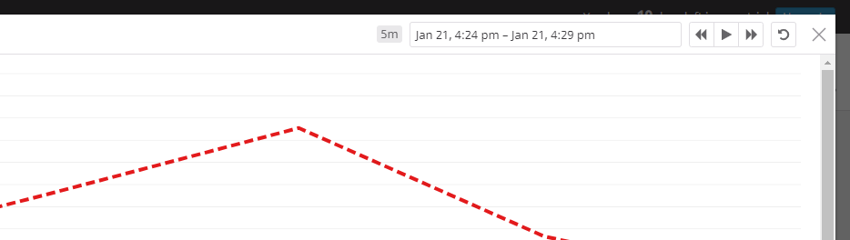

# DataDog Hiring Exercise - William Karges

## Introduction

Today I'm going to give an overview of the various ways to track your application data through the DataDog platform.  We'll discuss some high level concepts and dive into the software to start tracking real data.  I'll also provide some context into the various ways you can make use of this data to realize benefits across your organization.

*Disclaimer: I will be using Windows 10 OS throughout my tutorial.  For non-windows users some of the setup, configuration, and scripting may be different but at a high level the process should be fairly similar.*

### Getting Started

If you haven't already, install the relevant DataDog agent for your specific OS.  If you're using Docker or Kubernetes you can simply install and configure the DataDog Agent for that container service rather than the agent specifc to your containers' OS kernel (see [README.md](https://github.com/DataDog/hiring-engineers/tree/solutions-engineer) for full instructions).

## Section 1 - Collecting Metrics

### What are Tags?

As you'll soon see, the DataDog platform can provide a ton of information on your various systems.  In order to make sense of all that data and turn it into actionable information, you'll want to build a good cadence of tagging.

DataDog tags let you assign properties to data so it can be filtered, grouped, and organized in relation to it's relevant components.  For example, on one of your dashboards you might simply see that one of your host machine's physical storage is running low.  Alternatively, with more tagging, you could see that in the AWS us-west-2 region in one of your Windows Server 2012 EC2 instances, the volume under serial number FAND-B0A8 is nearly full.

You don't necessarily have to get that granular with your tags but the latter example hopefully gives you an idea the value tags can provide when trying to manage applications of varying complexity.

### Defining Tags

DataDog gives you freedom to tag your various application components however you like.  That said if you need a little direction in your naming conventions, DataDog best practices for tagging can be found [here](https://docs.datadoghq.com/tagging/#why-it-matters).

For this example we're going to tag our host machine based off geographical location (region &/or availability-zone if you're using AWS), machine name, and environment (production, dev, etc.).

### Configuring Tags

Let's start by tagging your host machine.  First you'll need to navigate to the `datadog.yaml` configuration file on your relevant OS (instructions [here](https://docs.datadoghq.com/agent/guide/agent-configuration-files/?tab=agentv6v7)).

Once inside the `datadog.yaml` file navigate to the `tags` key to callout your host machine's tags.  Tags can be labeled in either of two syntaxes (see [Assigning Tags](https://docs.datadoghq.com/tagging/assigning_tags/?tab=agentv6v7)).  The tags and syntax I used are shown below as well as in my [datadog.yaml](configfiles/datadog.yaml) file.

`tags:
    - "availability-zone:us-west"
    - "machine:local"
    - "env:test"`

//-------------------------------------------------------------------------------------

[HostMap](https://app.datadoghq.com/infrastructure/map?fillby=avg%3Acpuutilization&sizeby=avg%3Anometric&groupby=availability-zone&nameby=name&nometrichosts=false&tvMode=false&nogrouphosts=true&palette=green_to_orange&paletteflip=false&node_type=host)

### Relational Database Integration

Installed MySQL and HeidiSQL (so I could have a UI) on my local Windows machine.  Added the datadog user to the MySQL DB to grant access for the DD Agent.  Configured the MySQL conf.yaml file to pass the appropriate database credentials.

This process is almost identical to a typical OLE DB integration but the DataDog agent gives you the ability for far more detailed machine & database monitoring as opposed to a simple SELECT query that you see in most relational DB integrations.

[conf.yaml](configfiles/conf.yaml)

### Custom Agent

Created a custom agent by placing a python file in the checks.d repository and a matching .yaml file in the config.d repository.

Uses the python [random](https://docs.python.org/3/library/random.html) library (specifically the **randint** function) with data dog [gauge](https://docs.datadoghq.com/developers/metrics/agent_metrics_submission/?tab=gauge) metric submission to submit my_metric with a random integer value between 0 and 1000.

Used the **min_collection_interval** function in the yaml file to set the collection to every 45 seconds without modifying the python check file.

[PythonFile](configfiles/custom_ac1.py)
[YamlFile](configfiles/custom_ac1.yaml)

## Section 2 - Visualizing Data

Imported the DataDog API collection into Postman.  Customized the create dashboard POST requet to track my_metric averages and sum over the past hour as well as MySQL CPU usage anomalies.  See [WK_CustomTimeBoard JSON file](configfiles/WK_CustomTimeBoard.json)

### Create Dashboard API

[WK Timeboard](https://app.datadoghq.com/dashboard/ysn-u6q-tmg/williams-timeboard-20-jan-2020-1735?from_ts=1579721318547&to_ts=1579722218547&live=true&tile_size=m)

Unfortunately I wasn't able to, "Set the Timeboard's timeframe to the past 5 minutes" (see screenshot below).  While I can adjust individual graphs to 5 minutes, the timeboard itself seems to be restricted to 15 minute intervals.  Not sure if this is just a limitation of the trial version or if I'm doing something wrong or maybe this was just a trick question?

### 5 Minute Snapshot

[TimeBoard Notification e-mail](assets/TimeBoard_Notification.eml)

##### Error

##### 5 Minute Graph

##### Notifications

### Bonus Question - What is the Anomaly graph displaying?

The Anomaly graph compiles historical performance of a specific metric to flag truly "abnormal" activity.  

For example a game developer may have an alert set for when their autoscaling server/instance count eclipses a specified threshold.  If the alert gets triggered on a Friday night it's likely redundant as the majority of their users are active weekend nights and there's probably an existing process to provision more servers if needed.  

The more relevant information might actually be the opposite, if the server count stays unchanged or low through the Friday night.  The alert wouldn't go off since the threshold wasn't eclipsed but the anomaly graph would call out the unusually low server usage.  This in turn may motivate the game company to boost their marketing efforts and/or run an in-game promotion the next weekend to recooperate that user base or, at the very least, scale down server usage to save costs.

## Section 3 - Monitoring Data

Used the DataDog monitoring tool to create a monitor that tracked my_metric on my host machine and sent notifications to my e-mail if specific criteria was met:

	* Warning if my_metric eclipsed the threshold of 500
	* Alert if my_metric eclipsed the threshold of 800
	* Notification if my_metric has missing data over 10 minutes

Tested the threshold both on average and at least once during the last five minutes.  Used conditional statements to adjust the body of the e-mail notification based on the relevant alert type.  Then immediately turned off the monitor to prevent my phone from vibrating off my desk.

* [Monitor JSON](configfiles/Monitor.json)

* [Monitor E-mails](assets/Monitors/)

### Bonus Question - Deactivate Out of Office notifications

Monitor notifications can be turned off on the fly via the mute button in the monitor dashboard or you can scheduled deactivation using the scheduled downtime feature.

* [Scheduled Downtime](https://app.datadoghq.com/monitors#downtime?)

#### Mute

#### Scheduled Downtime configuration

#### Scheduled Downtime test e-mail

## Section 4 - Collecting APM Data

I was unable to get the provided Flask app to run (I believe due to compatibility issues with my Win10 OS).  I instead modified the code to form a native python application that simply prints a string.  

Once the program could run on my machine all I had to do was use the tracer.wrap function to tag the relevant operation name, service, and resource.  Being an increadibly simple application, the trace recorded a processing-time of near 0.

* [APM & Infra Dashboard](https://app.datadoghq.com/dashboard/4nn-f4a-m48/williams-apm--metrics-dashboard?from_ts=1579795766356&to_ts=1579882166356&live=true&tile_size=m)

* [APM Python code](configfiles/APM-test.py)

### Bonus Question - What is the difference between a Service and a Resource?

Services are groups of related functions, URLs, etc. within an application.  Resources are the specifc endpoints (URL IP, DB Query, etc.) within that service.

The benefit of Datadog is tracking the performance of these services and make sure they're loosely coupled and new changes aren't negatively affecting each other and the application as a whole as is best practice with modern development.

## Final Question - Creative use of DataDog

Outside of cloud applicaiton monitoring DataDog's agent could be used to push the envelope in IT device management.  An organization's IT group could image all employee devices (laptops, cell phones, etc.) with the DataDog Agent installed.

From there they could track machine performance to determine how effectively individuals/department are using their devices.  Specifically they could tag each device to the relevant individual, team, department, etc. and make better determinations on the appropriate device OS/specs for each department.

For example the IT group might see the project managers barely tax their machines and then start issuing lower powered devices to that department to shave costs.  Conversely the creative teams may be constantly overclocking their machines so IT could source upgraded devices to reduce render times and improve effeciency.  For purely selfish reasons this use case would help me make the argument to upgrade my wildly under-spec'd PC.  You could also track anomalies in performance that may relate to misusage/malware or other IT concerns.

## Resource Folders

* [Assets/Screenshots](assets/)
* [Code Commits](configfiles)