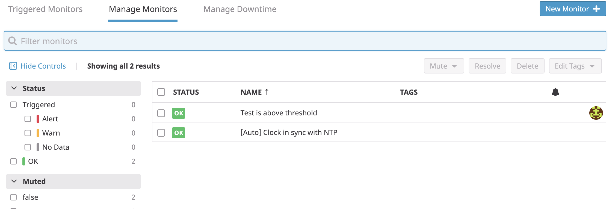

# Introduction to Datadog - Ryan Donat
#itsallaboutthedata

## Topics:
* Collecting Metrics
  * How can we use Datadog to collect metrics from our system? 
* Visulizing Data
  * Once we have collected Metrics, how can we use Datadog to visulize them?
* Monitoring Data
  * When your data is visulized exactly how you want it, how do you set up Monitors so that someone does not need to be watching the dashboard indefinitely for anomolies?
* Collecting APM Data
  * Now that we are collecting,visulizing, and monitoring our data and metrics, what else is there? Application Performance Monitoring lets you deep dive into your application's performance.
  
**NOTE:** As always, documentation is our friend, throughout this Introduction there will be many references and quotes to and from documentation that explains these topics in greater depth.

## Collecting Metrics:

### Datadog provides three main types of integrations that allow us to collect metrics:

* Agent-based integrations are installed with the Datadog Agent and use a Python class called check to define the metrics to collect.
* Authentication (crawler) based integrations are set up in the Datadog App where you provide credentials for obtaining metrics with the
* API. These include popular integrations like Slack,AWS,Azure, and PagerDuty.
Library integrations use the Datadog API to allow you to monitor applications based on the language they are written in, like Node.js, or Python.

### Example of Authentication based integration:
* Install a database on your machine (MongoDB, MySQL, or PostgreSQL) and then install the respective Datadog integration for that database.
* SCREENSHOT OF Datadog and DynamoDb

### Agent based integrations with custom Checks:
* Create a custom Agent check that submits a metric named my_metric with a random value between 0 and 1000.
* Custom checks are well suited to collect metrics from custom applications or unique systems. However, if you are trying to collect metrics from a generally available application, public service, or open source project, it is recommended that you create a full fledged Agent Integration.
* https://docs.datadoghq.com/agent/
* https://docs.datadoghq.com/developers/write_agent_check/?tab=agentv6
  * Ceate the custom Agent check configuration file.
``` 
vim /etc/datadog_agent/conf.d/custom_metric.d/custom_metric.yaml
```

  * Add necessary parameters.
```
instances: [{}]
```

  * Create the python method that contains the funtionality of the custom check.
``` 
vim /etc/datadog_agent/checks.d/custom_metric.py
```

```python 

# SOURCE: https://docs.datadoghq.com/developers/write_agent_check/?tab=agentv6\#overview

import random

# the following try/except block will make the custom check compatible with any Agent version
try:
    # first, try to import the base class from old versions of the Agent...
    from checks import AgentCheck
except ImportError:
    # ...if the above failed, the check is running in Agent version 6 or later
    from datadog_checks.checks import AgentCheck

# content of the special variable __version__ will be shown in the Agent status page
__version__ = "1.2.5"


class RandIntCheck(AgentCheck):
    def check(self, instance):
        self.gauge('custom.my_metric', random.randint(0, 1000), tags=['random:1000'])
 ```


  * Custom checks are well suited to collect metrics from custom applications or unique systems. However, if you are trying to collect metrics from a generally available application, public service, or open source project, it is recommended that you create a full fledged Agent Integration.
  * https://docs.datadoghq.com/developers/write_agent_check/?tab=agentv6
  * https://docs.datadoghq.com/agent/
* Change your check's collection interval so that it only submits the metric once every 45 seconds.

``` 
vim /etc/datadog_agent/conf.d/custom_metric.d/custom_metric.yaml
```

```python 
init_config:
instances:
     - min_collection_interval: 45
 ```
  * https://docs.datadoghq.com/developers/write_agent_check/?tab=agentv6#collection-interval
* **Bonus Question** Can you change the collection interval without modifying the Python check file you created?

### How do we keep all of the data comming into Datadog many different host organized?
* Add tags in the Agent config file and show us a screenshot of your host and its tags on the Host Map page in Datadog.
  * Tags are a way of adding dimensions to metrics, so they can be filtered, aggregated, and compared in Datadog visualizations. Using tags enables you to observe aggregate performance across a number of hosts and (optionally) narrow the set further based on specific elements. In summary, tagging is a method to observe aggregate data points.
  * Typically, it’s helpful to look at containers, VMs, and cloud infrastructure at the “service” level in aggregate. For example, it’s more helpful to look at CPU usage across a collection of hosts that represents a service, rather than CPU usage for server A or server B separately. Containers and cloud environments regularly churn through hosts, so it is critical to tag these to allow for aggregation of the metrics you’re getting.

  * https://docs.datadoghq.com/tagging/

## Visualizing Data:

Utilize the Datadog API to create a Timeboard that contains:

Basics ways to visualise yoyr data.
* Your custom metric scoped over your host.
  * Scoping a metric over a host is a great way to see what is happening on a specific host.
  * 
* Any metric from the Integration on your Database with the anomaly function applied.
  * You can apply anomonly detection to different metrics, that will help you notice that something is out of the ordinary. Here we see the peaks are drawn in <span style="color:red">RED</span> because they are anomalous to the previous data.
  * 
  * Here is an example the anomaly fuction applied to my_metric, this is a little easier to see what is happening here. The graph has the greyed area indicating the expected range of the metrics value, and highlights in RED when the metric breaks that range.
  * 
* Your custom metric with the rollup function applied to sum up all the points for the past hour into one bucket.
  * You can create custom functions to help provide the easiest visuals to analyse. Here we are creating a "rollup" of the sumation of one hours worth of my_metric, this may be helpful when you are not worried about the minute to minue changes that a gauge datatype can return, but the larger picutre of the trend of that gauge.
  * _avg:custom.my_metric{*}.rollup(sum, 3600)_
  * 

Please be sure, when submitting your hiring challenge, to include the script that you've used to create this Timeboard.

Once this is created, access the Dashboard from your Dashboard List in the UI:

* Set the Timeboard's timeframe to the past 5 minutes
  * You can change the timeframe of the Timeboard that you are looking at, 15minutes - 1 mounth, you can even set specific date ranges.
* Take a snapshot of this graph and use the @ notation to send it to yourself.
  * If you find something curious you can take a "Snapshot" of the graph, write a comment and send it to specific users that may be interested.
    * 
* **Bonus Question**: What is the Anomaly graph displaying?
  * Anomaly detection is an algorithmic feature that identifies when a metric is behaving differently than it has in the past, taking into account trends, seasonal day-of-week, and time-of-day patterns. It is well-suited for metrics with strong trends and recurring patterns that are hard to monitor with threshold-based alerting.
  * https://docs.datadoghq.com/monitors/monitor_types/anomaly/#overview

## Monitoring Data

Since you’ve already caught your test metric going above 800 once, you don’t want to have to continually watch this dashboard to be alerted when it goes above 800 again. So let’s make life easier by creating a monitor.

Create a new Metric Monitor that watches the average of your custom metric (my_metric) and will alert if it’s above the following values over the past 5 minutes:

* Warning threshold of 500
* Alerting threshold of 800
* And also ensure that it will notify you if there is No Data for this query over the past 10m.
  * This functionality can be created with this query
    * avg(last_5m):avg:custom.my_metric{host:i-0004adc938adf651a} > 800
* 
* 

Please configure the monitor’s message so that it will:

* Send you an email whenever the monitor triggers.
* Create different messages based on whether the monitor is in an Alert, Warning, or No Data state.
* Include the metric value that caused the monitor to trigger and host ip when the Monitor triggers an Alert state.
* When this monitor sends you an email notification, take a screenshot of the email that it sends you.


* **Bonus Question**: Since this monitor is going to alert pretty often, you don’t want to be alerted when you are out of the office. Set up two scheduled downtimes for this monitor:

  * One that silences it from 7pm to 9am daily on M-F,
  * And one that silences it all day on Sat-Sun.
  * Make sure that your email is notified when you schedule the downtime and take a screenshot of that notification.
    * 
    * The user Ryan Donat is on the list to be notify when downtime is Scheduled. He is sent an email to inform him.
      * 

## Collecting APM Data:

Given the following Flask app (or any Python/Ruby/Go app of your choice) instrument this using Datadog’s APM solution:

```python
from flask import Flask
import logging
import sys

# Have flask use stdout as the logger
main_logger = logging.getLogger()
main_logger.setLevel(logging.DEBUG)
c = logging.StreamHandler(sys.stdout)
formatter = logging.Formatter('%(asctime)s - %(name)s - %(levelname)s - %(message)s')
c.setFormatter(formatter)
main_logger.addHandler(c)

app = Flask(__name__)

@app.route('/')
def api_entry():
    return 'Entrypoint to the Application'

@app.route('/api/apm')
def apm_endpoint():
    return 'Getting APM Started'

@app.route('/api/trace')
def trace_endpoint():
    return 'Posting Traces'

if __name__ == '__main__':
    app.run(host='0.0.0.0', port='5050')
```

* **Note**: Using both ddtrace-run and manually inserting the Middleware has been known to cause issues. Please only use one or the other.

* **Bonus Question**: What is the difference between a Service and a Resource?

Provide a link and a screenshot of a Dashboard with both APM and Infrastructure Metrics.

Please include your fully instrumented app in your submission, as well.

## Final Question:

Datadog has been used in a lot of creative ways in the past. We’ve written some blog posts about using Datadog to monitor the NYC Subway System, Pokemon Go, and even office restroom availability!

Is there anything creative you would use Datadog for?
