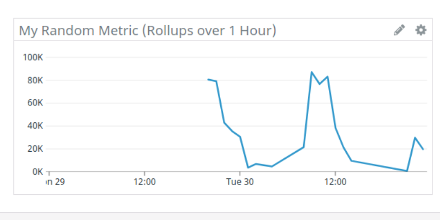

# Enterprise Sales Engineer - London

I come from Dev/Support/DevOps and a fair security background, I have been long interested in how [DataDog is evolving](https://en.wikipedia.org/wiki/Datadog#History), and how they made it to the log management world in 2018 after perfecting their Metrics collection capabilities, then for completion, complimenting that by announcing their SIEM solution in April this year. 

I played a little around collecting logs and local metrics, and that was it, however, the more I think about the product and the UX and capabilities it offers, the more I see myself full of energy to talk about it and subconsciously sell it! And boy, was I so excited about the opportunity of the Sales Engineer I found?! Yes!

Here I am going through the exercise, which recommending one of two options ([Docker vs Vagrant](https://www.datanyze.com/market-share/containerization--321/vagrant-vs-docker)), as the world trending more towards favoring containerization over full-blown VMs, I have decided to utilize on the [DataDog Docker Agent](https://docs.datadoghq.com/agent/docker/?tab=standard), the [Compose](https://docs.datadoghq.com/integrations/faq/compose-and-the-datadog-agent/) to be specific. On the other hand, my using my favorite stack [Python](https://www.python.org/), [Django](https://www.djangoproject.com/) and [Postgres](https://www.postgresql.org/) to demo how secure and pleasant DevOps could be, using Datadog

## Feedback

First I'd like to express how impressive the Datadog entire suite and features, and in particular the UX is throughout, and to say I have enjoyed the exercise and very much looking forward to working you and help customer to make the right decision by choosing such a fantastic product and make their life easier! On the other hand, as the product is genuinely self-service, further improving the documentation would be perfect! 

# Answers

Datadog lets us build dashboards that combine metrics from many different sources. We can mix and transform metrics to make them more useful. It also provides a powerful interface for interactive exploration of metrics.

A public [link](https://p.datadoghq.eu/sb/vik60ulhvn4ner0k-06f362dc4e8b89b439879eb1a962594e)

## Links to scripts (Provided in context as well)
* Monitoring [Json](https://github.com/dwpseng/hiring-engineers/blob/4b9d7d1d71f688e09b24448df68e799a36e67b2c/answers/exports/DataWizardMonitors--2020-06-30T22%2033%2055.json#L2)

* Data Wizard Overview Dashboard - [JSON](https://github.com/dwpseng/hiring-engineers/blob/4b9d7d1d71f688e09b24448df68e799a36e67b2c/answers/exports/DataWizardOverview--2020-06-30T22%2033%2055.json#L1)

* API driven dashboard [JSON](https://github.com/dwpseng/hiring-engineers/blob/4b9d7d1d71f688e09b24448df68e799a36e67b2c/answers/exports/DataWizardVisualisation-ViaAPI4--2020-06-30T10%2005%2045.json#L1)

## PoC

This repository is a fully functional self-service PoC of the features in context, instructions:
* Install Docker (Tested on Mac & Ubuntu)
* Clone the repostory
* Rename the DOT_ENV_TEMPLATE.env file to .env
* Populate the relevant credentials and any other env. variables
* `sudo chmod +x run.sh`
* fire `sudo ./run.sh`

## Collecting Metrics:

* Add tags in the Agent config file and show us a screen-shot of your host and its tags on the Host Map page in Datadog.

  * I have added multiple tags

    * Env: **EMEA:demo:web:*** (Django & PostreSql)
    * Dept:**enablement:presales**
    * Version: 12.3 (**PostreSql**) 
    

- "DEPT" could be filtered by or displayed as a column in logs search for example.

  

- Install a database on your machine (MongoDB, MySQL, or **PostgreSQL**) and then install the respective Datadog integration for that database.

  - As I mentioned, I have installed [**PostgreSQL** docker image](https://hub.docker.com/_/postgres).

  - That was slightly challenging, as the documentation was less clear on the compose side but in the end, was very rewarding.

  - I have used **.env** file to manage the environment variables needed

    

  - The following is the code sniped that is creating the container needed. -The full compose [file](https://github.com/dwpseng/hiring-engineers/blob/6284d4c194c9ee51c68b90fa60a40f91394d9531/docker-compose.yml#L1)
    - Please note that the entry point is to add the Datadog required credentials using the [Initialization scripts](https://hub.docker.com/_/postgres). 
    - I have used the [Docker labels](https://docs.docker.com/config/labels-custom-metadata/) to let the magic of [Datadog Docker Autodiscovery](https://docs.datadoghq.com/agent/docker/integrations/?tab=docker) take care of things.
    - The docker label "**my.custom.label.dept**" this will be extracted by the agent and mapped to "dept" - I love this!
    - Including multi line pattern, to keep any message spared over multi lines as a single Datadog log line

- Create a custom Agent check that submits a metric named my_metric with a random value between 0 and 1000.

  - There was not much to do here to be honest, going through such brilliant [documentation](https://docs.datadoghq.com/developers/write_agent_check/?tab=agentv6v7) and taking the example with slight tweak.

  - The code below is almost copy paste except I have add a random number

  - Code found [here](https://github.com/dwpseng/hiring-engineers/blob/6284d4c194c9ee51c68b90fa60a40f91394d9531/dd-agent-checks.d/my_random_metrics.py#L1)

    

  -  The trick about this task was really to get the checks up and running by placing in a very specific location when it comes to docker, I had to use volumes mapped/mounted to /conf.d and /checks.d under the under the Datadog agent install for the configuration and actual code to run respectively

  -   is 

  - Below is the [Datadoge Docker comepose](https://docs.datadoghq.com/agent/docker/log/?tab=dockercompose) snippet, which I will explain as I go

  - Very curious, I have added the config needed for the [Datadog Network Performance Monitoring,](https://www.datadoghq.com/blog/network-performance-monitoring/) but could not see anything coming although it was enabled as flagged as ready (That was why I have deployed my Docker on Ubuntu, as this feature only supported on Linux), otherwise the entire stack worked identically on Mac/Docker

    

- Change your check's collection interval so that it only submits the metric once every 45 seconds.

  - Done

- **Bonus Question** Can you change the collection interval without modifying the Python check file you created?

  - Yes, this is simple, in fact it is right at the start of the Custom Agent Check [documentation](https://docs.datadoghq.com/developers/write_agent_check/?tab=agentv6v7), Brilliant!  Using the **min_collection_interval** 
  - Yaml config [here](https://github.com/dwpseng/hiring-engineers/blob/6284d4c194c9ee51c68b90fa60a40f91394d9531/dd-agent-conf.d/my_random_metrics.yaml#L5)
- 
  

  
## Visualizing Data:

Utilize the Datadog API to create a Timeboard that contains:

- Your custom metric scoped over your host.
  
  - The random metric is included also random metric on top of the CUP usage
  - Any metric from the Integration on your Database with the anomaly function applied.

    - I have put fetched rows and it's anomalies 
  - Use this JSON [export](exports/DataWizardVisualisation-ViaAPI4--2020-06-30T10 05 45.json) to re-create the same dashboard
  - Public [link](https://p.datadoghq.eu/sb/vik60ulhvn4ner0k-2c5e387d4b5827038aa58c2f79ea9a97) to the dashboard
  
  
  
- Your custom metric with the roll-up function applied to sum up all the points for the past hour into one bucket
  

* Please be sure, when submitting your hiring challenge, to include the script that you've used to create this Timeboard.

* Python script code found [here](https://github.com/dwpseng/hiring-engineers/blob/data_wizard/api/dashboard_api_.py#L1)

* The **django_container** could be used to run the script 

  `docker exec django_container python api/dashboard_api_.py`

  

  

Once this is created, access the Dashboard from your Dashboard List in the UI:

- Set the Timeboard's timeframe to the past 5 minutes
  
- Take a snapshot of this graph and use the @ notation to send it to yourself.
  
  
  
- **Bonus Question**: What is the Anomaly graph displaying? 
  
  - In the example abvoe "fetching rows" could be a valuable metric to monitor bu also the most variable. Application throughput, web requests, user logins… all of these important, top-level metrics tend to have pronounced peaks and valleys, depending on the time of day or the day of the week. Those fluctuations make it very hard to set sensible thresholds for alerting or investigation.
  
    To provide deeper context for dynamic metrics like these, Datadog is able of anomaly detection. **By analyzing a metric’s historical behavior, anomaly detection distinguishes between normal and abnormal metric trends.**
  
    Of course, anomaly detection is not just about showing you what’s normal—it’s also about surfacing what’s not. Here we see an unexpected spike in fetching the rows, which is quickly flagged as an anomaly
  
    
  
    Plummeting throughput is a very serious [symptom](https://www.datadoghq.com/blog/monitoring-101-alerting/), but it’s basically impossible to set threshold alerts that can identify an occurrence like this. After all, it’s not that the metric’s value was especially low when it dropped—it routinely reaches that level on weekends. It’s just that it was anomalously low for *midday on a Thursday* ... Datadog expling further [more](https://www.datadoghq.com/blog/introducing-anomaly-detection-datadog/)
  

  

  
## Monitoring Data

Since you’ve already caught your test metric going above 800 once, you don’t want to have to continually watch this dashboard to be alerted when it goes above 800 again. So let’s make life easier by creating a monitor.

Create a new Metric Monitor that watches the average of your custom metric (my_metric) and will alert if it’s above the following values over the past 5 minutes:

* You may use this [**script**](https://github.com/dwpseng/hiring-engineers/blob/4b9d7d1d71f688e09b24448df68e799a36e67b2c/answers/exports/DataWizardMonitors--2020-06-30T22%2033%2055.json#L2) to import the monitoring
  

* 
  
* Warning threshold of 500
  
  
  
  * Alerting threshold of 800
    * Interestingly well randomly I got no 800 but then had to fire the amazing test alert (I love that very useful)
    * 
  * And also ensure that it will notify you if there is No Data for this query over the past 10m.
  * 
  
  

Please configure the monitor’s message so that it will:

- Send you an email whenever the monitor triggers.
  
  - Done
  
- Create different messages based on whether the monitor is in an Alert, Warning, or No Data state.
  
  - Done
  
- Include the metric value that caused the monitor to trigger and host ip when the Monitor triggers an Alert state.
  
  - I could get all to work except for {{host.ip}} this might be due to Docker compose but I have tried quite few thing but could not git it working unfortunately
  
    
  
- When this monitor sends you an email notification, take a screen-shot of the email that it sends you.
  
    - Attached above
    
  - **Bonus Question**: Since this monitor is going to alert pretty often, you don’t want to be alerted when you are out of the office. Set up two scheduled downtimes for this monitor:
  
    - One that silences it from 7pm to 9am daily on M-F,
    - You may use this script to import the down time
    - 
    - 
    - And one that silences it all day on Sat-Sun.
    - You may use this **scrip** to import the down time
    - 
    - 
    - Make sure that your email is notified when you schedule the downtime and take a screen-shot of that notification.
    - Done and attached above

## Collecting APM Data:

Given the following Flask app (**or any Python**/Ruby/Go app of your choice) instrument this using Datadog’s APM solution:

**Note**: Using both ddtrace-run and manually inserting the Middleware has been known to cause issues. Please only use one or the other.

Provide a link and a screen-shot of a Dashboard with both APM and Infrastructure Metrics.

Please include your fully instrumented app in your submission, as well.

* I have gone with using Django, to utilize on Datadog APM
* I installed  [Python](https://docs.datadoghq.com/tracing/profiling/?tab=python) (Tracing & APM) - ddtrace
* 
* The code below would 
  * Using **pyddprofile** or **ddtrace-run** when profiling is needed otherwise tracing
  * Correctly tag the Metrics, logs, APM etc. using the sweet Auto discovery docker labels
  * Set the source service for the logs and enable the multi line

* The services

* Traces, with env set as demo

* 

**Bonus Question**: What is the difference between a Service and a Resource? 

**It's really a noun vs verb**

The short answer, A resource is defined by its URL and definition of inputs/outputs for every operation supported by a resource. Unlike a service, where methods are completely independent and can be deployed as independent endpoints, methods on a resource follow OO semantics, which means that all of them (except *createResource*) have to exist on the underlying resource (same URL).

##### Basic differences between Resources and Services

In the simplest case, a **Service** can be defined as a self-contained, independently developed, deployed, managed, and maintained software implementation supporting specific business-relevant functionality for an enterprise as a whole and is “integratable” by design. A “Service” is defined by a verb ( For example, “***validate\*** customer’s credit score”, which describes the business function it implements.)

A service **is not a programming construct or a set of APIs,** but rather an architectural **(unit of design, implementation, and maintenance)** and deployment artifact used for implementation of enterprise solutions. 

A **Resource** can be defined as a directly-accessible, independently-developed, deployed, managed and maintained software artifact supporting specific data. A resource **is defined by a noun** for example, “doctor’s **appointment**” that describes the data provided by the resource. A resource can also relate to other resources and provide a reference (link) to them. In effect, a resource is similar to an object[6], but with a predefined (CRUDish) interface semantic.

The semantics in REST are based on the set of HTTP operations and looks as follows::

- createResource – Create a new resource (and the corresponding unique identifier) – PUT
- getResourceRepresentation – Retrieve the representation of the resource – GET
- deleteResource – Delete the resource (optionally including linked resources) – DELETE (referred resource only), POST (can be used if the delete is including linked resources)
- modifyResource – Modify the resource – POST
- getMetaInformation – Obtain meta information about the resource – HEAD

## Final Question:

Datadog has been used in a lot of creative ways in the past. We’ve written some blog posts about using Datadog to monitor the NYC Subway System, Pokemon Go, and even office restroom availability!

Is there anything creative you would use Datadog for? Ah, probably few, and I would  love to be part of such a project of course! In particular Anomalies and Prediction 

* I would love to see Datadog to be attached to Airplanes Black boxes, off-line and live when/where possible that would  tremendously help security/safety, same applicable for cars and to work with insurgence company as to detect anomalies in areas and derive their premium accordingly
* Health care, devices in hospitals and wearables (Blood pressure and diabetes), prediction 
* COVID-19, across countries and areas real time and historic for research

## Conclusion 

Datadog is a very powerful and feature rich product, yet very self-service which is amazing! I would like to thank you for giving such a wonderful opportunity with such amazing experience, I very much look to what is coming next! I hope you would find my solution appealing and the effort and time I had to put through out with huge passion

## Other screen-shots 

**Dark Theme**

**Django Logs**

**Docker Overview**

**Inra Postgres Containers**

**Log Explorer - Postgres**

