# The Challenge

## Topic
*  Question
>Answer: - if there is a break between an answer and a note you may see >Answer
(cont):
>Note: - either challenges or items to keep in mind 

### - Setup an Ubuntu VM

* While it is not required, we recommend that you spin up a fresh linux VM via Vagrant or other tools so that you don't run into any OS or dependency issues. [Here are instructions for setting up a Vagrant Ubuntu 12.04 VM.](https://www.vagrantup.com/docs/getting-started/)

>Note: I am using macOS High Sierra Version 10.13.3 for this challenge, and I have installed VM via Vagrant, as well.

>Note: I faced several dependency issues when using just the OS especially with  
pip (Python tool). 

>Answer:

Hence, A Vagrant Virtual Box will need to be created. 
    - The first step will be to open your terminal and have a forked/cloned repository on your 
      machine.
    - Then change into the directory by utilizing the following command 'cd <Name of Directory>' 
    - The next step would be to create a folder which would house vagrant in your directory.
    - Utilize the following command 'mkdir vagrant_getting_started' in order to make a directory 
      for Vagrant to be housed. 
    - Following this, change to the directory you have made ('cd vagrant_getting_started') and 
      initiate vagrant by typing in 'vagrant init ubuntu/xenial64' in order to get the Ubuntu Virtual Box.
    - Still utilizing the terminal, type in the command 'vagrant up' in order to get the Virtual 
      Box running.
    - Once you have the Virtual Box running  you may receive an alert that Ubuntu/Xenial64 needs 
      an update. 
    - Run the command 'vagrant box update' and these updates may take a substantial amount of 
      time (45 minutes) to complete. 
    - Once the update is complete, enter the command 'vagrant ssh' to enter the Virtual Box. 
    - There are a few things to look for to make sure you did the installation correctly:
      First you need to ensure that the Vagrantfile that should have been created on 'vagrant init' is within your directory, as well as when running the command 'vagrant ssh' you should see your user path change into 'vagrant@ubuntu-xenial' or equivalently to the Ubunto VB you have selected. 
    - Finally, in order to quit this virtual box you would run the command 'vagrant destroy'.

Here is a screenshot displaying the successful environment being made. 

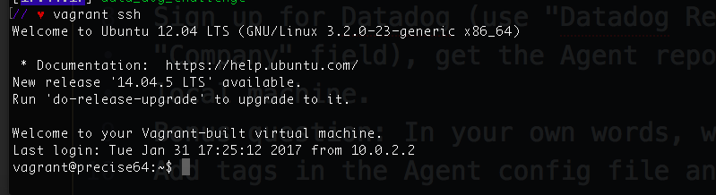

* Sign up for Datadog (use "Datadog Recruiting Candidate" in the "Company" field), get the Agent reporting metrics from your local machine.

>Answer: 

The following is the website url to create an account: https://app.datadoghq.com/account/login?next=%2F

Attached below is an image displaying the successful completion of making a profile and logging in.

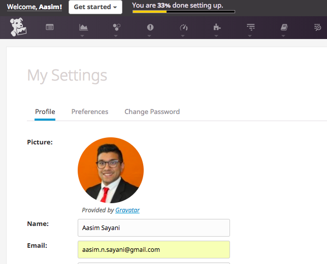

Now, after you have logged back in after creating your account on Datadog you would want to begin utilizing the tool right away. Also, this is where we would go back to your terminal and install the agent. Keep in mind that you are still running a Virtual Box agent so these dependecies and configurations may not be saved to the overall machine unless you run global commands. You can still install the agent outside of the Virtual Box by opening a new window of the terminal from the shell and entering the commmand listed below at the root. 

The command for installing DataDog is as follows: 
<!-- DD_API_KEY=ba43f5ff300b9342eb4d993e32500157 bash -c "$(curl -L https://raw.githubusercontent.com/DataDog/datadog-agent/master/cmd/agent/install_mac_os.sh)" -->

You will need to go open your terminal. Once you have opened your terminal enter the command listed above. Now, this command will be different per user and you will receive this command containing your unique API after a successful registration. Each unique API Key within the command points to the DataDog agent associated with your account. The rest of the command is telling your machine to install the DataDog Agent from a particular file path, and this particular agent will be used to configure your integrations and receive analytics around your devops later on. 

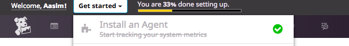

### Level 1 - Collecting Metrics

* Add tags in the Agent config file and show us a screenshot of your host and its tags on the Host Map page in Datadog.

>Note: In order to navigate to the Agent config file you would need to utilize the docs.
        - Personally, I utilized the following link: https://docs.datadoghq.com/agent/
          basic_agent_usage/osx/?tab=agentv6
        - Under the section called Configuration you will see the path for YAML
          files containing agent files and folders, as well as a path for the configuration for each of the integrations
        - Each of these paths will allow you to make changes to the DataDog agent
        - They contain the configurations for the various integrations, as well as allow 
          the user to write their own custom checks verifying the integrations

>Answer: 

Within the terminal change your directory to the DataDog Agent by typing 'cd ~/.datadog-agent', then use your text editor (I have created a sublime shortcut so I typed 'sublime .' once I was in the correct path) to make the following changes to the configuration file (datadog.yaml): 
    - On line 35 - 39, you can see that the tags section is commented out because of the
      '#' sign at the front of each line. 
    - You will need to uncomment these lines in order to make sure that the DataDog agent is 
      able to collect information on these tags. 

Go back to your browser, and make sure you are logged into DataDog. Then refresh your DataDog home page, and use the navigation bar to go to the Infrastructure tab. Once you are on the infrastructure tab click on the Host Map, and here you should be able to see your tags if you search in the "Filter By" column. This will display your tags within the host map. 

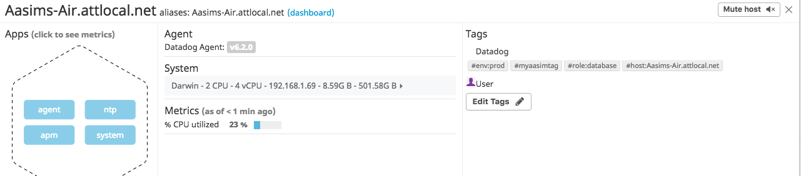

* Install a database on your machine (MongoDB, MySQL, or PostgreSQL) and then install the respective Datadog integration for that database.

>Answer: 

We will utilize the integration of PostgreSQL for this excercise. We will want to integrate the 
Datadog Agent and your PSQL within your machine. Now, we will need to confirm that you have PSQL
installed in your computer, and we can confirm this by typing the 'psql' command in your terminal. This command will display your version number and that will confirm that  you have PSQL installed.
Now, once you have confirmed that PSQL is installed we will need to go back to the DataDog website, and once you have logged back in you will see a puzzle piece in the navigation tab.
The puzzle piece will be followed by a drop-down menu and you will be able to click on the Integrations tab. Here, you can either browse by the titles available or enter PSQL into the search bar. 

You will need to click the install button to add this integration to your DataDog account via the website, but there are additional steps in adding PSQL for your DataDog Agent to track. You will also need to keep your browser open with the Integrations page open to complete this. 
These are the following steps to complete within your terminal and browser: 
    - Open your browser back to the Integrations tab on the Datadog page 
    - Open the integrations for PSQL and click on the configurations tab next to the overview.
    - Now, in your browser there should be a button to generate the automatic password, so click
      on that button to create this password. 
    - Open your Terminal.
    - Start PSQL within your terminal with the command 'psql'. 
    - Enter the following command 'create user datadog with password 'Given By DataDog';
      grant SELECT ON pg_stat_database to datadog;'.
    - You should see the words CREATE and GRANT in all capital letters if you completed the query
      successfully. 
    - Once you have completed the creation of the account as well as granting access enter the 
      command '/q' to quit PSQL.
    
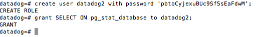

Now, we will need to configure the agent files to connect to PostgreSQL in your machine. This will
enable the database to be tracked by the Datadog Agent and allow you to measure metrics around PSQL. You will need to do the following to make sure the configurations are setup in your DD-Agent:
    - Open your terminal shell and once again go to the directory housing the
      DataDog Agent (Here is the path: 'cd ~/.datadog-agent/'). 
    - Next utilize your text editor to open this directory.
    - Following opening the directory you should see the 'conf.d' directory 
    - Here you should see another folder called 'postgres.d'
    - Initially, everything within the sample example configuration file will contain the
      integrations you will need and the integrations will be commented out within the code 
    - You will need to make a new file by going back to your terminal and navigating 
      to 'cd ~/.datadog-agent/conf.d/postgres.d' followed by the command 'touch postgres.yaml'.
    - Once the file is created go back to your text editor, and you should see the new file in the 
      'postgres.d' folder.
    - Finally, take the following code below from your sample file, place it in your new file, 
      and uncomment the code. 

>Note: You will need to make sure you have your password which was generated from the PSQL installation on the DataDog website.

    Code Snippet: 

   <!--  
    init_config:

    instances:
       host: localhost
       port: 5432
       username: datadog
       password: <generated during PSQL Integration setup>
       tags:
            - optional_tag1
            - optional_tag2
     -->

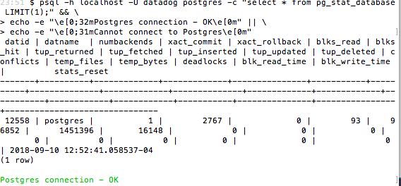

Once you have input the new code be sure to save your changes in order for them to occur. You will need to restart the agent in order for the integration to take place. 
To restart your agent: 
    - Go into your terminal and enter the following command to stop the agent 
      'launchctl stop com.datadoghq.agent'
    - Next, you will enter this command to restart your agent 
      'launchctl start com.datadoghq.agent' 
    - In order to confirm that you have your DataDog Agent running, 
      you can either go to your browser and enter the address associated with 
      your local agent (i.e 'http://127.0.0.1:5002/').
    - Now, we can also run a command within the terminal 'datadog-agent check postgres'
      and this commands will run checks on the integrations and the name of the check is listed after the command 'check', so this will also be how we run custom checks later on.

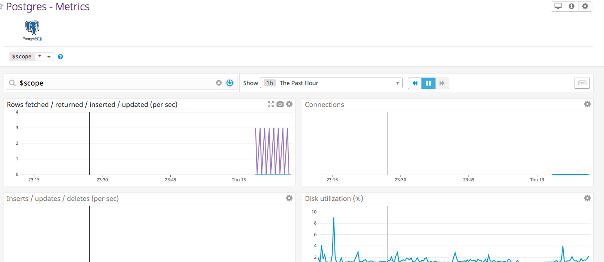

Following up on the dashboard gives us assurance that the data is traveling to DataDog: 
    - Go to your browser and proceed to log into your DataDog dashboard 
    - When you have logged in you will be able to go to the tab with the graph representing 
      dashboards. 
    - Go to the Dashboard List tab in the drop-down menu
    - Here, we should see Postgres - Metrics and Postgres - Overview pop up in the
      dashboard list
    - If we click on either of these we should be able to see metrics and our overview around
      the PSQL integration.

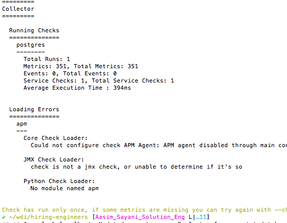

* Write a custom Agent check that samples a random value. Call this new metric: `my_metric`

>Answer: 

First, we will need to navigate into the datadog agent directory. There we will need to add a 
my_metric.py for the check itself followed by a yaml file for configuring the check in the conf.d  folder. 
    - Navigate to the datadog agent in your terminal (Here is the path: 'cd ~/.datadog-agent/').
    - Change your directory to the 'cd checks.d' and add the file 'touch my_metric.py'
    - Get back out of this directory 'cd ..' then go into the configurations file 'cd conf.d'
    - Create a folder to house your metric 'mkdir my_metric.d' the change into that directory 
      'cd my_metric.d' and add the yaml configuration file 'touch my_metric.yaml'

Following the previous steps, we would open the DataDog agent with a text-editor and edit the 'my_metric.py' file that we created to have the code snippet below. Now, we are importing the random function within python and creating a variable that generates a random value between 0 and 1000.

    Code Snippet: 

    <!-- from random import randint
            random_number = randint(0,1000)
            print random_number

        from checks import AgentCheck
        class RandomCheck(AgentCheck):
            def check(self, instance):
                self.gauge('my_metric', random_number) -->

Now, we will need to go back to the DataDog Agent in the terminal, and you will open
the 'conf.d' folder (path: 'cd ~/.datadog-agent/conf.d'). After you have entered into this directory create a file you have created called my_metric.yaml and open this file in a text editor. When you are in this file you will make the configurations for the custom metric (my_metric) utilizing the DataDog documentation online. Below you will find the code snippet for the custom metric configuration template. 

    Code Snippet:

    <!-- init_config:
    instances:
        [{}] -->

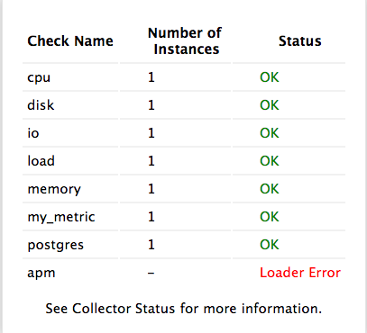
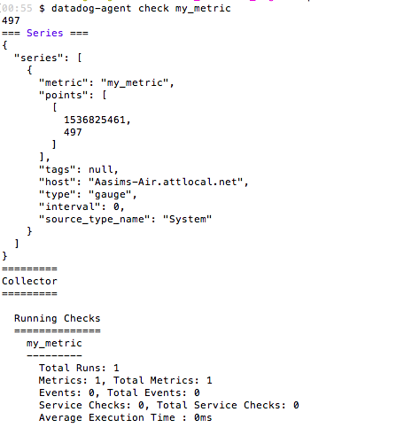

Bonus Question: Can you change the collection interval without modifying the Python check file you created?

>Answer: I thought about iterating over an array within the Python portion and having a time.sleep(45) in order to only have a value display every 45 seconds but this seems to be the only solution for this. I see the min_interval within the YAML file in instances but on the docs it says that this is not necessarily utilized to have the Agent collect every 45 seconds. 

### Level 2 - Visualizing your Data

* Utilize the Datadog API to create a Timeboard that contains:

Your custom metric scoped over your host. Any metric from the Integration on your Database with the anomaly function applied. Your custom metric with the rollup function applied to sum up all the points for the past hour into one bucket

>Note: The API commands for Timeboards are listed within the DataDog documentation here: 
       (https://docs.datadoghq.com/api/?lang=python#timeboards). You can adjust based on the language you are using.

>Answer: 

Now, in order to utilize the DataDog API to create a Timeboard you will need to ensure you know how a timeboard is different from a screenboard. When lookign at the documentation, you will see that there are three main frameworks to be used. This example will demonstrate utilizing the terminal in order to execute these API calls. Though we can utilize Ruby and Python as scripting languages to execute these API calls, and there are certain pieces of these commands which relate to your account. Specifically, the API key and APP key you will need to execute these commands chich you will obtain by completing the steps below. 
    - Log into your DataDog account 
    - Hover over the Integration tab 
    - Once you see the API tab pop-up in the Integration drop-down menu, click on it 
    - Now, you should see your API key or if you do not see one you can click 'Create API key'
    - Also, you will need the Application key which you can generate by clicking the 
     'Create Applicaion Key'

Once you obtain your API and Application key you can enter adjust the command below to 
be tailored to your information in order to create your timeboard. 

    Code Snippet: 
        
        api_key=ba43f5ff300b9342eb4d993e32500157
        app_key=631a76043f9c6825b5913e5d10b97e5c697409ac

        curl  -X POST -H "Content-type: application/json" \
        -d '{
              "graphs" : [{
                  "title": "Metrics Combined",
                  "definition": {
                      "events": [],
                      "requests": [
                          {  "q": "avg:my_metric{*}, anomalies(avg:postgresql.rows_returned{*}, 'basic', 2), avg:my_metric{*}.rollup(sum, 60)",
                          "type": "line",
                          "style": {
                          "palette": "dog_classic",
                          "type": "solid",
                          "width": "normal"
                          }
                           "conditional_formats": []
                      ]
                  },
                  "viz": "timeseries",
                  "autoscale": true
              }],
              "title" : "All Metrics",
              "description" : "A dashboard with my custom metric, rollup function, and anomaly detection.",
              "template_variables": [{
                  "name": "host1",
                  "prefix": "host",
                  "default": "host:my-host"
              }],
              "read_only": "True"
        }' \
        "https://api.datadoghq.com/api/v1/dash?api_key=${api_key}&application_key=${app_key}"

Now, there are a few steps within the CURL command that need to be discussed because we need to make graphs for each respective aspect for the query. The first graph is for the custom metric (my_metric) mapped over the host. We can adjust the request portion of the Timeboard object within the API request to reflect the queries we want displayed in a graph. We can also adjust the type of graph that we want displayed. 

Below, we can see each of the queries for the requests we want a graph for listed. The query is represented in object formatting where the string q is the key, and the actual query is the value in string format. 

>Note: None of these queries are listed explicitly in the documentation, and have to be discovered by utilizing the graph tool in JSON setting. 

The first code snippet demonstrates the average of my_metric displayed over the host. 

        Code Snippet:

        {
          "requests": [
            {
              "q": "avg:my_metric{*}",
              },
              "conditional_formats": []
            }
          ],
        } 

The second code snippet shows the anomaly function applied to the PSQL metric of rows being returned.

        Code Snippet: 

        {
          "requests": [
            {
              "q": "anomalies(avg:postgresql.rows_returned{*}",
              },
              "conditional_formats": []
            }
          ],
        }
 
Finally, the last snipped shows the custom metric with the rollup function applied to it over the sum of the past hour. 

        Code Snippet:

        {
          "requests": [
            {
              "q": "avg:my_metric{*}.rollup(sum, 60)",
              },
              "conditional_formats": []
            }
          ],
        }

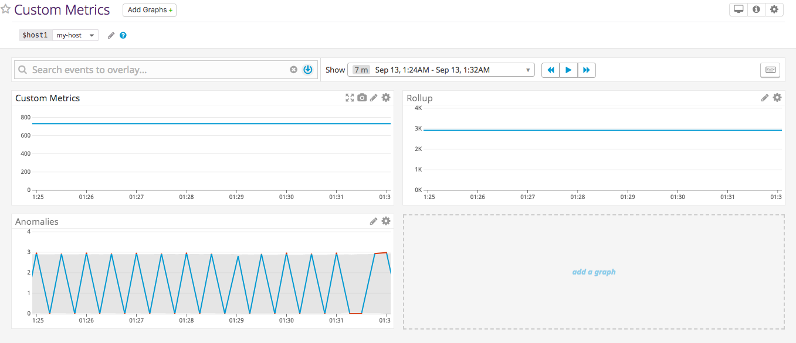

*Once this is created, access the Dashboard from your Dashboard List in the UI:
Set the Timeboard's timeframe to the past 5 minutes
Take a snapshot of this graph and use the @ notation to send it to yourself.

The Timeboard's timeframe is set to five minutes, and you can confirm this by logging into Datadog's web interface. Here we will be able to navigate to the Dashboard from the navigation bar with the graph icon representing the dashboard. You will need to select the correct Dashboard (Custom Metrics, Rollups, and Anomalies) from a list of dashboards and we can confirm we have a timeboard because next to the star icon there will be a stopwatch icon representing a timeboard. Once you have opened the specific dashboard for the Timeboard we are able to see that each of the graphs are set to a five minute interval. 

Regarding the snapshot of the graph, once you are in the dashboard of the timeboard you have created you are able to capture a screenshot of any position within the graph that you find pertaining to your analysis.
    - First, you will need to log into your Datadog account 
    - Navigate to the dashboard of your choice by going to the graph icon representing 
      dashboards then select one from your dashboard list.
    - You must have some graphs already or create one in order to have a snapshot of particular 
      data. 
    - Next, within the graph of your choice as you hover over this graph with your mouse
      you are able to see a small icon of a camera pop up allowing you to take a screenshot.
    - When you take the screenshot of the graph it can be of that entire period or of a certain 
      portion relating to the analysis you are doing.
    - Once you have taken the screenshot you will see a box below that allows you to tag
      team memebers, as well as make a note around why you highlighted this portion of the graph.
    - Use the @ symbol to tag teammates and type in your message within the textbox that appears 
      beneath your snapshot. 

Below are some screenshots of the snapshot of the graph, along with an example of how to tag your teammates within the graph. Also, there is a screenshot of how the message would appear within your teammates email.  

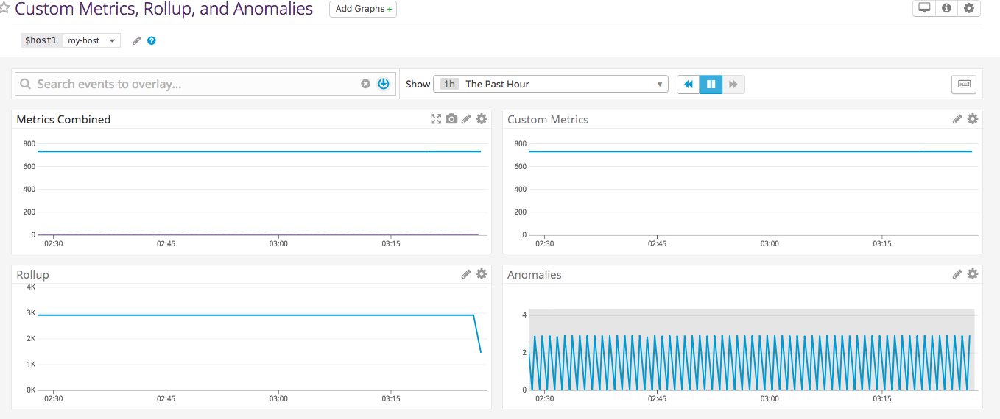

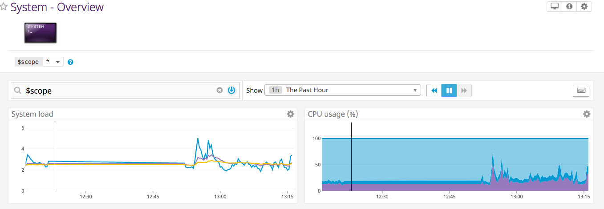
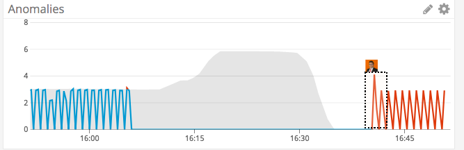
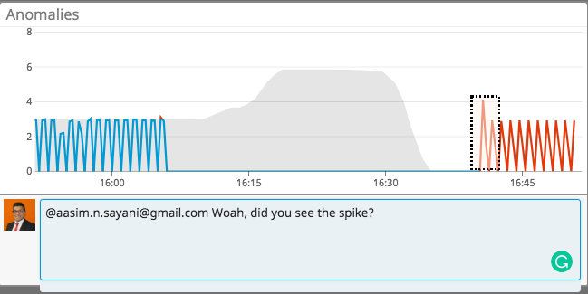
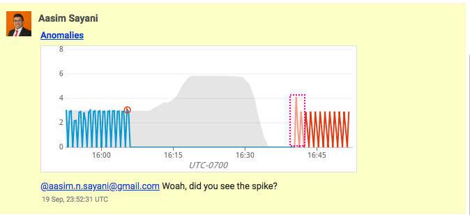

* Bonus Question: What is the Anomaly graph displaying?

>Answer: The anomaly graph is displaying the predictable patterns within the graph. Though anomaly 
detection requires a large amount of data in order to function.  If we look specifically 
at the anomalies within the graph for my_metric we can see the gray background which is beginning to display the anomalies, but as the data grows the trends could change. 

 ### Level 3 - Monitoring Data

Create a new Metric Monitor that watches the average of your custom metric (my_metric) and will alert if it’s above the following values over the past 5 minutes:

Warning threshold of 500
Alerting threshold of 800
And also ensure that it will notify you if there is No Data for this query over the past 10m.

>Answer:

If you would like to create an alert that notifies you based on when a particular metric is varying from your expected use you can use a Metric Monitor. Now, the Metric Monitor can be created using the DataDog web interface, and you will need to be logged in to do so. 
    - First, once you have logged in within the navigation bar look for the stop sign icon 
      with an exclamation point in it.
    - Click on this icon and select the New Monitor tab and click on Metric as your monitor type.
    - You will see that the first step is already configured to Threshold Alert.
    - We will need to define the metric in this case you are monitoring your custom metric,
      so in the second step type in the custom metric you would like to monitor (my_metric).
    - After this the third step automatically open up the ability to add an Alert threshold 
      (Set to 800), Warning threshold (Set to 500), and the ability to change the 'Do Not Notify'
      of the 'if Data is missing' to 'Notify' to get notifications when the monitor is not getting data from the metric.
    - Next, in the fourth section of the Metric Monitor you can actually set messages to be sent
      based on the various thresholds being set, and the messages for each of these thresholds can vary. 
    - There is also a layout of being able to add tags such as the ip address to the message
    - Also, the ability to display the metric value that triggered the alert by using {{value}}  
      tag within the message for the alert. 
    - Finally, in the last section you can select users to send this alert or Metric Monitor 
      via email to these selected individuals whenever the listed thresholds are reached.

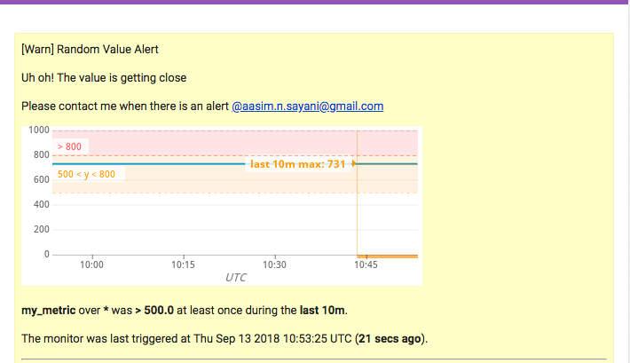

Bonus: 

Now, in order to restrict the alert to not be triggered at off-hours along with not disturbing individuals on the weekend. Also, you would probably need an email notification when scheduled downtime is coming into play. You will be able to make these changes directly within your Datadog web interface by navigating to the Monitors tab via the navigation bar, and you would navigate to the tab called Managing Downtime, and on the right hand side of the page you will find a yellow
button stating 'Schedule Downtime' with an icon of a wrench. Once you have clicked on this button you will be able to first select the monitor to schedule downtime for. Following this you would set the schedule which can either be a one-time occurance or in our case reoccuring when you need to set it for particular days of the week this is advantageous. We can select repeat every week instead of days to select the days of the week which we want the monitor to have downtime, and you would then set the time when the downtime would begin as well as how long you would want it to last for these days (7:00pm and 9:00am), and we can create a second downtime turning the monitor off for the weekend. 

Attached below are screenshots of the downtime monitor being made, as well as the alert sent via email for the weekend downtime. 

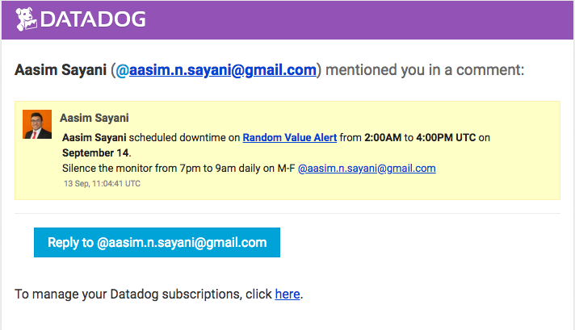
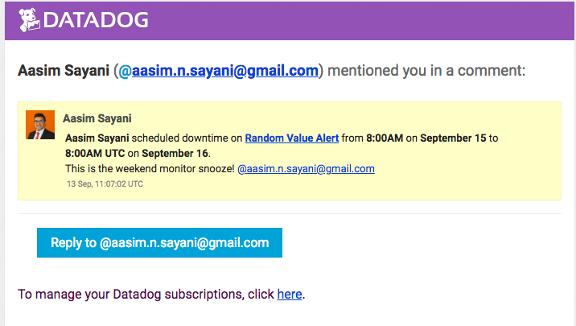

### Level 4 - Collecting APM Data 

>Answer: 

The Datadog APM provides application performance from automatically generated dashboards 
that will monitor key metrics. The first thing we will need to do is configure the Datadog Agent
YAML configuration file. 
        - First, open your terminal and navigate to the directory containing the Datadog Agent 
        - After you have arrived at the agent open the directory in a text editor 
        - Next, you will need to edit the 'datadog.yaml' file 
        - Once you are in the 'datadog.yaml' file you will uncomment the 'apm_config' as well as 
          change the enabled section to 'true' that way we have enabled this configuration.
        - The next step would be to go to the 'apm.yaml.default' file within the Datadog Agent
          and uncomment the instances as well as the bin path 
        - You will need the path in the apm.yaml.default to point towards the 
          'datadog.yaml' file (i.e. /opt/datadog-agent/etc/datadog.yaml)

Next, you will need to go to the documentation based upon the scripting language you will utilize. You will receive the respective commands that are necessary to install ddtrace which will trace the application which you would like data on. Also, ddtrace acts like a middleware so the documentation suggests either utilizing middleware or using ddtrace with the agent. Now, since you will be using a virtual environment that was previously setup you will not deal with dependency issues. Now, for this example Python is the utilized scripting language. Though you will need to install and configure 'pip' which is a package manager for Python. Furthermore, if you require assistance with installing this package manager utilize this link (https://pip.pypa.io/en/stable/installing/) and follow the steps as instructed within your terminal. Now, once you have installed 'pip' use the command 'pip install ddtrace'. After the installation of 'ddtrace' you can utilize the command 'ddtrace-run python <nameofapp.py>' and this will execute the file while also simultaneously running the metrics using the agent via the APM integration previously setup.  

Finally, if you face some dependency challenges with the previous steps along with your application being in flask you may need to create a separate virtual environment such as the one listed in the flask documentation called virtualenv (http://flask.pocoo.org/docs/1.0/cli/#environment-variables-from-virtualenv) , as well as confirm that the application is actively being executed while ddtrace is running.    

>Note: This was definitely very interesting to complete. I definitely found this to be the most challenging to configure on macOSX, and I think having to run the Trace Agent in a virtual environment was the rewarding part because initially I thought I could run it on my local machine.
I was able to collect metrics and connect the ddtracer with the APM agent, and even though I had configured the APM YAML file to be activated this took a few extra steps. The first trying to install to ddtrace into the local machine and setup a path for this, and it kept denying me permission. Finally, I followed along using flask's tutorial to setup a virtual environment and run the flask application. After running the APM, I was unable to get the data to load into the dashboard I would try to setup a new dashboard and graph the APM events but the loading symbol would come up and stay on for several minutes. When, I checked the Collectors in the GUI I was able to see that the apm was setup and collecting metrics. I wanted just a simple 'hello world' with an integer of 1 to be collected, but it would not display this. 

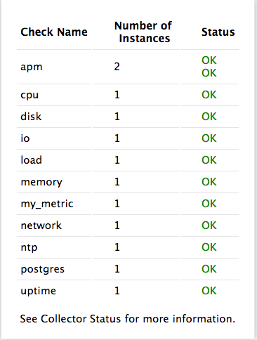
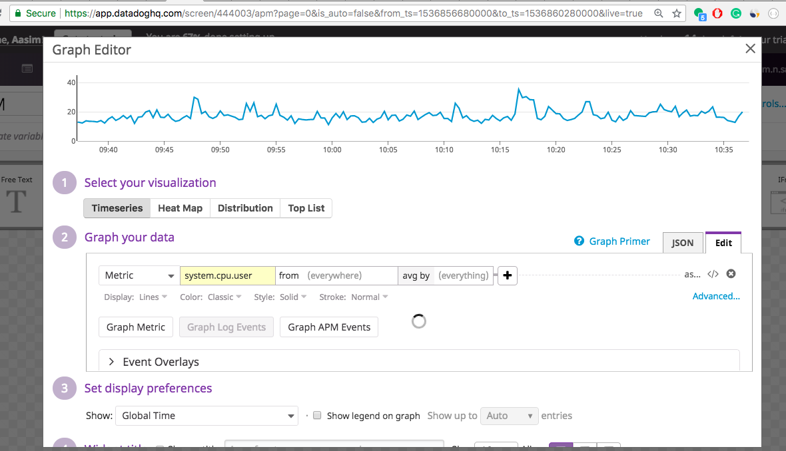
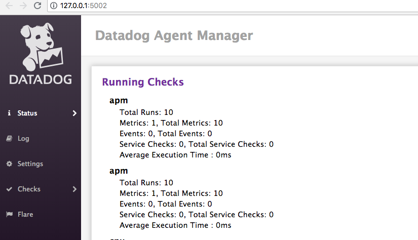
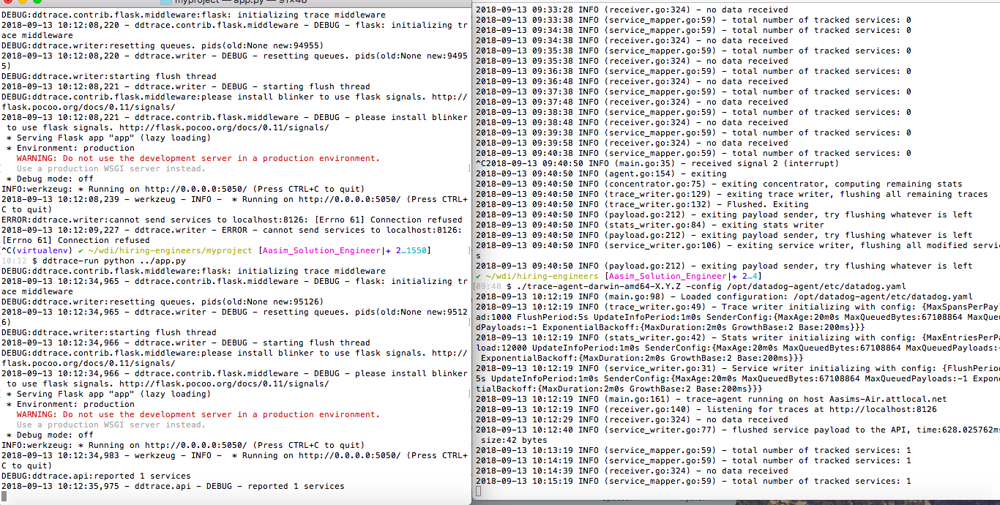
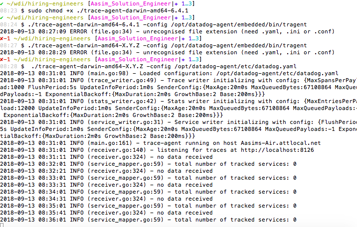

Bonus Question: What is the difference between a Service and a Resource?

>Answer: A service would be like a function or performing a particular operation whereas a resource would be like a piece of data or JSON object.You can look at your web browser as a service: you give it facebook.com and then it returns you a resource (an HTML response). 

Links: 
    - (Custom Metric, Anomalies, and Rollup Dashboard) https://app.datadoghq.com/dash/914672/custom-metrics-rollup-and-anomalies?live=true&page=0&is_auto=false&from_ts=1536858055309&to_
    ts=1536861655309&tile_size=m&fullscreen=false
    - (PostgreSQL Dashboard) https://app.datadoghq.com/dash/integration/17/postgres---metrics?live=true&page=0&is_auto=false&from_ts=1536858163747&to_ts=1536861763747&tile_size=m

### Final Question 
Is there anything creative you would use Datadog for?

>Answer: Absolutely, I would love to use Datadog to do analysis on blockchain technologies. I feel that the efficacy of Solidity contracts as well as working to see how gas fees influx due to increase in resources (i.e. miners) would be really interesting. Seeing how the backend or devop technologies in the Blockchain world could really help find the inequities within the system as well as solve inefficiences relatively quickly, plus it would increase business value for a lot of blockchain projects that are struggling to have analytics on which of their tech is taking over their development. Another place I thought it would be very intersting to use Datadog would be to monitor hospital bed availability or ER wait times because I know that often people travel long distances to find that they are trapped without the resources they need, as well as using the montoring to increase overall effectiveness in the healthcare system. 

## Instructions
If you have a question, create an issue in this repository.

To submit your answers:

1. Fork this repo.
2. Answer the questions in `answersAasim.md`
3. Commit as much code as you need to support your answers.
4. Submit a pull request.
5. Don't forget to include links to your dashboard(s), even better links *and* screenshots.  We recommend that you include your screenshots inline with your answers.

## References

### How to get started with Datadog

* [Datadog overview](http://docs.datadoghq.com/overview/)
* [Guide to graphing in Datadog](http://docs.datadoghq.com/graphing/)
* [Guide to monitoring in Datadog](http://docs.datadoghq.com/guides/monitoring/)

### The Datadog Agent and Metrics

* [Guide to the Agent](http://docs.datadoghq.com/guides/basic_agent_usage/)
* [Writing an Agent check](http://docs.datadoghq.com/guides/agent_checks/)

### Other questions:
* [Datadog Help Center](https://help.datadoghq.com/hc/en-us)

