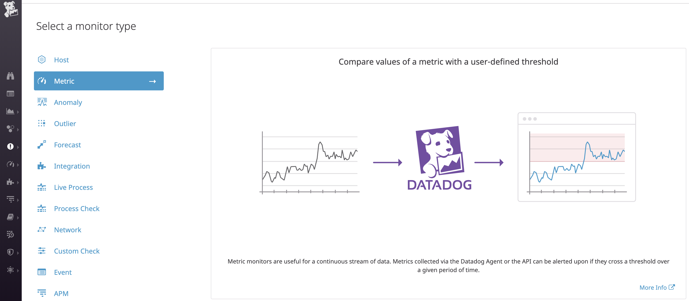

# The Challenge

## Questions

### - Setup an Ubuntu VM

* While it is not required, we recommend that you spin up a fresh linux VM via Vagrant or other tools so that you don't run into any OS or dependency issues. [Here are instructions for setting up a Vagrant Ubuntu 12.04 VM.](https://www.vagrantup.com/docs/getting-started/)

>Answer: I am using macOS High Sierra Version 10.13.3 for this challenge, and I have installed VM via Vagrant, as well.


### Level 1 - Collecting Metrics

* Sign up for Datadog (use "Datadog Recruiting Candidate" in the "Company" field), get the Agent reporting metrics from your local machine.

>Answer: Website Url to create account: https://app.datadoghq.com/account/login?next=%2F


>Once you have logged in then you are prompte to install the DataDog Agent, and I utilized the macOS integration. 

> The command for installing DataDog was 
<!-- DD_API_KEY=ba43f5ff300b9342eb4d993e32500157 bash -c "$(curl -L https://raw.githubusercontent.com/DataDog/datadog-agent/master/cmd/agent/install_mac_os.sh)" -->


* Add tags in the Agent config file and show us a screenshot of your host and its tags on the Host Map page in Datadog.

>Answer: Within the terminal change your directory to the DataDog Agent by typing _cd ~/.datadog-agent_ , then I used my text editor to make changes to the configuration file (datadog.yaml). 


Refresh your DataDog page, and use the navigation bar to go to the Infrastructure tab followed by the Host Map, and here you should be able to see your tags if you search in the "Filter By" column.


* Install a database on your machine (MongoDB, MySQL, or PostgreSQL) and then install the respective Datadog integration for that database.

>Answer: I utilized PSQL database integration as an example for this part of the excercise. 

>Initially, I went to the Integrations tab and there I was able to see the configurations needed to integrate the DataDog Agent with PostgreSQL. 


>Create a read-only datadog user with proper access to your PostgreSQL Server.

```
create user datadog with password 'Given By DataDog';
grant SELECT ON pg_stat_database to datadog;
```
>Configure the Agent to connect to the PostgreSQL server 
>Edit _conf.d/postgres.yaml_


>You need to restart the agent in order for the integration to take place. 

>I ran a test using 'datadog-agent check postgres', and it gave me confirmation that the integration was working correctly.


>Followed by this I checked on the dashboard within DataDog and was able to confirm that the PSQL metrics were displaying


* Write a custom Agent check that samples a random value. Call this new metric: `my_metric`

>Answer: Both of these check files will need to be placed in two directories. First, we will need to navigate into the datadog agent directory. There we will need to add a my_metric.py for our check followed by a yaml file in the conf.d. 

> First we would place a file within the Checks directory in Datadog (~/.datadog-agent/checks.d). 

```
from random import randint
random_number = randint(0,1000)
print random_number

from checks import AgentCheck
class RandomCheck(AgentCheck):
    def check(self, instance):
        self.gauge('my_metric', random_number)

```

>Second the other directory which we would be placing the YAML file in would be the Conf.d or the configuration portion where there would also be explicit instances being described. I understood that we could add minimum intervals here but it was quite challenging. Unfortunately, my instances area often would give me an error. (~/.datadog-agent/conf.d/my_metric.yaml)

```
init_config:
instances:
    [{}]
```


Bonus Question: Can you change the collection interval without modifying the Python check file you created?

>Answer: I thought about iterating over an array within the Python portion and having a time.sleep(45) in order to only have a value display every 45 seconds but this seems to be the only solution for this. I see the min_interval within the YAML file in instances but on the docs it says that this is not necessarily utilized to have the Agent collect every 45 seconds. 

### Level 2 - Visualizing your Data

* Utilize the Datadog API to create a Timeboard that contains:

Your custom metric scoped over your host.
Any metric from the Integration on your Database with the anomaly function applied.
Your custom metric with the rollup function applied to sum up all the points for the past hour into one bucket


>Answer: This part was interesting I found it quite straight forward to map the Timeboard 
over the host, and if you look in initializeTimeboard3.curl it shows the CURL commands I used to initiate the Timeboard. The next portion I tackled was the rollup function applied to the sum of allpoints I utilized the following requests within the graph. 

{
  "requests": [
    {
      "q": "avg:my_metric{*}.rollup(sum, 60)",
      },
      "conditional_formats": []
    }
  ],
}

> Finally, I applied the anonmaly function to the PSQL Row's Returned metric. I was able to do this with the following query. 

{
  "requests": [
    {
      "q": "avg:my_metric{*}.rollup(sum, 60)",
      },
      "conditional_formats": []
    }
  ],
}


Once this is created, access the Dashboard from your Dashboard List in the UI:
Set the Timeboard's timeframe to the past 5 minutes
Take a snapshot of this graph and use the @ notation to send it to yourself.

The Timeboard's timeframe is set to 5 minutes, and it is displaying the correct metrics. 
Regarding the snapshot of the graph, I have went into the share tab within the graph and created 
embedded code, as I could not find the @ notation to send it to myself. I have provided the code below:

<iframe src="https://app.datadoghq.com/graph/embed?token=259c7d8e2e1ca75617b9351f5102af8144898c8790f9e301117ff334baf3b9ea&height=300&width=600&legend=false" width="600" height="300" frameborder="0"></iframe>


* Bonus Question: What is the Anomaly graph displaying?

>Answer: The anomaly graph is displaying the predictable patterns within the graph. Though anomaly 
detection requires a large amount of data in order to function.  If we look specifically 
at the anomalies within the graph for my_metric we can see the gray background which is beginning to display the anomalies, but as the data grows the trends could change. 

 
### Level 3 - Monitoring Data

Create a new Metric Monitor that watches the average of your custom metric (my_metric) and will alert if it’s above the following values over the past 5 minutes:

Warning threshold of 500
Alerting threshold of 800
And also ensure that it will notify you if there is No Data for this query over the past 10m.




Bonus: I went on tab for Managing Downtime for Monitors and I was able to configure the alerts for the weekdays between 7:00pm and 9:00am, as well as turning the monitor off for the weekend. 


### Level 4 - Collecting APM Data 

>Answer: This was definitely very interesting to complete. I definitely found this to be the most challenging to configure on macOSX, and I think having to run the Trace Agent in a virtual environment was the rewarding part because initially I thought I could run it on my local machine.
I was able to collect metrics and connect the ddtracer with the APM agent, and even though I had configured the APM YAML file to be activated this took a few extra steps. The first trying to install to ddtrace into the local machine and setup a path for this, and it kept denying me permission. Finally, I followed along using flask's tutorial to setup a virtual environment and run the flask application. After running the APM, I was unable to get the data to load into the dashboard I would try to setup a new dashboard and graph the APM events but the loading symbol would come up and stay on for several minutes. When, I checked the Collectors in the GUI I was able to see that the apm was setup and collecting metrics. I wanted just a simple 'hello world' with an integer of 1 to be collected, but it would not display this. 


Bonus Question: What is the difference between a Service and a Resource?

>Answer: A service would be like a function or performing a particular operation whereas a resource would be like a piece of data or JSON object.You can look at your web browser as a service: you give it facebook.com and then it returns you a resource (an HTML response). 

Links: 
    - (Custom Metric, Anomalies, and Rollup Dashboard) https://app.datadoghq.com/dash/914672/custom-metrics-rollup-and-anomalies?live=true&page=0&is_auto=false&from_ts=1536858055309&to_
    ts=1536861655309&tile_size=m&fullscreen=false
    - (PostgreSQL Dashboard) https://app.datadoghq.com/dash/integration/17/postgres---metrics?live=true&page=0&is_auto=false&from_ts=1536858163747&to_ts=1536861763747&tile_size=m

### Final Question 
Is there anything creative you would use Datadog for?

>Answer: Absolutely, I would love to use Datadog to do analysis on blockchain technologies. I feel that the efficacy of Solidity contracts as well as working to see how gas fees influx due to increase in resources (i.e. miners) would be really interesting. Seeing how the backend or devop technologies in the Blockchain world could really help find the inequities within the system as well as solve inefficiences relatively quickly, plus it would increase business value for a lot of blockchain projects that are struggling to have analytics on which of their tech is taking over their development. Another place I thought it would be very intersting to use Datadog would be to monitor hospital bed availability or ER wait times because I know that often people travel long distance to find that they are trapped without the resources they need, as well as using the montoring to increase overall effectiveness in the healthcare system. 

## Instructions
If you have a question, create an issue in this repository.

To submit your answers:

1. Fork this repo.
2. Answer the questions in `answersAasim.md`
3. Commit as much code as you need to support your answers.
4. Submit a pull request.
5. Don't forget to include links to your dashboard(s), even better links *and* screenshots.  We recommend that you include your screenshots inline with your answers.

## References

### How to get started with Datadog

* [Datadog overview](http://docs.datadoghq.com/overview/)
* [Guide to graphing in Datadog](http://docs.datadoghq.com/graphing/)
* [Guide to monitoring in Datadog](http://docs.datadoghq.com/guides/monitoring/)

### The Datadog Agent and Metrics

* [Guide to the Agent](http://docs.datadoghq.com/guides/basic_agent_usage/)
* [Writing an Agent check](http://docs.datadoghq.com/guides/agent_checks/)

### Other questions:
* [Datadog Help Center](https://help.datadoghq.com/hc/en-us)

