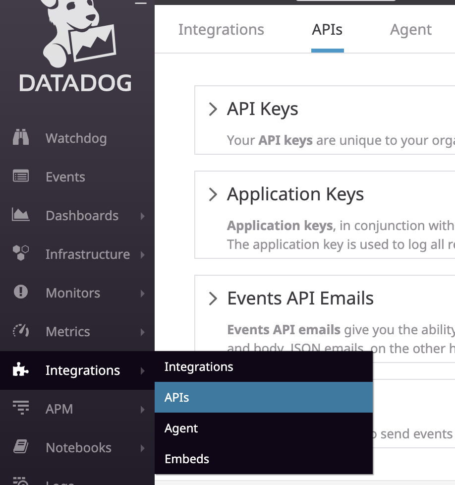
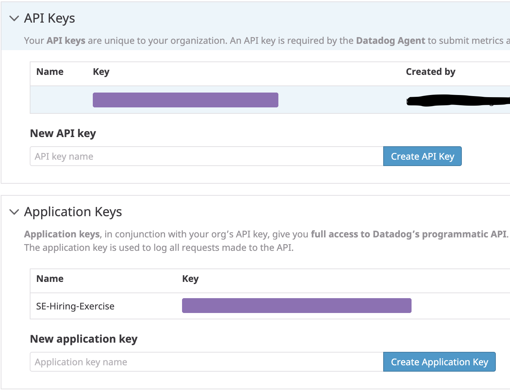
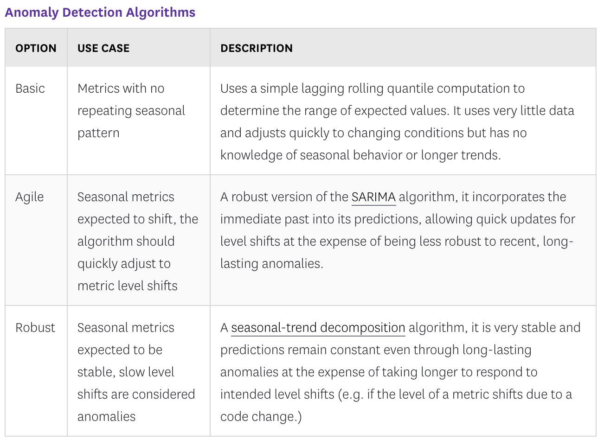
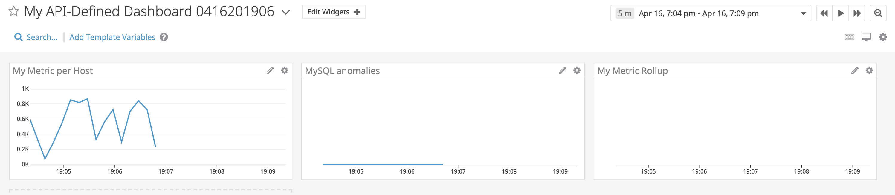

Datadog offeres a lot of modern APIs for accessing and modifying the Datadog backend programmatically. Let's look at a couple of basic calls.

# Datadog APIs

Let's take a look at a sample API call that creates a dashboard with:

1.) The custom metric we created earlier scoped over the host we're running.
2.) A metric from the Integration on the Database we set up with the anomaly function applied.
3.) The custom metric with the rollup function applied to sum up all the points for the past hour into one bucket.

[Here is a bash script](./api_call.md) that does all of the above.

We can get both the `api_key` and `app_key` that we use on the first two lines from the `Integrations` menu item. Here's a screenshot:



From the account settings page, you have to create a key for both the API and the application. This allows you granular control over which applications have access to different APIs.



The first thing to notice in the call to `curl` are the widgets. The widgets attribute in our API call takes a comma separated array of widgets that will be displayed. This is the meat of the call. Here we define each of the widgets we want to display. I simplified things a bit by using the `timeseries` widget for all three of items listed above we're adding to the dashboard.

The first widget ends up looking like this:

```javascript
       {
			"definition": {
				"type": "timeseries",
				"requests": [{
					"q": "avg:my_metric{host:ramy.abdelazim}"
				}],
				"title": "My Metric per Host"
			}
		}
```

You can see this is a pretty straightforward snippet of JSON. The meat of this is in the `requests` attribute which takes a comma separated array of queries. Here you can see that the query is pretty simple and takes the form of `metric_name{scope}` where metric name here is the name of the custom metric we created earlier and `hostname` is the tag we created earlier and `ramy.abdelazim` is the value assigned to that tag.

Let's have a look at the third widget next where we use the rollup feature. Everything remains identical except the title (which I've used "My Metric Rollup" for the value) the query, `q` (within the '`requests` array) so let's take a look at that query: The query looks like this:

`"q": "sum:my_metric{host:ramy.abdelazim}.rollup(sum, 3600)"`

Here we can see the query is a little more complex. First we sum the metric, scoped over the same hostname and then apply the rollup feature using the sum function in buckets of 1 hour (in seconds). This gives you the sum of the metric in buckets of one hour.

Lastly, let's look at the second widget. Again everything is identical except the title (this time "MySQL anomolies") and the query. Here's that query:

`"q": "anomalies(mysql.innodb.rows_read{*}, \"basic\", 2)"`

There's obvoiusly more going on here but when broken down, the strange syntax isn't so bad. first all our query is doing is applying the `anomolies` function which needs a metric to apply to, a type of anomoly detection to use (`basic`, `agile` or `robust`) and lastly the bounds (an integer from 1-6).

The difference between each of the anomoly detection functions can be found [here](https://docs.datadoghq.com/monitors/monitor_types/anomaly/#anomaly-detection-algorithms):


The basic algorithm is just a moving average that's commonly found on any analysis of timeseries data. This algorithm allows for smoothing of the average line. The longer the moving window, the smoother the line becomes, but the less granular it is. The shorter the window, the more representative of the moment the line becomes but is more affected by any one value.


Finally, using the above API call will result in a dashboard that looks like this:


[Previous: Create a Custom Check](./custom_check.md)  |  [Next: Monitors](./monitors.md)
