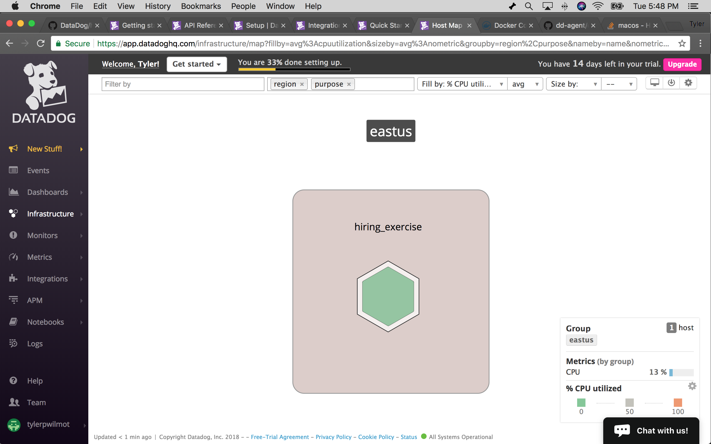
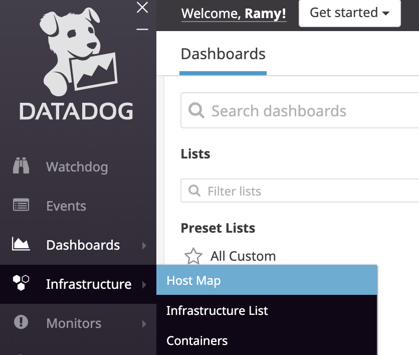
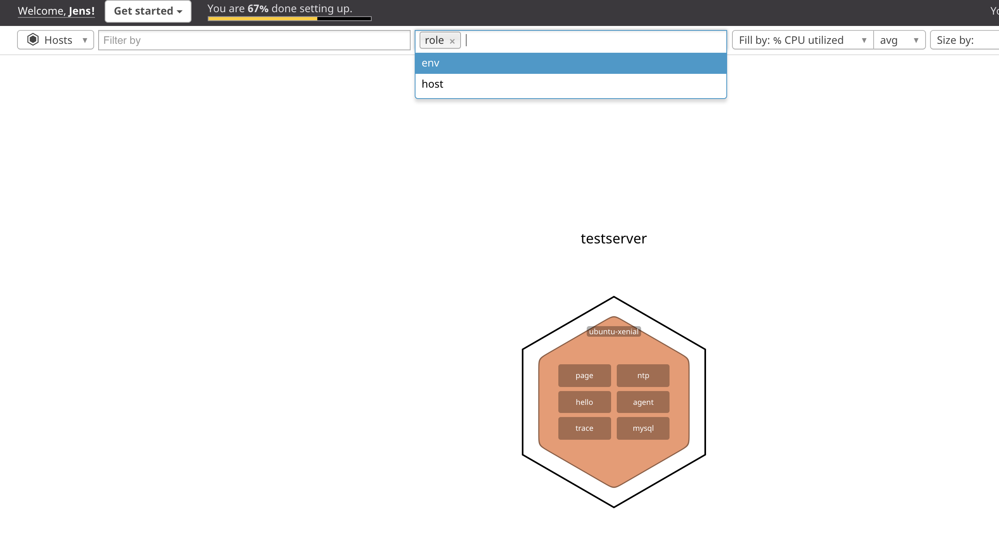

# Collecting Metrics


First and foremost, Datadog is a metrics collection tool. Everything else flows from the data that you've collected. So let's start by collecting some data!

In order to slice up our data in different ways, we'll use [tagging](https://docs.datadoghq.com/tagging/). The tags that come out of the box are as follows:


It's worth looking over the [guidelines for leveraging tags](https://docs.datadoghq.com/tagging/#defining-tags) but you don't need to read that to get started.

#### Add tags in the Agent config file and show us a screenshot of your host and its tags on the Host Map page in Datadog.

So let's for fun add some of our own tags. To add tags, we'll put them into our `datadog.yaml` file which lives at `/etc/datadog-agent/datdog.yaml` on Ubuntu systems. For other operating systems, check the [configuration section](https://docs.datadoghq.com/agent/basic_agent_usage/ubuntu/?tab=agentv6v7#configuration) for your particular OS.

Here's how I've added my tags to the bottom of my yaml file:

```
hostname: ramy.abdelazim
tags:
        - "installation_method:vagrant"
        - "installation_type:basic"
        - "operating_system:ubuntu"
        - "version:1"
```

After adding this to your agent configuration, log in to the datadog site and you'll be able to see that the tags have been added to your host by going to the [host map](https://app.datadoghq.com/infrastructure/map).




Here's what mine looks like:


---------------------------------------------------------------------------------------------------------------------------------------------------------------------------

[Next: Install a database and monitor it](./database.md)
