# Customer Answer - Solutions Engineer

### Phone Greeting
Hi there Customer ! My name is Ben and I'm a Solutions Engineer here at Datadog. How can I be of assistance for you today?

### Prerequisites - Setting up the Environment
----
##### Docker Attempt: 
I started to try and have the Docker container running, however this would take more than 1+ hours to configure. This link [here](docker.md) is a detailed process of my thinking and debugging. 

##### Python VirtualEnv: 
This was the traditional way that I used to finish the solutions engineering challenge. Please refer to the BEN_BASUNI_solutions_engineer branch located [here](https://github.com/stampedethegoat/hiring-engineers/tree/BEN_BASUNI_solutions_engineer) for my original submission.  
Here are the steps that I took to set up the Python virtual environment. 


Running virtualenv . got me up and running! And just like that I have a container in my local mac OS X for this repo. 

##### Signing up for DataDog: 
So I signed up for DataDog 2 weeks ago since I first did this challenge, June 2nd, I am assuming that most people will be able to sign in. So here's the signup page and my login below. I just went to datadog.com and signed up! Then it proceeded me to the login and the dashboard to where I am now! I will be more than happy to explain this to a customer if they have trouble!


#### Logged in! :D 
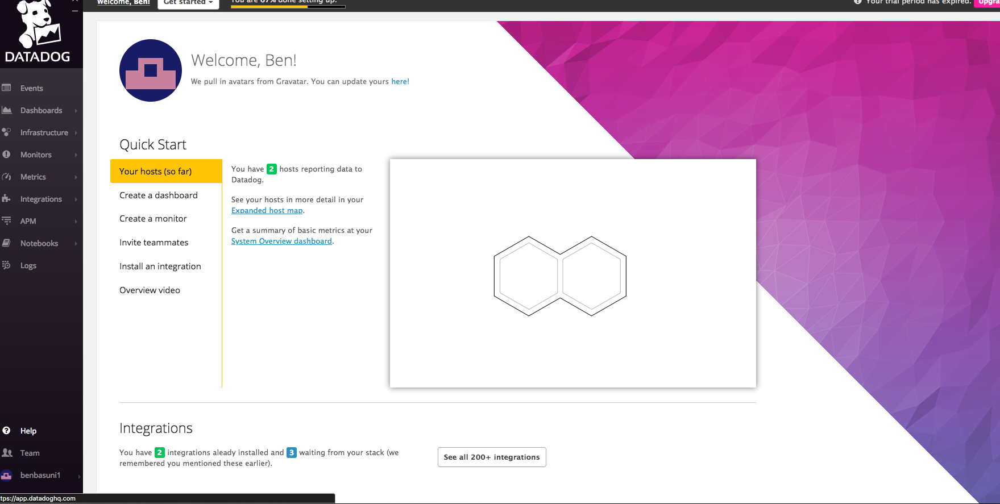

### Collecting Metrics:
---
##### Add tags in the Agent config file and show us a screenshot of your host and its tags on the Host Map page in Datadog.
So here, I needed to find the Agent config file first on my Mac, which is located in my root directory .datadog-agent/datadog.yaml. I found this out by going to this link. https://help.datadoghq.com/hc/en-us/articles/203037169-Where-is-the-configuration-file-for-the-Agent.  
Once I found the config file, I knew that all I needed to do was add the host and its tags on the config file, go to the dashboard on the datadog website and boom, I finished this step.


#### Edited the file below.


#### Hostmap Snapshot with Tags and custom hostname 


##### 2. Install a database on your machine (MongoDB, MySQL, or PostgreSQL) and then install the respective Datadog integration for that database.
I just googled how to install postgres on my mac with homebrew and stumbled upon this article. https://www.moncefbelyamani.com/how-to-install-postgresql-on-a-mac-with-homebrew-and-lunchy/. I followed the instructions there and ran psql on my terminal and this worked! I didn't take a picture of when I ran brew install postgresql, so I just ran brew upgrade postgresql instead and brew returned me an error because my postgres is already the latest version.
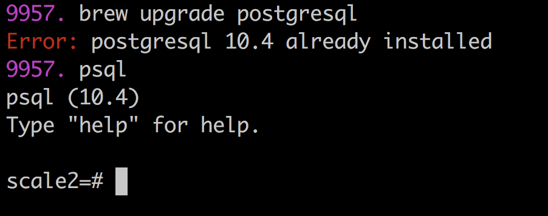

The next thing to do is setup the integration with Datadog. Here's what I did.  
I went to my dashboard on app.datadoghqa.com and clicked on Integrations. Then I proceeded to find PostgresQL and click +Available button and install it.
This is a picture of my current state. I installed Docker earlier as well! Again, I am more than happy to share this thought process with a customer. 


#### In addition, I also went through the configuration steps below to get my psql setup.
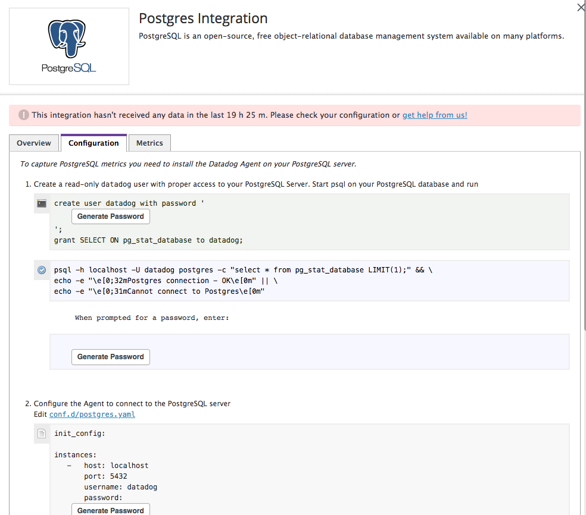

#### Also did a check with datadog-agent to confirm that everything went perfectly fine and that my psql is connected. The reason why it says that I haven't received data in the past 19hr and 25 mins is because my datadog trial ended :(. But now I completed step 2 of connecting a postgres database with Datadog


#### 3. Create a custom Agent check that submits a metric named my_metric with a random value between 0 and 1000.
So for this step, this link https://docs.datadoghq.com/developers/agent_checks/  was extremely helpful. 
Specifically the Configuration part. I took a picture below.
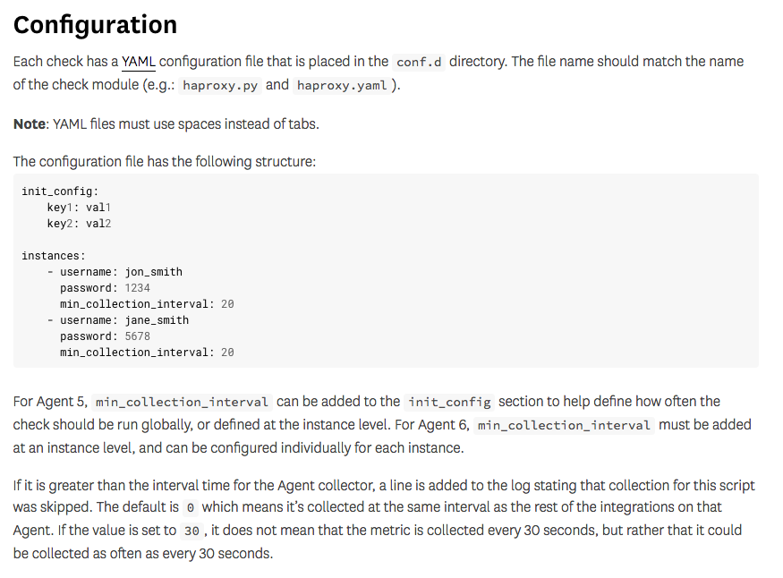

It not only taught me that each YAML config file is placed in the conf.d directory, I knew that it needed to have matching names in the example: haproxy.py and haproxy.yaml 

So I proceeded to go to the configuration files from the knowledge that I have from the collecting metrics section. https://help.datadoghq.com/hc/en-us/articles/203037169-Where-is-the-configuration-file-for-the-Agent.. Once I went to that directory, I created a my_metric.py & my_metric.yaml file down below.

### Picture below shows how I went into my terminal and configured the files in the respective places based on the documentation from Datadog.
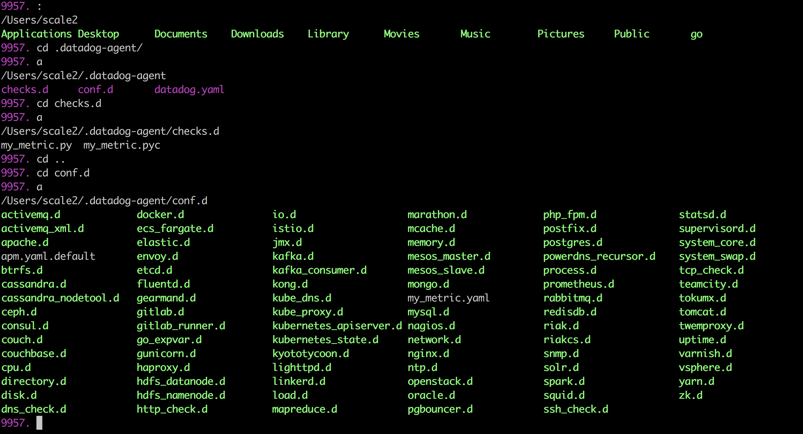

##### 4. Change your check's collection interval so that it only submits the metric once every 45 seconds.
For this, I just continued reading the "Configuration" documentation above and the answer was there. Instances: - min_collection_interval and it worked!


#### 5. Bonus Question Can you change the collection interval without modifying the Python check file you created?
Yes, the answer is right above this question! Just implemented min_collection_interval to 45 seconds.


### Visualizing Data:
##### Utilize the Datadog API to create a Timeboard that contains:
I just googled Datadog API and got taken to this link. https://docs.datadoghq.com/api/  
Then, I went to the Timeboard API and tinkered around with it. I first created a simple Timeboard with one graph. One trouble/issue that I did encounter was that the API for deleting a Timeboard wasn't straight forward. I ultimately figured that I could do a DELETE with the Timeboard ID as one of the parameters. 

I used Postman and used this link datadoghq.com/hc/en-us/articles/115002182863-Using-Postman-With-Datadog-APIs. Below are picture of the steps that I took.


Get all Timeboards
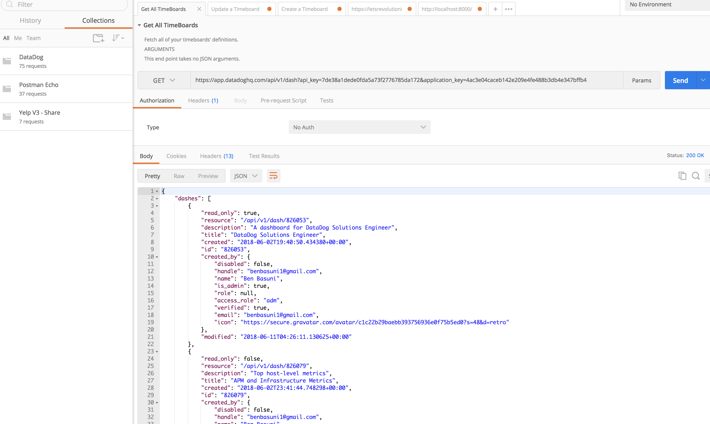

Once I can get all the Timeboard IDs, I just do a DELETE request to delete the timeboard that I didn't need. This was something that was not in the API documentation. 
I clicked GET Timeboard from postman, and then I replaced the ID of the Timeboard that I want to delete and press SEND. Below is a picture returning a 204.

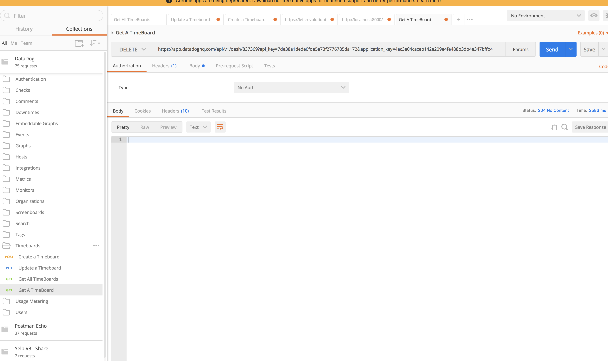

I got the ID from selecting Get All Timeboards.

Creating a Timeboard was pretty straightforward because once I followed the steps importing Datadog_postman_collection_redacted.json, I just basically copy pasted what was in the API and I used Postman to do a POST request.
Here's a picture.
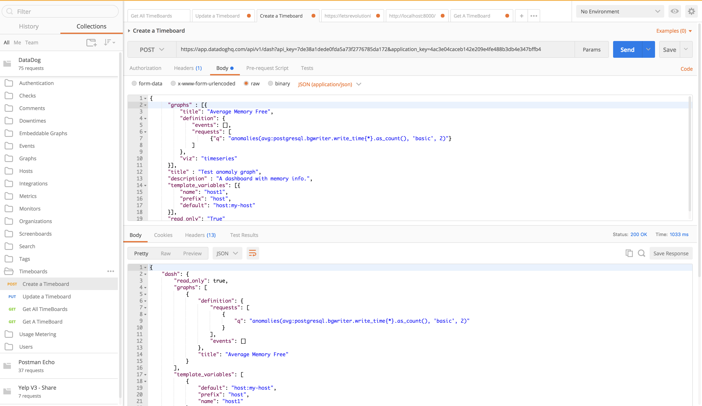


#### API Documentation page from Datadog
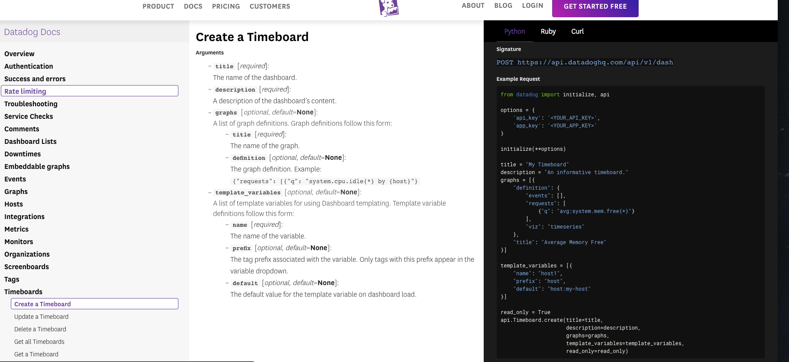

That's how I did it! Then, I proceeded to write a python script to actually create the timeboard instead of doing it in Postman.

I got all 3 of the items below from going into the Dashboard UI and copy pasting the code that was generated for each one.  
[x] Your custom metric scoped over your host.  
[x] Any metric from the Integration on your Database with the anomaly function applied.  
[x] Your custom metric with the rollup function applied to sum up all the points for the past hour into one bucket

Here is a picture. 
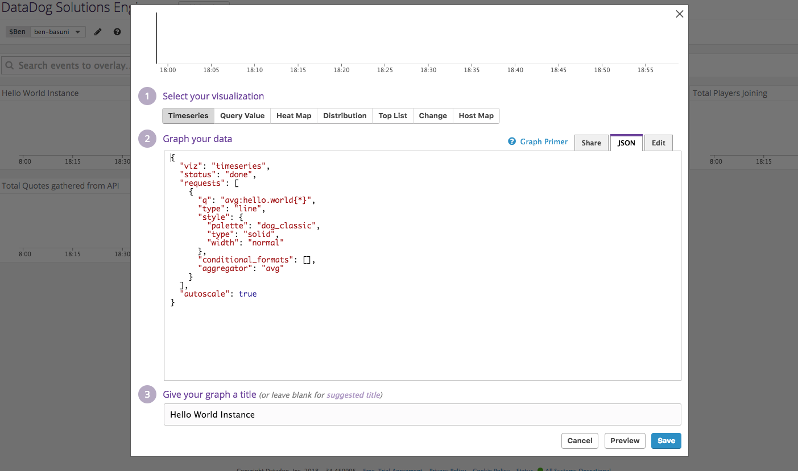

This JSON code combined with the API documentation from Datadog allowed me to create the script.
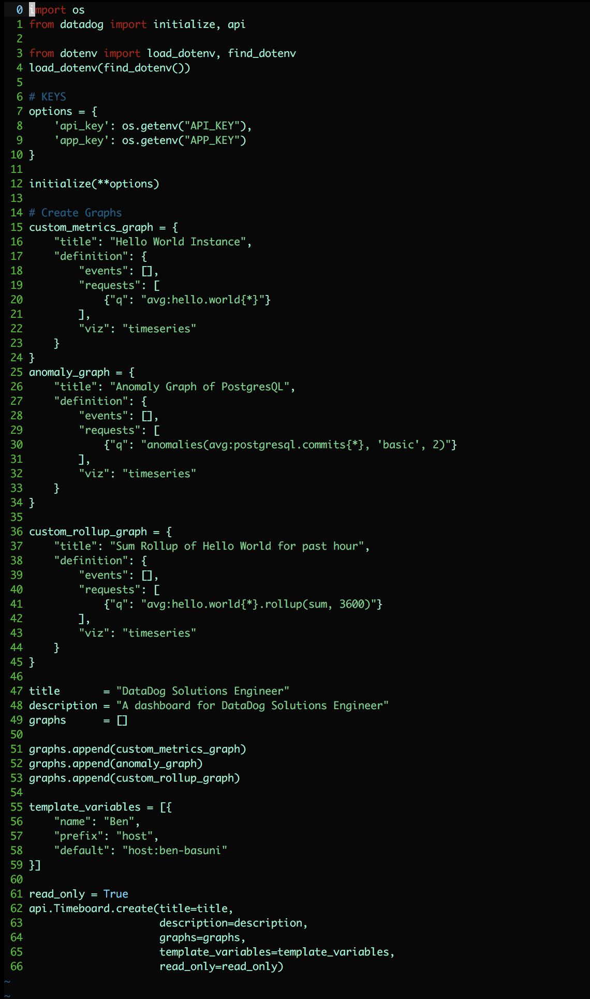
##### Please be sure, when submitting your hiring challenge, to include the script that you've used to create this Timeboard.
Here is the [code](timeboard.py).

##### Once this is created, access the Dashboard from your Dashboard List in the UI:
Below is a picture of me accessing the Dashboard from the Dashboard List in the UI! 
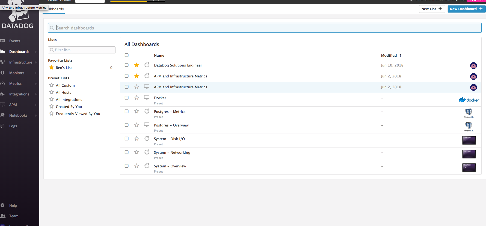


#### Seeing the Timeboards that I created from timeboard.py!


##### Take a snapshot of this graph and use the @ notation to send it to yourself.
##### Set the Timeboard's timeframe to the past 5 minutes

##### Bonus Question: What is the Anomaly graph displaying?
**Answer: The Anomaly graph reveals the anomalies that happens when pSQL database makes commits.**

### Monitoring Data  
---
This portion helped me to learn what I did setting up Agent Checks in the yaml and py file in section 1 Collecting Metrics.
##### Since you’ve already caught your test metric going above 800 once, you don’t want to have to continually watch this dashboard to be alerted when it goes above 800 again. So let’s make life easier by creating a monitor.  
I just googled "How to alert in datadog" and got taken here https://docs.datadoghq.com/monitors/

In particular the "Creating a Monitor" helped, then I proceeded to go to the "Notification" section under Alerting. https://docs.datadoghq.com/monitors/notifications/  

Here's a snapshot of the most helpful place I saw in the documentation.
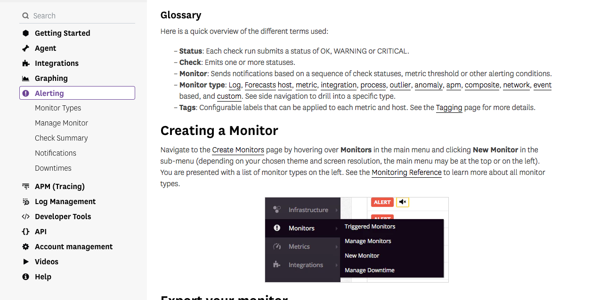

#### Notifications Page


##### Create a new Metric Monitor that watches the average of your custom metric (my_metric) and will alert if it’s above the following values over the past 5 minutes:  

[x] Warning threshold of 500  
[x] Alerting threshold of 800  
[x] And also ensure that it will notify you if there is No Data for this query over the past 10m.  

##### Please configure the monitor’s message so that it will:
[x] Send you an email whenever the monitor triggers.  
[x] Create different messages based on whether the monitor is in an Alert, Warning, or No Data state.
[x] Include the metric value that caused the monitor to trigger and host ip when the Monitor triggers an Alert state.  
[x] When this monitor sends you an email notification, take a screenshot of the email that it sends you.

#### Here is a picture of how I created the new Metric Monitor for all the requirements above.
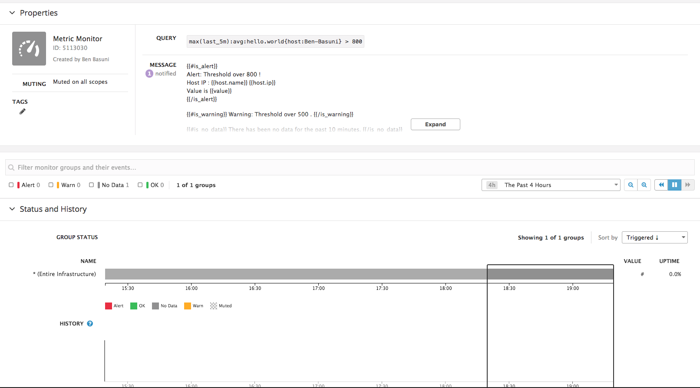

##### Monitor Alert Email
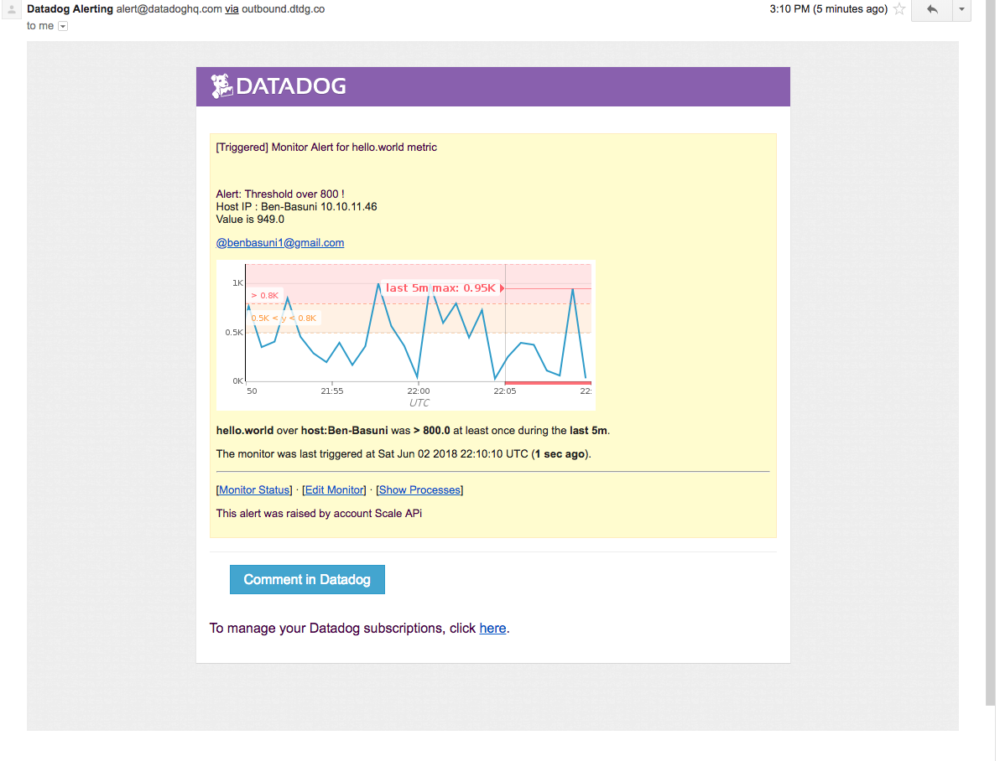

#### Another Monitor Alert


##### Bonus Question: Since this monitor is going to alert pretty often, you don’t want to be alerted when you are out of the office. Set up two scheduled downtimes for this monitor:

[x] One that silences it from 7pm to 9am daily on M-F,  
[x] And one that silences it all day on Sat-Sun.  
[x] Make sure that your email is notified when you schedule the downtime and take a screenshot of that notification.  

##### Downtime Notification


#### No Data for past 10 mins email


I want to just highlight that https://docs.datadoghq.com/monitors/notifications/ was helpful in getting past this portion.


### Collecting APM Data:
---
##### Given the following Flask app (or any Python/Ruby/Go app of your choice) instrument this using Datadog’s APM solution:

Please look at the BEN_BASUNI_solutions_engineer branch [here](https://github.com/stampedethegoat/hiring-engineers/tree/BEN_BASUNI_solutions_engineer) for my full application.   
I added 4 tracers onto the app.  

I had to run pip install -r requirements.txt to get my python app installed with all the dependencies. 
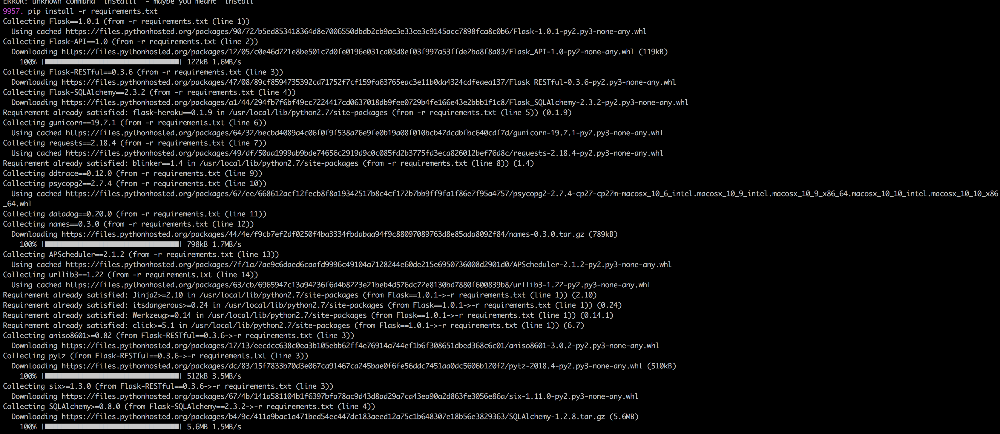

One bug/issue that I encountered was actually installing the tracer to be listened onto localhost:8126
My free trial ended so I had trouble regenerating the error. 

Here's a post from my Stack Overflow that had the same bug.
https://stackoverflow.com/questions/49699969/datadog-errorddtrace-writercannot-send-services-to-localhost8126-errno-111

I figured out how to get the tracer to 'trace' my calls from this post. https://github.com/DataDog/datadog-trace-agent/issues/397

In particular, this portion helped me with connecting the tracers. I installed an older version of dd-trace and ran the command that mateuspadua setup. 
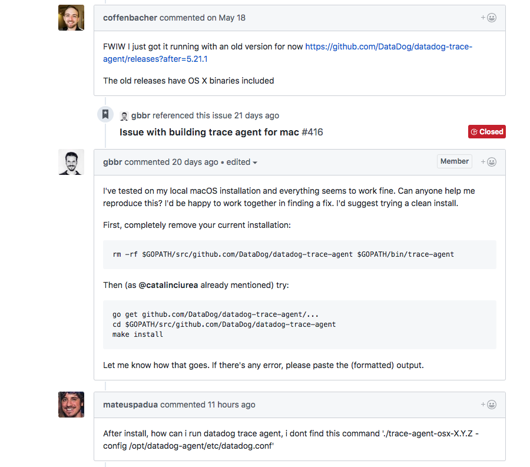


In my Bash Profile, I included this alias to have dd-trace run. 
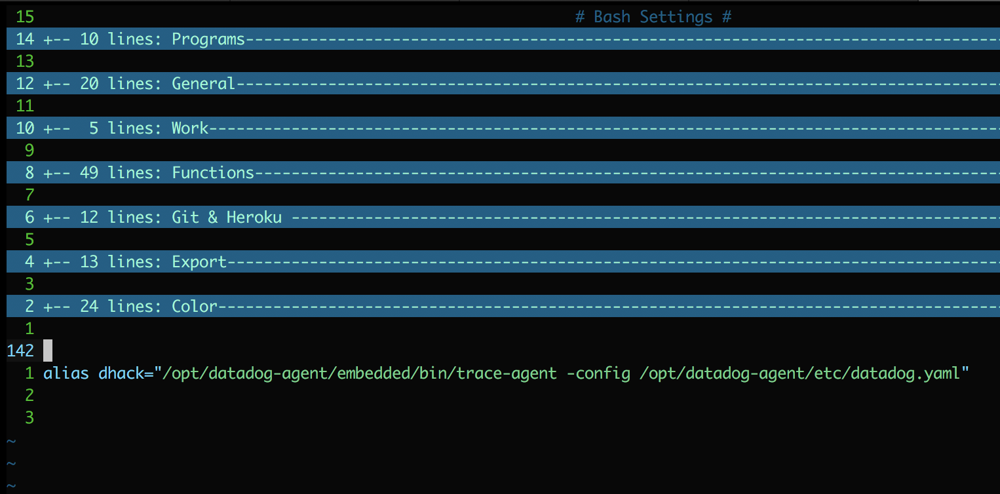

By running dhack on terminal with datadog-agent start. I have what I needed and got the tracers to work!
Below is a picture of my datadog-agent, the trace agent, and my python server working simultaneously.
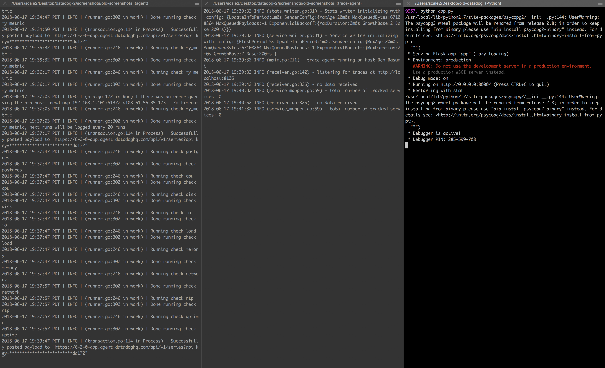

Bonus Question: What is the difference between a Service and a Resource?  
**Answer: A service is a process that does a job. This can be used to showcase a graph in Datadog. A service can be a database, webapp, API endpoint. A resource is an action of a service, such as a query to a database or an endpoint**

Provide a link and a screenshot of a Dashboard with both APM and Infrastructure Metrics.

#### APM and Infrastructure Metrics
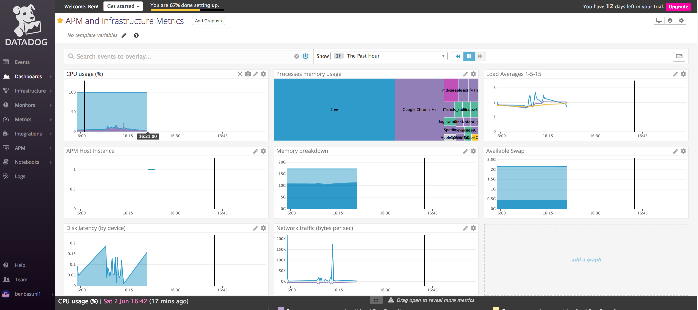

#### Application Metrics
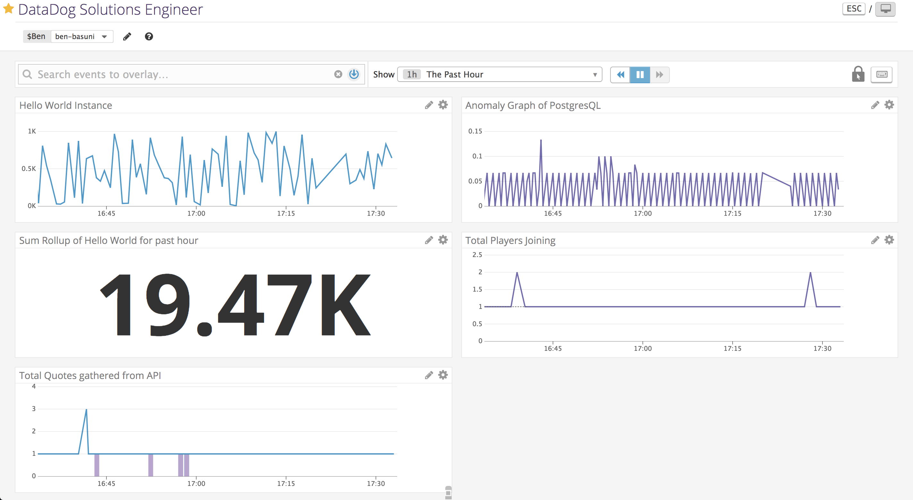

Please include your fully instrumented app in your submission, as well.


### Final Question
Datadog has been used in a lot of creative ways in the past. We’ve written some blog posts about using Datadog to monitor the NYC Subway System, Pokemon Go, and even office restroom availability!

Is there anything creative you would use Datadog for?  

```
1. Connect Datadog with Mobile Health apps 
         - Track running
         - Steps walked
         - Meditation duration during the day  
         
2. Use Datadog Metrics for Professional Sports   
    a. Basketball 
         - Distance ran
         - Times passed 
         - Defense vs offense duration 
         - Duration of what half they played on    
    b. Soccer 
         - Distance ran 
         - Times passed
         - Accuracy of passes
         
3. Income/Expense Chart Flow for personal and business use

4. Government usage such as traffic flow, DMV lines, etc

5. Personal gadget trackers (Raspberry PI) 
    - Temperature in the house
    - Water usage
    - Microwave/Electricity usage
    Also would be useful to send alerts if usage would go over a certain amount
    I also notice that there is already a DataDog Integration here
    https://docs.datadoghq.com/developers/faq/deploying-the-agent-on-raspberrypi/
```
# App Screenshots
  
  #### App Home Page
  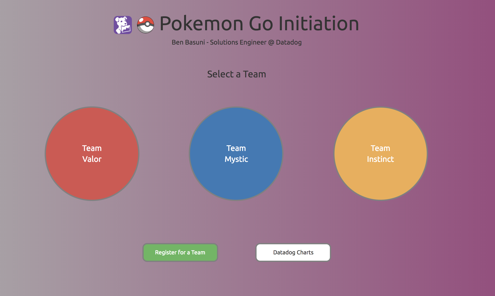

  #### Datadog Charts
  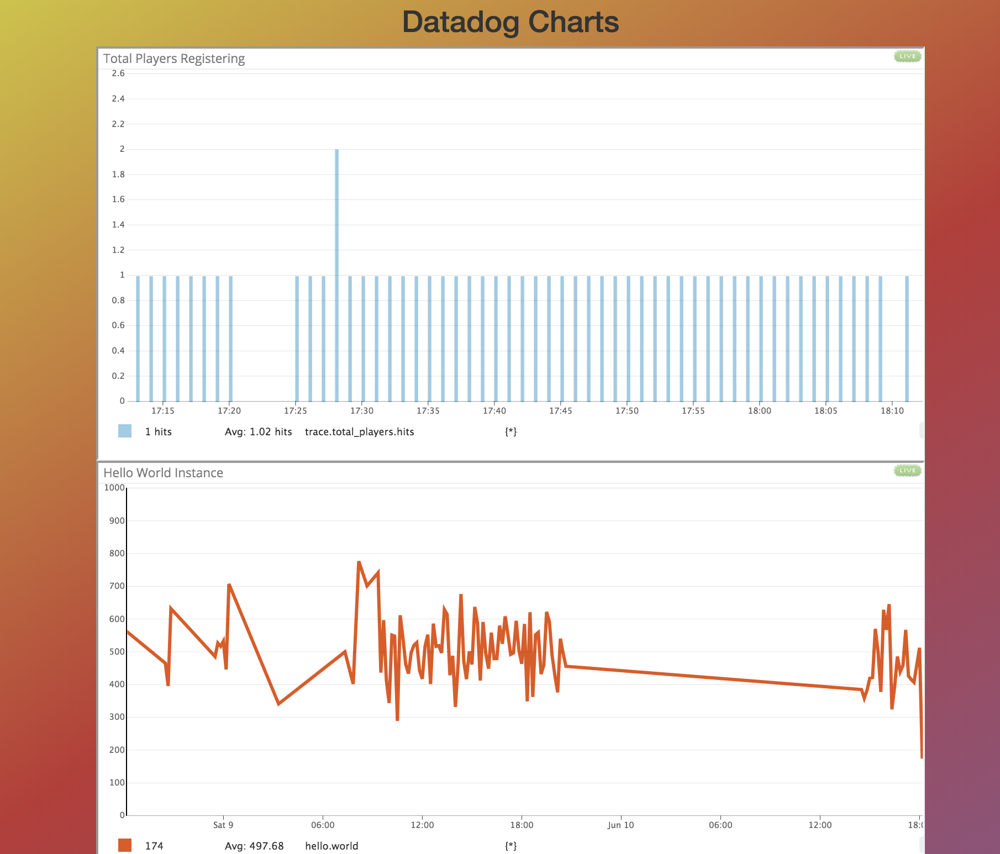

  #### Register for a Team
  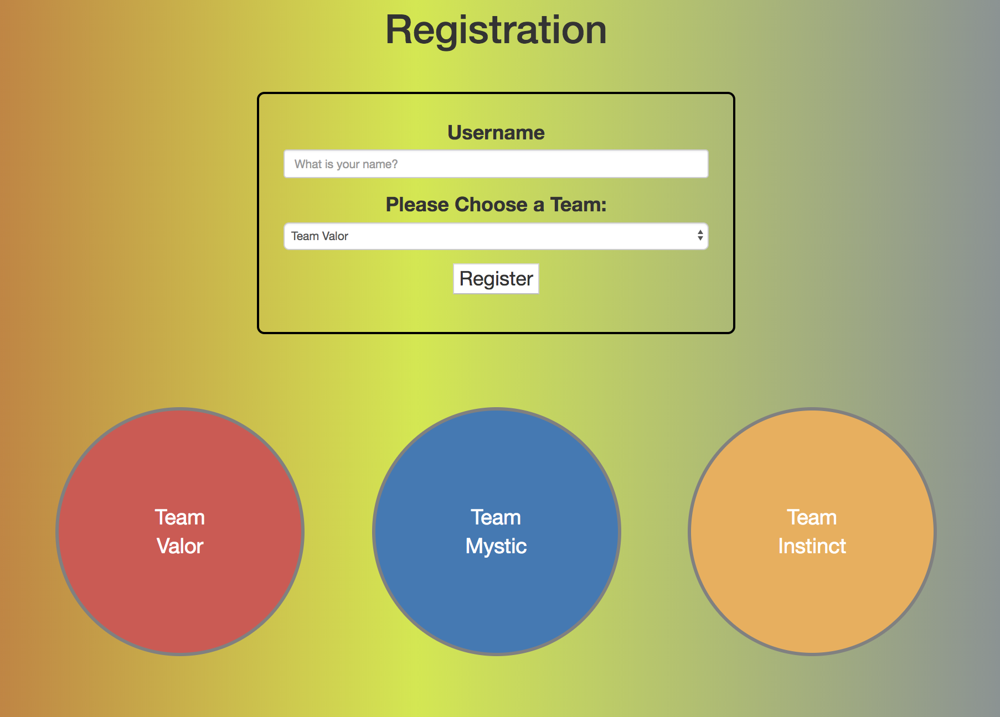

  #### Team Mystic
  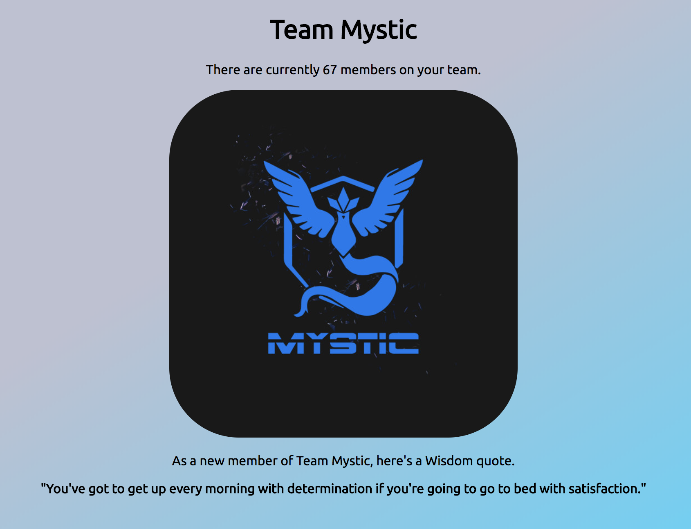
  
  #### Team Valor
  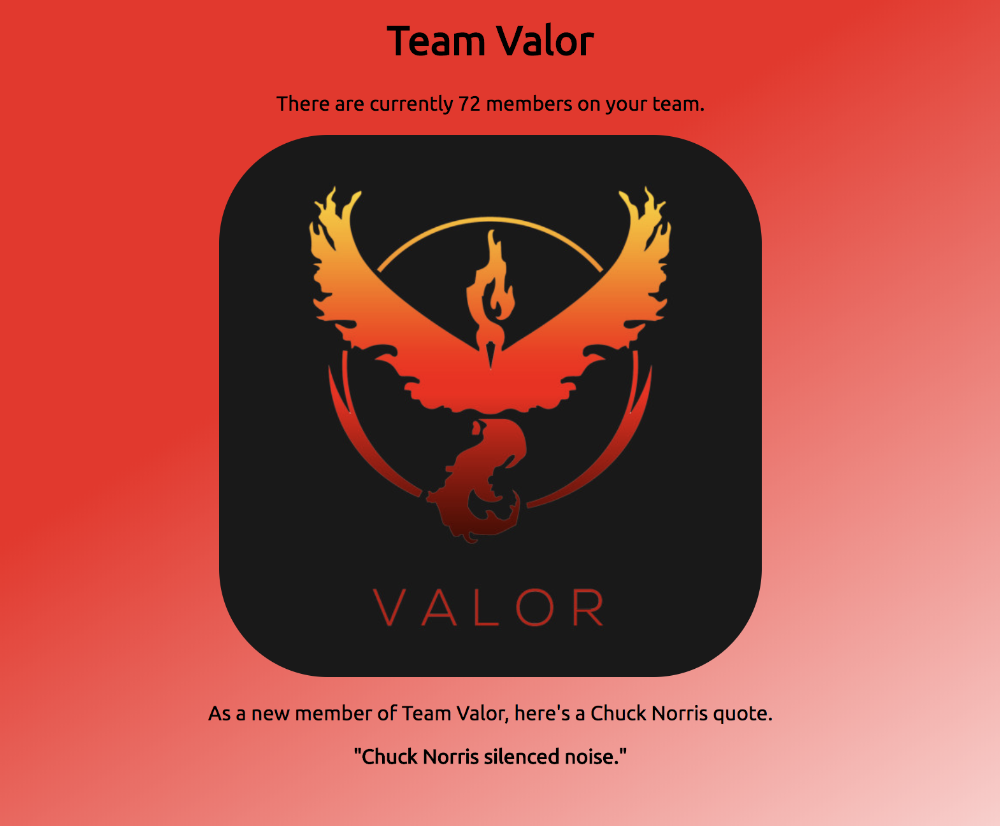
  
  #### Team Instinct
  
  
