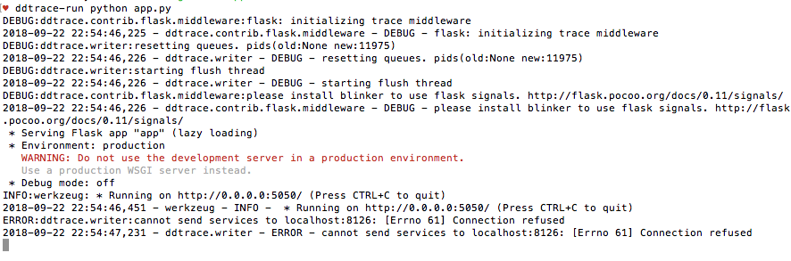

### Flask App

<b>Part 1: Install ddtrace</b>

Read APM [introduction](https://app.datadoghq.com/apm/intro) on GUI, chose "Python," followed instructions.

Installed the Python client.

```
python -m pip install ddtrace
```

Response:
>Could not install packages due to an EnvironmentError: [Errno 13] Permission denied: '/Library/Python/2.7/site-packages/wrapt'
Consider using the `--user` option or check the permissions.

```
python -m pip install ddtrace --user
```

Response:
>Successfully installed ddtrace-0.14.0 msgpack-python-0.5.6 wrapt-1.10.11

<b>Part 2: Install Flask</b>

Researched [Flask](http://flask.pocoo.org/), downloaded latest [version](https://pypi.org/project/Flask/1.0.2/), read [documentation](http://flask.pocoo.org/docs/1.0/) and "[Datadog Trace Client](http://pypi.datadoghq.com/trace/docs/#module-ddtrace.contrib.flask)".

```
python -m pip install Flask==1.0.2
```

Response:
>Could not install packages due to an EnvironmentError: [Errno 13] Permission denied: '/Library/Python/2.7/site-packages/markupsafe'
Consider using the `--user` option or check the permissions.

```
python -m pip install Flask==1.0.2 --user
```

Response:
>Successfully installed Flask-1.0.2 Jinja2-2.10 MarkupSafe-1.0 Werkzeug-0.14.1 click-6.7 itsdangerous-0.24

```
ddtrace-run python app.py
```

Response:
>-bash: ddtrace-run: command not found


Read Flask documentation on "[virtual environments](http://flask.pocoo.org/docs/1.0/installation/#virtual-environments)."

1. Installed virtualenv:

```
sudo python -m pip install virtualenv
```

Response:
>Successfully installed virtualenv-16.0.0

2. Created an environment:

```
mkdir datadog-flask-app
mv app.py datadog-flask-app/
cd datadog-flask-app/
python -m virtualenv venv
```

Response:
>New python executable in /Users/tiffanymonroe/dev/datadog-flask-app/venv/bin/python
Installing setuptools, pip, wheel...done.

3. Activated the environment:

```
. venv/bin/activate
```

Response:
>(venv) tiffanymonroe: datadog-flask-app

```
python -m pip install ddtrace --user
```

Response:
>Can not perform a '--user' install. User site-packages are not visible in this virtualenv.

```
python -m pip install Flask==1.0.2
python -m pip install ddtrace
ddtrace-run python app.py
```

Response:


