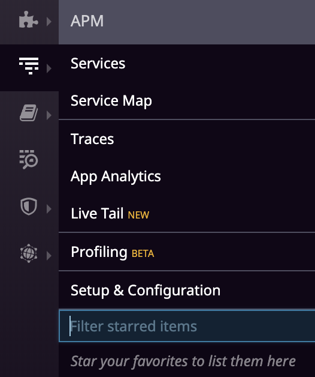
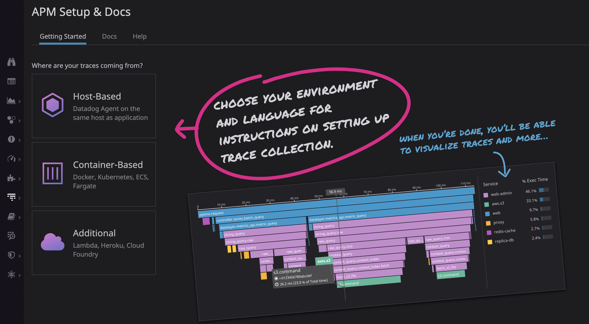
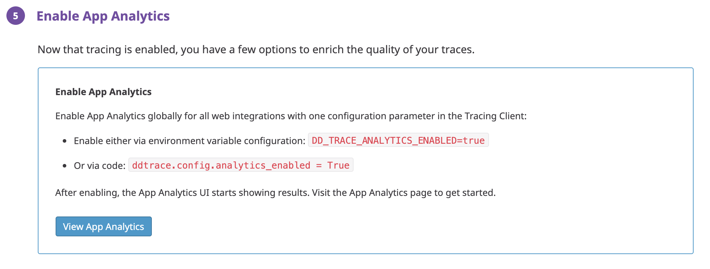
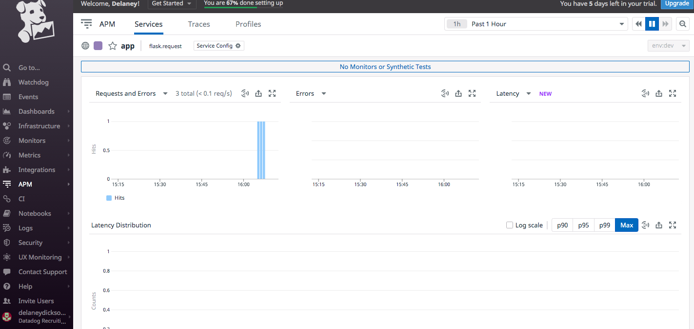

Finally the last piece of the Datadog puzzle is something that really sets the offering apart from anything else on the market: Application Performance Monitoring or APM

# Application Performance Monitoring

Datadog's APM offering is extremely robust and I'll only scratch the surface here. APM allows you to set up traces within your codebase to monitor the performance of your code in production with all of the visualizations, anomoly detection algorithms and alerting capabilities we've already discussed so far.

You can use any application you'd like for this as long as you know the language it was written in and have a way of starting the application yourself. For the purposes of this demo, let's take a very small `Flask` application with three routes that just returns a 200 with every request. You can [get the code here](./app.py). Be sure to have [flask](https://flask.palletsprojects.com/en/1.1.x/) installed on your system.

Start by going into the APM section of the Datadog portal 

and select `Instrument a new service`. You should end up at a page like this screenshot.

For now we'll use the Host-Based Tracing. This will take you through a brief wizard to set up your new instrumentation. Select the language of choice and follow the directions for installing the datadog trace software. Once you've got the application working, starting the traces for the Performance monitoring is dead simple:

`ddtrace-run python app.py`

After running the command above, you just need to set an environment variable to enable Application Analytics. After that you can click the `View App Analytics` button to get to see the metrics you're collecting.

Your dashboard will look like* the screenshot below.

Another great thing about APM metrics is that they can be used exactly the same way you'd use any other metrics you've collected in datadog. So you could have a dashboard with a graph of your APM metrics along side, say, a custom metric as in [this dashboard](https://app.datadoghq.com/dashboard/qgp-qjj-7ap?from_ts=1587139760095&live=true&to_ts=1587143360095).

All of this only scratches the surface of the APM capabilities. I won't get into it here but you can also instrument your application with lots of different kinds of traces that can be added directly into your code. You can learn more about that [here](https://docs.datadoghq.com/tracing/setup/python/)

[Previous: Monitors](./monitors.md)  |  [Next: Conclusion](./conclusion.md)

*I wrote a small bash script to hit my local webserver a random number (between 1-1000) of times and set it to run every minute in a cron. You can find that script [here](./code/requestor.sh)
