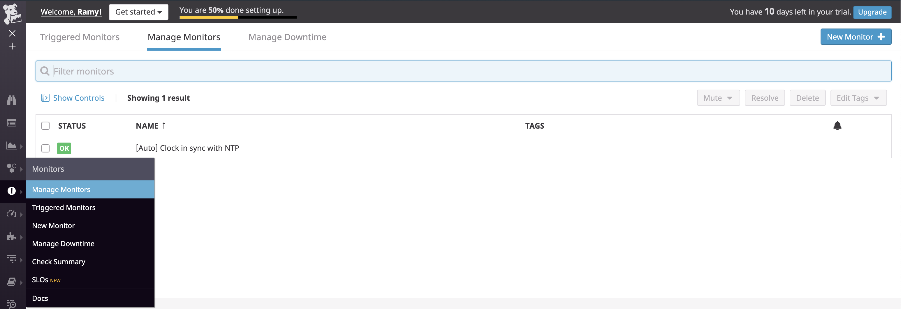
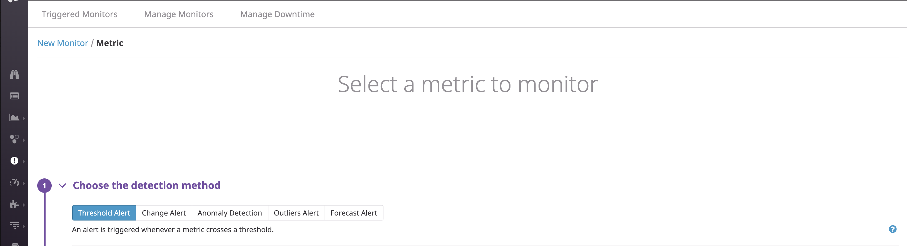
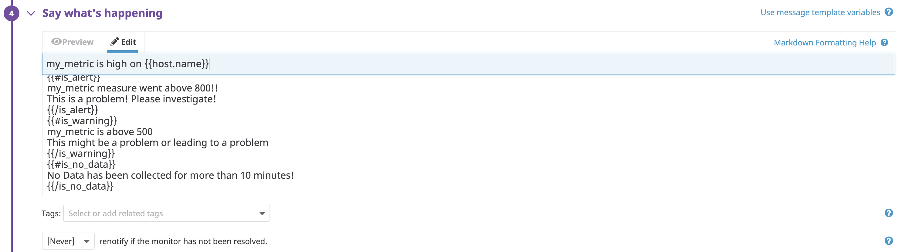
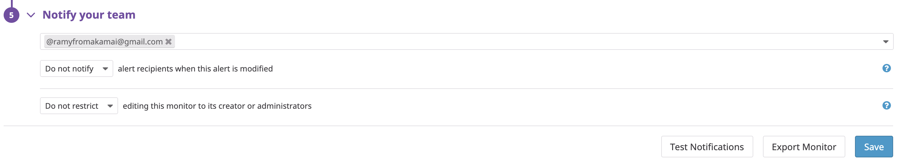

All the data we've collected so far is nice to look at, but what if you need to respond to a metric that goes outside of some bounds by, say, restarting a server? It would be nice to have an alerting mechanism around this. Luckily Datadog provides this via Monitors.

# Monitors

Monitors are your gateway to making the metrics about your infrastructure actionable by alerting you when certain things happen in your infrstructure. As an example of setting up a monitor, lets create a new Metric Monitor that watches the average of your custom metric (my_metric) and will if it’s above 800 over the past 5 minutes and send a warning if it's above 500 for the past 5 minutes. We'll also set up an alert when no data is received for 10 minutes.

We'll start by navigating to the Monitor screen by going to `Manage Monitors`:

At the top right you'll see a big blue `New Monitor` button.* Go ahead and click that to go to the Monitor Selection page. There's a whole menagerie of [Monitor types](https://docs.datadoghq.com/monitors/) to choose from but I'll focus on the Metric Monitor. Go ahead and select the Metric monitor to start creating an alert.

This will bring you to the alert page where you can configure your alert. Let's walk through each part. First we need to choose the detection method. For our goals of alerting and warning above certain values, we can just use the basic `Threshold Alert`. Here we'll set the `Alert threshold` to `800` and the `Warning threshold` to `500`. And before we leave this part of the page, make sure to set the drop down setting for missing data to `Notify` (the default is `Do not notify`) and set the lookback window to 10 minutes.

In the next section (labeled `#4 Say what's happening`) we can define who will be alerted under the various conditions. We'll also send different messages based on whether the monitor is in an Alert, Warning, or in the No Data state and include the metric value that caused the monitor to trigger and host ip when the Monitor triggers an Alert state for easy troubleshooting. There are lots of conditional variables to use and you can learn more about the conditional formatting by clicking the question mark next to `Use message template variables`. For now we'll just use the `#is_alert`, `#is_warning` and `#is_no_data` variables.

And lastly, we can define who will be notified when the alerts (and other states) are triggered.

*The astute reader will notice that you can go directly to the New Monitor page by selecting 'New Monitor' from the drop down/pull out menu instead 'Manage Monitor'. You get extra points for saving a click.
