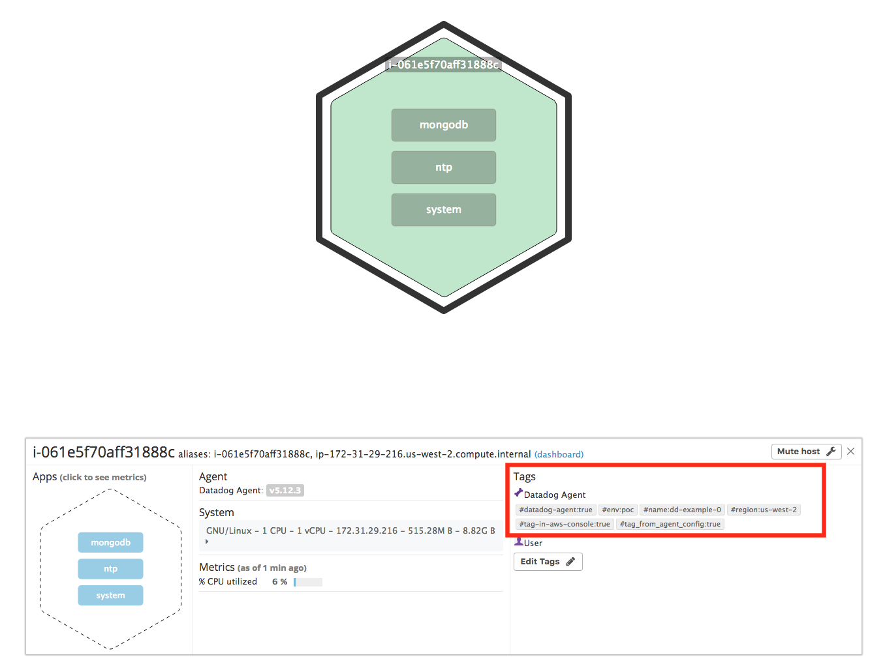
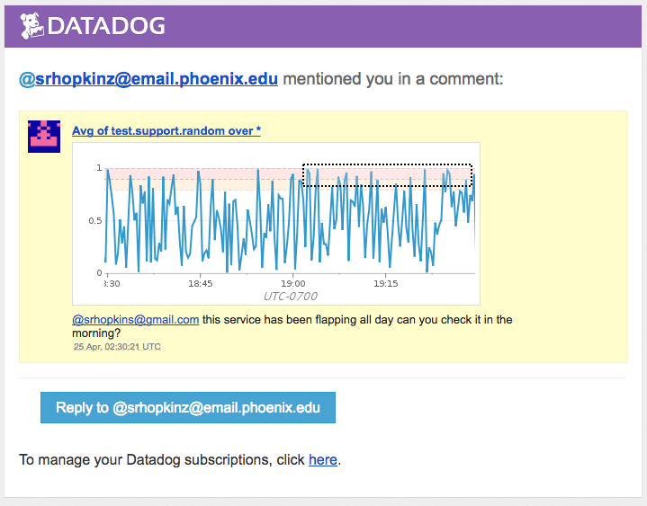
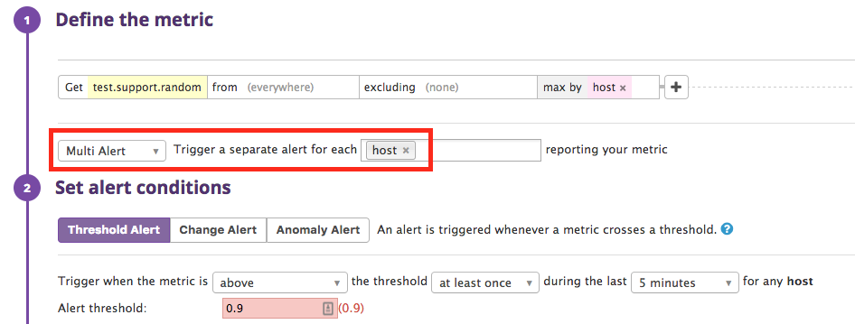
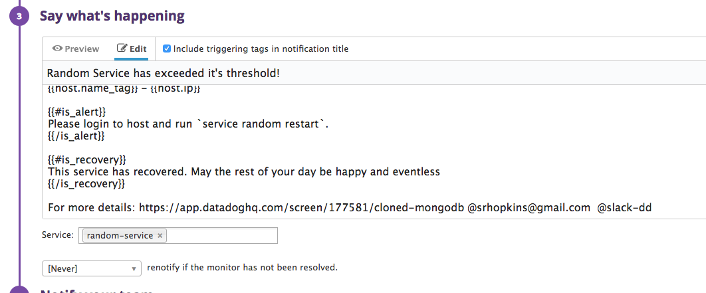
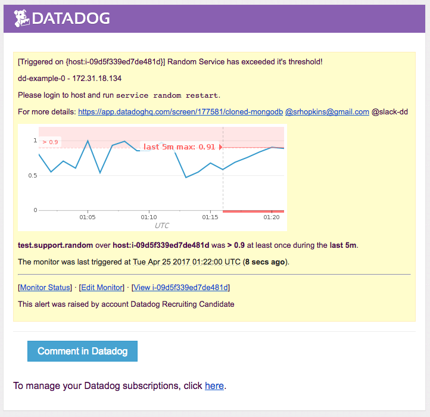
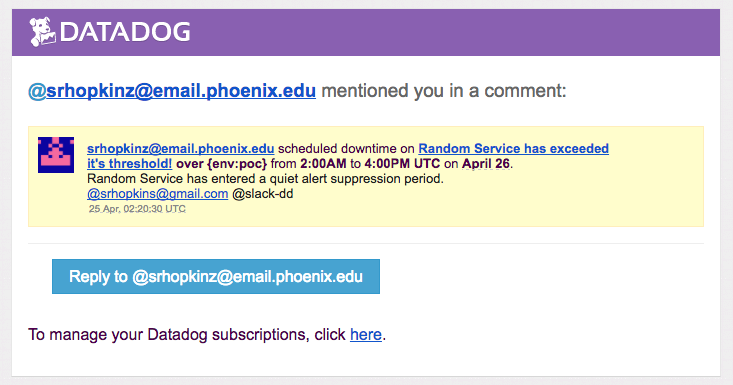

# Level 0 (optional) - Setup an Ubuntu VM

I created a [Terraform module](terraform/main.tf) for instance creation with dd-agent installed. Additionally I added AmazonEC2ReadOnlyAccess policy to the instance definition and enabled ec2 tags datadog.conf ([Ansible config](ansible/dd-conf.yaml)).

## Level 1 - Collecting your Data

* Sign up for Datadog (use "Datadog Recruiting Candidate" in the "Company" field), get the Agent reporting metrics from your local machine.
Bonus question: In your own words, what is the Agent?

>**Bonus question: In your own words, what is the Agent?**
>It is a highly customizable application that lives on each host relaying various events and time-series data to datadog for visualization; such as system and application performace metrics, aggregated log parsing and custom user created checks. 

* Add tags in the Agent config file and show us a screenshot of your host and its tags on the Host Map page in Datadog.

* Install a database on your machine (MongoDB, MySQL, or PostgreSQL) and then install the respective Datadog integration for that database.
 * [Ansible mongo](ansible/mongo.yaml)
* Write a custom Agent check that samples a random value. Call this new metric: test.support.random
 * [Ansible check](ansible/check.yaml)

## Level 2 - Visualizing your Data

* Since your database integration is reporting now, clone your database integration dashboard and add additional database metrics to it as well as your test.support.random metric from the custom Agent check. [MongoDB - Random Service](https://app.datadoghq.com/screen/177581/mongodb---random-service)

> **Bonus question: What is the difference between a timeboard and a screenboard?** Timeboards share a common time-frame and have less control over widget size and placement. Screenboards allow widgets to specify different time-frames in addition to providing flexibility of placement and widget size.

* Take a snapshot of your test.support.random graph and draw a box around a section that shows it going above 0.90. Make sure this snapshot is sent to your email by using the @notification

## Level 3 - Alerting on your Data

Since you've already caught your test metric going above 0.90 once, you don't want to have to continually watch this dashboard to be alerted when it goes above 0.90 again. So let's make life easier by creating a monitor.

* Set up a monitor on this metric that alerts you when it goes above 0.90 at least once during the last 5 minutes
> **Bonus points: Make it a multi-alert by host so that you won't have to recreate it if your infrastructure scales up.**
* Give it a descriptive monitor name and message (it might be worth it to include the link to your previously created dashboard in the message). Make sure that the monitor will notify you via email.

* This monitor should alert you within 15 minutes. So when it does, take a screenshot of the email that it sends you.

> **Bonus: Since this monitor is going to alert pretty often, you don't want to be alerted when you are out of the office. Set up a scheduled downtime for this monitor that silences it from 7pm to 9am daily. Make sure that your email is notified when you schedule the downtime and take a screenshot of that notification.**

**I had to move the suppression time to the following day as it was already past 7p when adding this alert. It would be nice to remove this restriction on downtime schedules with `repeat` selected.**

## Please contact me with questions or if you would like me to elaborate on any exercise.
