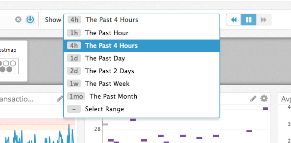
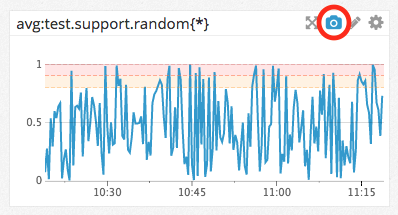

# Overview

* [Datadog Agent](#Datadog-Agent)
  * [Example Ubuntu Installation](#Example-Ubuntu-Installation)
* [Collecting Data](#Collecting-Data)
  * [Tags](#Tags)
* [Integrations](#Integrations)
  * [Example MongoDB](#Example-MongoDB)
* [Custom Checks](#Custom-Checks)
  * [Example Agent Check](#Example-Agent-Check)
* [Timeboards](#Timeboards)
* [Screenboards](#Screenboards)
* [Notifications](#Notifications)
* [Monitors](#Monitors)
  * [Example Monitor](#Example-Monitor)
* [Downtime](#Downtime)
  * [Example Downtime](#Example-Downtime)
* [Links](#Links)
  * [Agent](#Agent)
  * [KBA](#KBA)
  * [Example Configs](#Example-Configs)
  * [Custom Tools](#Custom-Tools)


# Datadog Agent 

An open source customizable application that lives on each host relaying various events and time-series data to datadog for visualization; such as system and application performace metrics, aggregated log parsing and custom user created checks.

* Agent Source Code: https://github.com/DataDog/dd-agent

## Example Ubuntu Installation
* https://app.datadoghq.com/account/settings#agent

```
$ DD_API_KEY=[secret] bash -c "$(curl -L https://raw.githubusercontent.com/DataDog/dd-agent/master/packaging/datadog-agent/source/install_agent.sh)"
```

# Collecting Data

Basic system metrics begin flowing into your Datadog account after setup. Several features are available to provide further meaning into your environment.

## Tags

Use the power of tags for locating and grouping metrics.

* Added automatically through integrations
* Created using the API
* Configured in the agent configuration


* Editable in the UI for hosts


# Integrations

Datadog comes with several [Integrations](https://www.datadoghq.com/product/integrations/) that make installation a snap and add dashboards out of the box so you can visualize meaningful data instantly. 

## Example MongoDB

* Add the Datadog integration


* Install MongoDB on an instance
  * [Ansible MongoDB](ansible/mongo.yaml) 

```
$ ansible-playbook -i [ip_address], mongo.yaml
```

* Check for successful installation


# Custom Checks

You may find use cases that require the collection of metrics not already provided by Datadog's many functions and Integrations. Custom [Agent Checks]( http://docs.datadoghq.com/guides/agent_checks/) have the ability to run personalized scripts to meet these requirements.

## Example Agent Check

* Create the script `/etc/dd-agent/checks.d/random.py`

```python
from random import random

from checks import AgentCheck

class RandomMetric(AgentCheck):
    """sends a random number > 0 < 1"""

    def check(self, instance):
        self.gauge('test.support.random', random())
```

* Each check requires a config with the same name `/etc/dd-agent/conf.d/random.yaml`

```yaml
init_config:

instances:
    [{}]

```

* Restart the agent and confirm the installation

```
$ sudo /etc/init.d/datadog-agent restart && sudo dd-agent info
```


# Timeboards

* Are laid out in a grid and good for analysing events during a specific window of time
* Graphs and widgets share a common time frame


* Available widgets: Timeseries, Query Value, Heat Map, Distribution, Top List, Change, Hostmap


# Screenboards

* Screenboards allow widgets to specify different time frames 
* providing flexibility of placement and widget size.
* Available widgets: Free Text, Graph, Query Value, Toplist, Change, Event Timeline, Event Stream, Image, Note, Alert Graph, Alert Value, IFrame, Check Status, Hostmap


# Notifications

* Share findings from graphs in Timeboards and Metrics Explorer

 
 

* Use @name to send an email notification


# Monitors

Datadog provides Monitors for alerting on metrics

## Example Monitor


* Simple Alerts fire once when the conditions you set match while Multi Alerts will alert for each member of the provided grouping tag


* Provide a meaningful message so receipients can understand the event and take action if needed


# Downtime

Downtime allows for the suppresion of alerts while performing maintenance and deployments or to remove noise and mitigate alert fatigue.

## Example Downtime

* Alerts from a POC environment are not required outside normal business hours, let the team get some sleep


* By using @name again you can send notifications when a Downtime is configured


# Questions?


# Links

## Agent
* https://github.com/DataDog/dd-agent

## KBA
* [Agent Settings](https://app.datadoghq.com/account/settings#agent)
* [Guide to Tagging](http://docs.datadoghq.com/guides/tagging/)
* [Integrations](http://docs.datadoghq.com/integrations/)
* [Writing an Agent Check](http://docs.datadoghq.com/guides/agent_checks/)
* [Guide to Monitors](http://docs.datadoghq.com/guides/monitors/)
* [Downtime](https://www.datadoghq.com/blog/mute-datadog-alerts-planned-downtime/)
* [Screenboard vs Timeboard](https://help.datadoghq.com/hc/en-us/articles/204580349-What-is-the-difference-between-a-ScreenBoard-and-a-TimeBoard-)
* [Converting Dashboards](https://help.datadoghq.com/hc/en-us/articles/211244183-How-to-Transform-a-Timeboard-to-a-Screenboard-or-vice-versa)

## Example Configs
* [Terraform Instance](terraform/)
* [Ansible Resources](ansible/)

## Custom Tools
* https://github.com/DataDog/Miscellany
* https://github.com/DataDog/Miscellany/pull/12


```python

```
