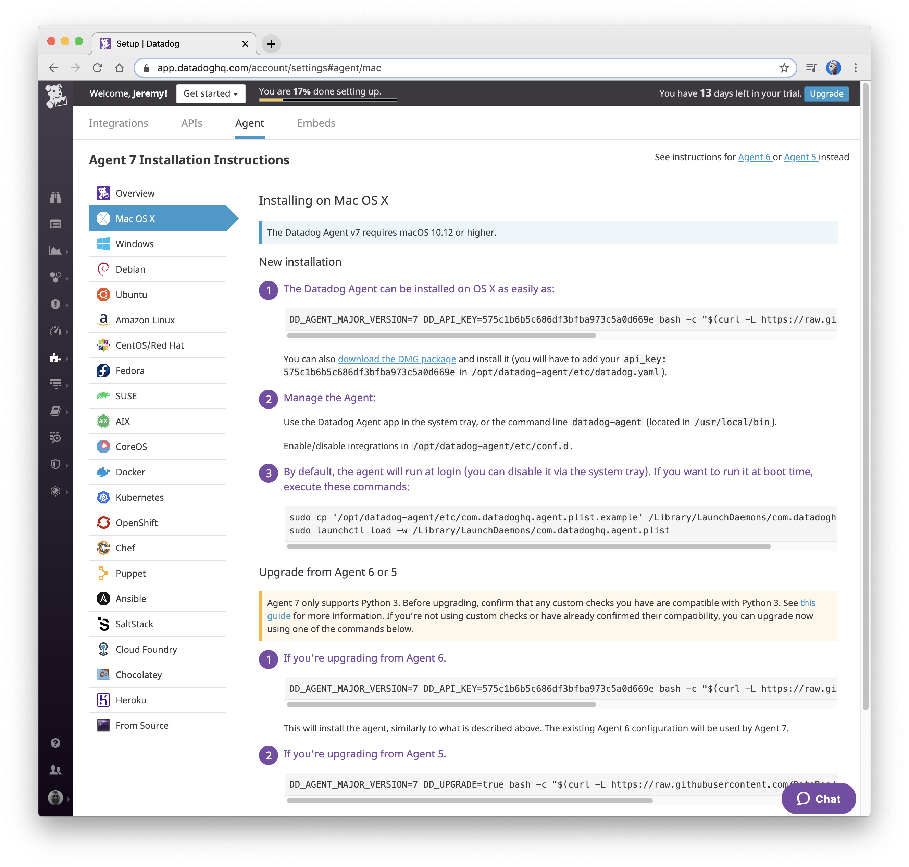
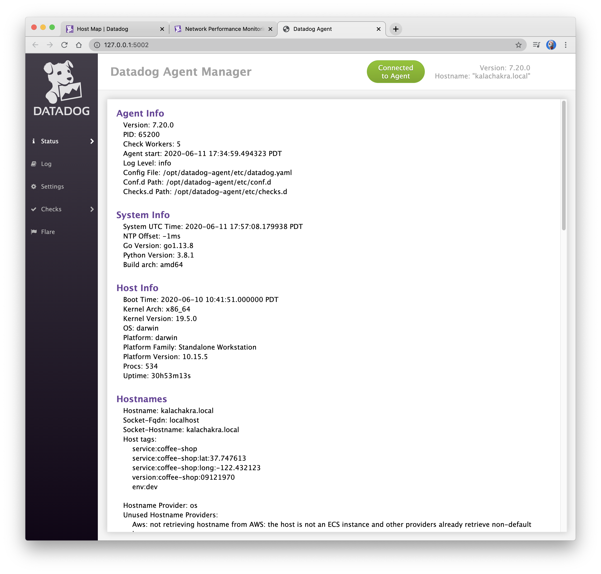
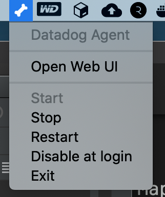

# macOS Agent Install 

##Agent Installation Page
This page provides installation instructions for a variety of systems that Datadog supports. 


## Command Line Installation

```commandline
~ » DD_AGENT_MAJOR_VERSION=7 DD_API_KEY=XXXXXXXX bash -c "$(curl -L https://raw.githubusercontent.com/DataDog/datadog-agent/master/cmd/agent/install_mac_os.sh)"

  % Total    % Received % Xferd  Average Speed   Time    Time     Time  Current
                                 Dload  Upload   Total   Spent    Left  Speed
  0     0    0     0    0     0      0      0 --:--:-- --:--:-- --:--:--    100  6536  100  6536    0     0  27008      0 --:--:-- --:--:-- --:--:-- 27008

* Downloading datadog-agent
##################################################################### 100.0%

* Installing datadog-agent, you might be asked for your sudo password...
Password:

    - Mounting the DMG installer...

    - Unpacking and copying files (this usually takes about a minute) ...

    - Unmounting the DMG installer ...

* A datadog.yaml configuration file already exists. It will not be overwritten.


Your Agent is running properly. It will continue to run in the
background and submit metrics to Datadog.

You can check the agent status using the "datadog-agent status" command
or by opening the webui using the "datadog-agent launch-gui" command.

If you ever want to stop the Agent, please use the Datadog Agent App or
the launchctl command. It will start automatically at login.

---------------------------------------------------------------------------------
```

## Check Agent Status

```commandline
~ » datadog-agent status                                       jeremy@kalachakra
Getting the status from the agent.

===============
Agent (v7.20.0)
===============

  Status date: 2020-06-11 16:06:22.674492 PDT
  Agent start: 2020-06-11 16:03:06.107908 PDT
  Pid: 31003
  Go Version: go1.13.8
  Python Version: 3.8.1
  Build arch: amd64
  Check Runners: 5
  Log Level: info

  Paths
  =====
    Config File: /opt/datadog-agent/etc/datadog.yaml
    conf.d: /opt/datadog-agent/etc/conf.d
    checks.d: /opt/datadog-agent/etc/checks.d

  Clocks
  ======
    NTP offset: 1.139ms
    System UTC time: 2020-06-11 16:06:22.674492 PDT

  Host Info
  =========
    bootTime: 2020-06-10 10:41:51.000000 PDT
    kernelArch: x86_64
    kernelVersion: 19.5.0
    os: darwin
    platform: darwin
    platformFamily: Standalone Workstation
    platformVersion: 10.15.5
    procs: 539
    uptime: 29h21m25s

  Hostnames
  =========
    hostname: kalachakra.local
    socket-fqdn: localhost
    socket-hostname: kalachakra.local
    host tags:
      env:dev
      host:macos
      service:sample-app
    hostname provider: os
    unused hostname providers:
      aws: not retrieving hostname from AWS: the host is not an ECS instance and other providers already retrieve non-default hostnames
      configuration/environment: hostname is empty
      gce: unable to retrieve hostname from GCE: Get http://169.254.169.254/computeMetadata/v1/instance/hostname: net/http: request canceled while waiting for connection (Client.Timeout exceeded while awaiting headers)

  Metadata
  ========
    hostname_source: os

=========
Collector
=========

  Running Checks
  ==============

    cpu
    ---
      Instance ID: cpu [OK]
      Configuration Source: file:/opt/datadog-agent/etc/conf.d/cpu.d/conf.yaml.default
      Total Runs: 13
      Metric Samples: Last Run: 6, Total: 72
      Events: Last Run: 0, Total: 0
      Service Checks: Last Run: 0, Total: 0
      Average Execution Time : 0s
      Last Execution Date : 2020-06-11 16:06:16.000000 PDT
      Last Successful Execution Date : 2020-06-11 16:06:16.000000 PDT


    disk (2.9.0)
    ------------
      Instance ID: disk:e5dffb8bef24336f [OK]
      Configuration Source: file:/opt/datadog-agent/etc/conf.d/disk.d/conf.yaml.default
      Total Runs: 12
      Metric Samples: Last Run: 42, Total: 504
      Events: Last Run: 0, Total: 0
      Service Checks: Last Run: 0, Total: 0
      Average Execution Time : 11ms
      Last Execution Date : 2020-06-11 16:06:08.000000 PDT
      Last Successful Execution Date : 2020-06-11 16:06:08.000000 PDT


    io
    --
      Instance ID: io [OK]
      Configuration Source: file:/opt/datadog-agent/etc/conf.d/io.d/conf.yaml.default
      Total Runs: 12
      Metric Samples: Last Run: 13, Total: 147
      Events: Last Run: 0, Total: 0
      Service Checks: Last Run: 0, Total: 0
      Average Execution Time : 0s
      Last Execution Date : 2020-06-11 16:06:15.000000 PDT
      Last Successful Execution Date : 2020-06-11 16:06:15.000000 PDT


    load
    ----
      Instance ID: load [OK]
      Configuration Source: file:/opt/datadog-agent/etc/conf.d/load.d/conf.yaml.default
      Total Runs: 12
      Metric Samples: Last Run: 6, Total: 72
      Events: Last Run: 0, Total: 0
      Service Checks: Last Run: 0, Total: 0
      Average Execution Time : 0s
      Last Execution Date : 2020-06-11 16:06:07.000000 PDT
      Last Successful Execution Date : 2020-06-11 16:06:07.000000 PDT


    memory
    ------
      Instance ID: memory [OK]
      Configuration Source: 

      Total Runs: 12
      Metric Samples: Last Run: 9, Total: 108
      Events: Last Run: 0, Total: 0
      Service Checks: Last Run: 0, Total: 0
      Average Execution Time : 0s
      Last Execution Date : 2020-06-11 16:06:14.000000 PDT
      Last Successful Execution Date : 2020-06-11 16:06:14.000000 PDT


    network (1.16.0)
    ----------------
      Instance ID: network:e0204ad63d43c949 [OK]
      Configuration Source: file:/opt/datadog-agent/etc/conf.d/network.d/conf.yaml.default
      Total Runs: 13
      Metric Samples: Last Run: 36, Total: 468
      Events: Last Run: 0, Total: 0
      Service Checks: Last Run: 0, Total: 0
      Average Execution Time : 109ms
      Last Execution Date : 2020-06-11 16:06:21.000000 PDT
      Last Successful Execution Date : 2020-06-11 16:06:21.000000 PDT


    ntp
    ---
      Instance ID: ntp:d884b5186b651429 [OK]
      Configuration Source: file:/opt/datadog-agent/etc/conf.d/ntp.d/conf.yaml.default
      Total Runs: 1
      Metric Samples: Last Run: 1, Total: 1
      Events: Last Run: 0, Total: 0
      Service Checks: Last Run: 1, Total: 1
      Average Execution Time : 172ms
      Last Execution Date : 2020-06-11 16:03:16.000000 PDT
      Last Successful Execution Date : 2020-06-11 16:03:16.000000 PDT


    uptime
    ------
      Instance ID: uptime [OK]
      Configuration Source: file:/opt/datadog-agent/etc/conf.d/uptime.d/conf.yaml.default
      Total Runs: 12
      Metric Samples: Last Run: 1, Total: 12
      Events: Last Run: 0, Total: 0
      Service Checks: Last Run: 0, Total: 0
      Average Execution Time : 0s
      Last Execution Date : 2020-06-11 16:06:13.000000 PDT
      Last Successful Execution Date : 2020-06-11 16:06:13.000000 PDT

========
JMXFetch
========

  Initialized checks
  ==================
    no checks

  Failed checks
  =============
    no checks

=========
Forwarder
=========

  Transactions
  ============
    CheckRunsV1: 13
    Connections: 0
    Containers: 0
    Dropped: 0
    DroppedOnInput: 0
    Events: 0
    HostMetadata: 0
    IntakeV1: 2
    Metadata: 0
    Pods: 0
    Processes: 0
    RTContainers: 0
    RTProcesses: 0
    Requeued: 0
    Retried: 0
    RetryQueueSize: 0
    Series: 0
    ServiceChecks: 0
    SketchSeries: 0
    Success: 26
    TimeseriesV1: 13

  API Keys status
  ===============
    API key ending with d669e: API Key valid

==========
Endpoints
==========
  https://app.datadoghq.com - API Key ending with:
      - d669e

==========
Logs Agent
==========


  Logs Agent is not running

=========
APM Agent
=========
  Status: Running
  Pid: 31301
  Uptime: 186 seconds
  Mem alloc: 7,995,312 bytes
  Hostname: kalachakra.local
  Receiver: localhost:8126
  Endpoints:
    https://trace.agent.datadoghq.com

  Receiver (previous minute)
  ==========================
    No traces received in the previous minute.
    Default priority sampling rate: 100.0%

  Writer (previous minute)
  ========================
    Traces: 0 payloads, 0 traces, 0 events, 0 bytes
    Stats: 0 payloads, 0 stats buckets, 0 bytes

=========
Aggregator
=========
  Checks Metric Sample: 1,557
  Dogstatsd Metric Sample: 1,094
  Event: 1
  Events Flushed: 1
  Number Of Flushes: 13
  Series Flushed: 1,948
  Service Check: 88
  Service Checks Flushed: 101

=========
DogStatsD
=========
  Event Packets: 0
  Event Parse Errors: 0
  Metric Packets: 1,093
  Metric Parse Errors: 0
  Service Check Packets: 0
  Service Check Parse Errors: 0
  Udp Bytes: 76,752
  Udp Packet Reading Errors: 0
  Udp Packets: 91
  Uds Bytes: 0
  Uds Origin Detection Errors: 0
  Uds Packet Reading Errors: 0
  Uds Packets: 0

---------------------------------------------------------------------------------
```

## Launch the Datadog Agent GUI

```commandline
~ » datadog-agent launch-gui                                    jeremy@kalachakra
```



Optionally, macOS has a handy system tray integration for the Datadog Agent.

