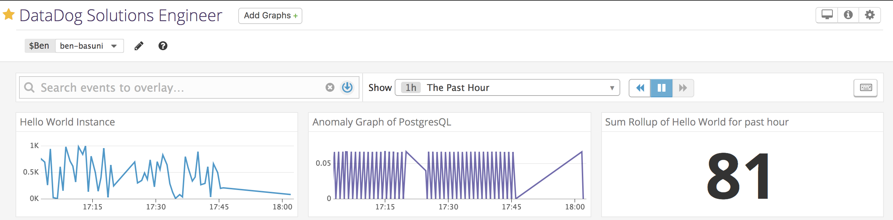

# Technical Answer - Solutions Engineer 

# Completed App  

The app is deployed live at https://datadog-app.herokuapp.com/  
[x] Implemented Datadog-Tracer onto Heroku  
[x] Connected PostgresQL database onto Heroku    
[x] Implemented Datadog Timeboards onto App  

---
# 1. Collecting Metrics
  ### Tasks
  [x] Use virtualenv to establish Virtual Environment on local machine  
  [x] Installed Postgres and integrated with Datadog    
  [x] Create custom Agent Check (my_metric) with random value between 0 - 1000    
  [x] Submit metric once every 45 seconds (Bonus: change w/o modifying Python check file)    

  ### Screenshots
  
  #### Host Map and Configuration
    
  

  #### PostgresQL Integration
  
  
  
  #### Agent Check my_metric
  
  

  ### Questions   
   Can you change the collection interval without modifying the Python check file you created?
   
   **Answer: I configured the min_collection_interval setting to 45.**
  

# 2. Visualizing Data
  ### Tasks
  [x] With the Datadog API, create a Timeboard that contains:  
      [x] Custom metric (my_metric)   
      [x] Database metric w/ anomaly function   
      [x] Custom metric w/ rollup function applied to sum up all points for past hour into 1 bucket   
  [x] Access Dashboard from Dashboard List in UI:  
      [x] Set Timeboard's timeframe to past 5 mins  

[Datadog API Script creating Timeboard](scripts/timeboard.py)

  ### Screenshots
  
  #### Timeboard
  
 
  #### Graph w/ @ notation to send self  
  
  
  ### Questions
   What is the anomaly graph displaying?  
   Answer: **The Anomaly graph reveals the anomalies that happens when pSQL database makes commits.**
  

# 3. Monitoring Data
  ### Tasks
  [x] Create a new Metric Monitor that watched my_metric and will alert if it's above the following values for the past 5 mins   
      [x] Warning threshold of 500  
      [x] Alerting threshold of 800  
      [x] Notify if there is No Data for the past 10m  
  [x] Configure monitor's message so that it will:   
      [x] Send an email whenever a monitor triggers  
      [x] Create different messages based on warning, alert, no data  
      [x] Include metric value and host IP on Alert  
      [x] Bonus: Schedule 2 downtimes     
            - 7pm - 9am (M - F)   
            - All day Sat and Sun  
  ### Screenshots

  #### Monitoring Data
  
  
  #### Monitor Alert
  
  
  #### No Data Alert
  
  
  #### Downtime (Bonus)
    
  
# 4. Collecting APM Data   
Given an app use Datadog’s APM solution   
Provide a link and a screenshot of a Dashboard with both APM and Infrastructure Metrics.

[Dashboard Link](https://app.datadoghq.com/dash/826079/apm-and-infrastructure-metrics?live=true&page=0&is_auto=false&from_ts=1527979455178&to_ts=1527983055178&tile_size=m)

### Screenshots

  #### APM and Infrastructure Metrics
  
  
  #### Application Metrics
  
  
### Question: What is the difference between a Service and a Resource?

 **Answer: A service is a process that does a job. This can be used to showcase a graph in Datadog. A service can be a database, webapp, API endpoint. A resource is an action of a service, such as a query to a database or an endpoint**

# 5. Final Question
Datadog has been used in a lot of creative ways in the past. We’ve written some blog posts about using Datadog to monitor the NYC Subway System, Pokemon Go, and even office restroom availability!

Is there anything creative you would use Datadog for?  

```
1. Connect Datadog with Mobile Health apps 
         - Track running
         - Steps walked
         - Meditation duration during the day  
         
2. Use Datadog Metrics for Professional Sports   
    a. Basketball 
         - Distance ran
         - Times passed 
         - Defense vs offense duration 
         - Duration of what half they played on    
    b. Soccer 
         - Distance ran 
         - Times passed
         - Accuracy of passes
         
3. Income/Expense Chart Flow for personal and business use

4. Government usage such as traffic flow, DMV lines, etc

5. Personal gadget trackers (Raspberry PI) 
    - Temperature in the house
    - Water usage
    - Microwave/Electricity usage
    Also would be useful to send alerts if usage would go over a certain amount
    I also notice that there is already a DataDog Integration here
    https://docs.datadoghq.com/developers/faq/deploying-the-agent-on-raspberrypi/
```
# App Screenshots
  
  #### App Home Page
  

  #### Datadog Charts
  

  #### Register for a Team
  

  #### Team Mystic
  
  
  #### Team Valor
  
  
  #### Team Instinct
  
  
