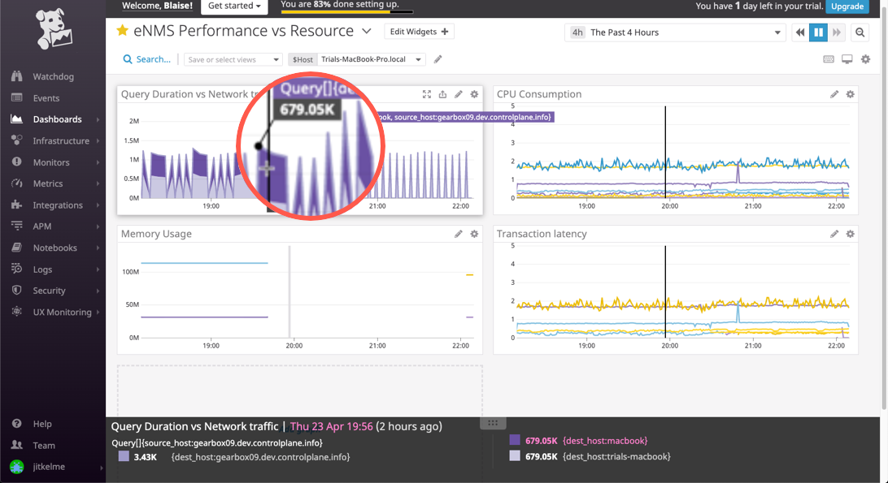

Performance Monitoring: Collecting APM Data
===========================================

* *Given the following Flask app, instrument this using Datadog’s APM solution*:

Because using both ``ddtrace-run`` and manually inserting the Middleware has been known to cause issues,
I have included an example of a manually-instrumented app below.
In the case of Flask, the ddtrace module automatically registers hooks and wraps tracers around functions that have requests.

Dashboard: Unified APM and Metrics
===================================

* *Provide a link and a screenshot of a Dashboard with both APM and Infrastructure Metrics.*

This dashboard illustrates network traffic levels in conjunction with database queries (e.g. ``trace.sqlite.query.duration``).
The dashboard is accessible at:
https://p.datadoghq.com/sb/tete840uvd9y7dkj-1f06d1c161aec5dd0c7c306ead78ab2e

I used a database-intensive Flask app called eNMS (https://enms.readthedocs.io/en/latest/ ) to produce a burst of transactions.

.. code-block:: python

	from ddtrace import patch_all
	patch_all()

	from flask import Flask
	from loguru import logger

	app = Flask(__name__)

	""" This minimal app invokes the ``ddtrace`` module."""
	@app.route('/')
	def api_entry():
		logger.info("Welcome to Zero2Datadog")
		return 'Entrypoint to the Application'

	@app.route('/api/apm')
	def apm_endpoint():
		logger.info("Starting the APM")
		return 'Getting APM Started'

	@app.route('/api/trace')
	def trace_endpoint():
		logger.info("Posting a Trace")
		return 'Posting Traces'

	if __name__ == '__main__':
		app.run(host='0.0.0.0', port='5050')

Bonus: Service vs Resource?
----------------------------

* *What is the difference between a Service and a Resource?*

	:term:`Resource`
		A resource is a particular action for a given service (typically an individual endpoint or query). A helpful
		mnemonic could be: *A service...provides (serves) a resource*

	:term:`Service`
		Services are the building blocks of modern microservice architectures.
		Broadly speaking, a service groups together endpoints, queries, or jobs for the purposes of scaling instances

