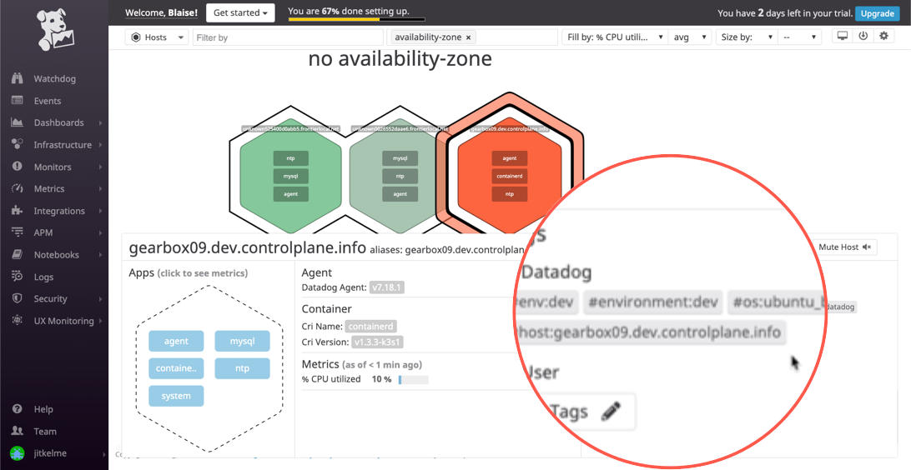
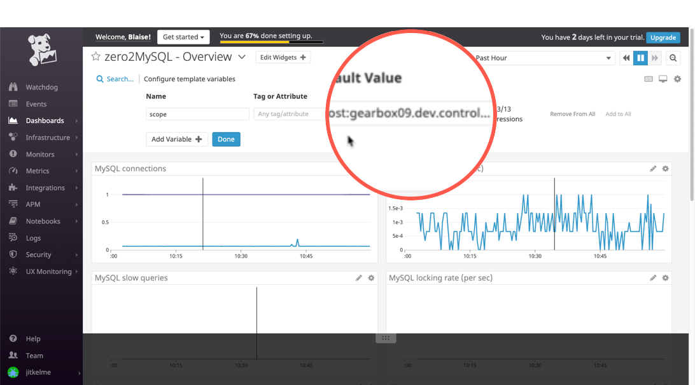
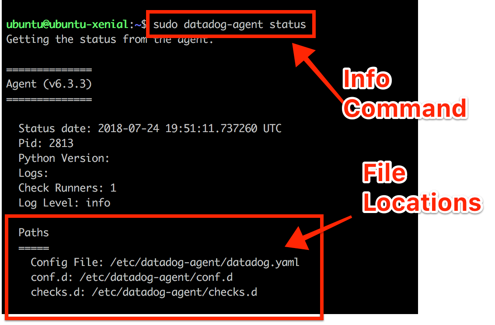

Collecting Metrics
==================

Add tags in the agent config file
----------------------------------

* *Add tags in the Agent config file and show us a screenshot of your host and its tags on the Host Map page in Datadog.*

On OS X the config file for the :term:`datadog-agent <Agent>` is at ``~/.datadog-agent/datadog.yaml``
For now, the contents of the file can be limited to:

.. literalinclude:: ./docker/datadog/datadog.yaml

Restart the agent after updating this file and you will begin to see data in your Host Map:

	 Web UI Host Map with agent-provided tags.

Add an integration for MySQL
-----------------------------

* *Install a database on your machine (MongoDB, MySQL, or PostgreSQL) and then install the respective Datadog integration for that database.*

Use the instructions at the Documentation site (https://docs.datadoghq.com/integrations/mysql/) because they are closer
to what you will find on your desktop machine.

Configure the DataDog agent
---------------------------

Provide the agent with the details it needs to receive data from MariaDB. Edit the ``~/.datadog-agent/etc/conf.d/mysql.d/conf.yaml``.
In my case, it looks like this:

.. code-block::yaml

	init_config:
	instances:
	  - server: 127.0.0.1
		user: datadog
	pass: <READACTED>
		tags:
		  - environment:dev
		  - admin_email:jitkelme@gmail.com
		  - expires:20200630
		options:
		  replication: false
		  galera_cluster: false
		  extra_status_metrics: true
		  extra_innodb_metrics: true
		  extra_performance_metrics: true
		  schema_size_metrics: false
		  disable_innodb_metrics: false

	Web UI with MySQL metrics

Create a custom Agent check
---------------------------

* *First, create a custom agent :term:`check <Check>` using the Web UI.*

Next, configure the check to submit a metric named ``my_metric`` with a random value between 0 and 1000.

.. code-block::python

	""" Submit a metric with a random value between 0 and 1000."""
	class MyClass(AgentCheck):
		   self.monotonic_count(
				"my_metric",
				random.randint(0, 1000),
				tags=["env:dev", "metric_submission_type:monotonic_count", "admin_email:jikelme@gmail.com],
			)

Since I'm deploying on a remote host, I commit my  files to git, and push the feature branch so that I can pull them onto the remote host.
The directory structure is important, so I copy the files from my repo directory to the agent's ``conf.d`` and
``checks.d`` locations.

.. code-block:: bash

	$ sudo -u dd-agent cp zero2datadog/checks.d/custom_hello.py /etc/datadog-agent/checks.d/custom_hello.py
	$ sudo -u dd-agent cp zero2datadog/conf.d/custom_hello.yaml /etc/datadog-agent/conf.d/custom_hello.yaml

If you have an IDE like PyCharm or VS Code, you can synchronize the file transfer.

	Image courtesy of `Brendan Roche <https://www.reddit.com/r/datadog/comments/91hezx/custom_agent_check_help/>`_

.. note:: This post clarifies the directory structure: https://www.reddit.com/r/datadog/comments/91hezx/custom_agent_check_help/

The ``custom_hello`` check
''''''''''''''''''''''''''

.. automodule:: zero2datadog
.. autoclass:: custom_hello
   :inherited-members:

Change the check's collection interval
----------------------------------------

* *Change your check's collection interval so that it only submits the metric once every 45 seconds.*

Bonus:
------

* *Can you change the collection interval without modifying the Python check file you created?*

