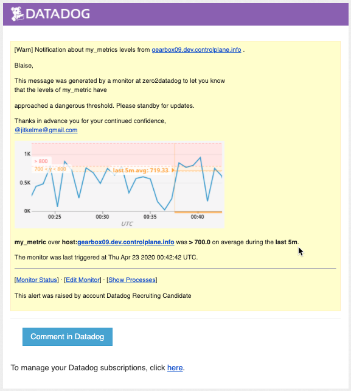
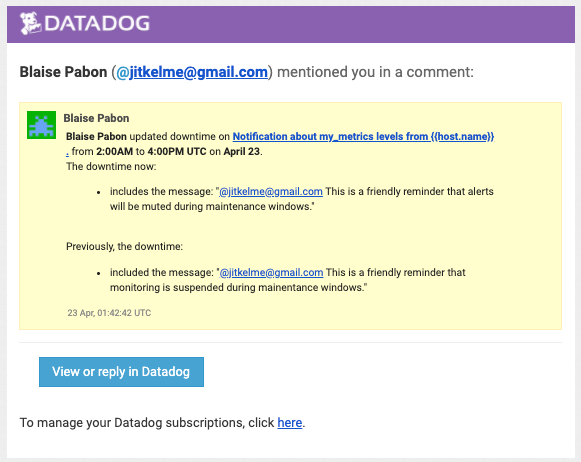

Monitoring Data
================

Constraining Alerts
--------------------

Since you’ve already caught your test metric going above 800 once, you don’t want to have to continually watch this dashboard to be alerted when it goes above 800 again.
* *So let’s make life easier by creating a monitor.*

Create a new Metric Monitor that watches the average of your custom metric (my_metric) and will alert if it’s above the following values over the past 5 minutes:

* Warning threshold of 500
* Alerting threshold of 800
* And also ensure that it will notify you if there is No Data for this query over the past 10m.

The text of of the monitor settings is easy to export to JSON, so that it can be included in source control, like this:

.. code-block:: json

	{
	  "id": 17893302,
	  "name": "Notification about my_metrics levels from {{host.name}} .",
	  "type": "metric alert",
	  "query": "avg(last_5m):avg:my_metric{host:gearbox09.dev.controlplane.info} > 800",
	  "message": "Blaise,\n\nThis message was generated by a monitor at zero2datadog to let you know\nthat the levels of my_metric have\n{{#is_alert}}\nreached a critical level of {{value}}  at IP address: {{host.ip}}\n{{/is_alert}}\n{{#is_warning}}\napproached a dangerous threshold. Be prepared to receive additional\nnotifications{{/is_warning}}\n\n{{#is_recovery}}returned to stability and America is once again safe for democracy and\nlittle children.{{/is_recovery}}\n{{#is_no_data}}not been reported in the past 10 minutes, this may be an indication of a bad scene around the corner{{/is_no_data}} \n{{#is_no_data_recovery}}been appearing once again in our instruments.{{/is_no_data_recovery}}  \n\nThanks in advance you for your continued confidence,\n@jitkelme@gmail.com",
	  "tags": [],
	  "options": {
		"notify_audit": false,
		"locked": false,
		"timeout_h": 0,
		"new_host_delay": 300,
		"require_full_window": false,
		"notify_no_data": true,
		"renotify_interval": "0",
		"escalation_message": "",
		"no_data_timeframe": 10,
		"include_tags": true,
		"thresholds": {
		  "critical": 800,
		  "warning": 700
		}
	  }
	}

Configuring Notifications
-------------------------

*Please configure the monitor’s message so that it will:*

* Send you an email whenever the monitor triggers.
* Create different messages based on whether the monitor is in an Alert, Warning, or No Data state.
* Include the metric value that caused the monitor to trigger and host ip when the Monitor triggers an Alert state.
* When this monitor sends you an email notification, take a screenshot of the email that it sends you.

Bonus: Scheduling maintenance windows
----------------------------------------------

Since this monitor is going to alert pretty often, you don’t want to be alerted when you are out of the office.
* *Set up two scheduled downtimes for this monitor:*

  * One that silences it from 7pm to 9am daily on M-F,
  * And one that silences it all day on Sat-Sun.
  * Make sure that your email is notified when you schedule the downtime and take a screenshot of that notification.

