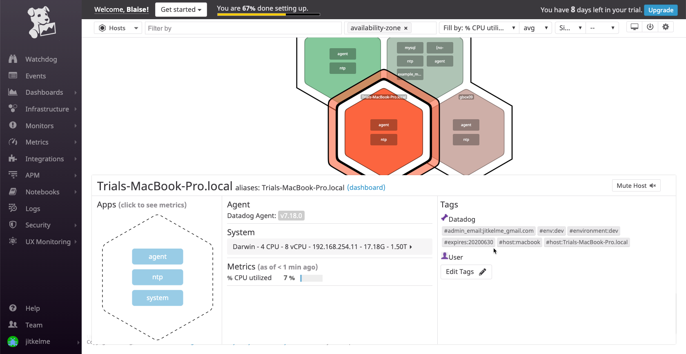

Setup the DataDog project
==========================

Add tags in the agent config file
----------------------------------

* Add tags in the Agent config file and show us a screenshot of your host and its tags on the Host Map page in Datadog.

On OS X the config file for the :term:`datadog-agent<Agent>` is at ``~/.datadog-agent/datadog.yaml``
For now, the contents of the file can be limited to:

.. code-block::yaml
	api_key: <REDACTED>
	hostname: Trials-MacBook-Pro.local
	hostname_fqdn: true
	tags:
	  - environment:dev
	  - host:macbook
	  - admin_email:jitkelme@gmail.com
	  - expires:20200630
	env: dev

Restart the agent after updating this file and you will begin to see data in your Host Map:

	 Web UI Host Map with agent-provided tags.

Add an integration for MySQL
-----------------------------

* Install a database on your machine (MongoDB, MySQL, or PostgreSQL) and then install the respective Datadog integration for that database.

Use the instructions at the Documentation site (https://docs.datadoghq.com/integrations/mysql/) because they are closer
to what you will find on your desktop machine.

Using the Containerized approach is likely to be smoother if you are using OS X and have installed  ``mariadb`` via Homebrew.
Check the status of your setup using ``brew info mariadb`` and pay close attention the Caveats section of the response.

.. code-block::sql

	mariadb: stable 10.4.11 (bottled)
	Drop-in replacement for MySQL
	https://mariadb.org/
	Conflicts with:
	  mariadb-connector-c (because both install plugins)
	  mysql (because mariadb, mysql, and percona install the same binaries)
	  mytop (because both install `mytop` binaries)
	  percona-server (because mariadb, mysql, and percona install the same binaries)
	/usr/local/Cellar/mariadb/10.4.11 (742 files, 167.8MB) *
	  Poured from bottle on 2020-01-31 at 21:50:48
	From: https://github.com/Homebrew/homebrew-core/blob/master/Formula/mariadb.rb
	==> Dependencies
	Build: cmake ✔, pkg-config ✔
	Required: groonga ✔, openssl@1.1 ✔
	==> Caveats
	A "/etc/my.cnf" from another install may interfere with a Homebrew-built
	server starting up correctly.

	MySQL is configured to only allow connections from localhost by default

	To have launchd start mariadb now and restart at login:
	  brew services start mariadb
	Or, if you don't want/need a background service you can just run:
	  mysql.server start
	==> Analytics
	install: 10,322 (30 days), 36,656 (90 days), 171,886 (365 days)
	install-on-request: 10,175 (30 days), 35,985 (90 days), 167,487 (365 days)
	build-error: 0 (30 days)

Installing the database into a container is going to be less disruptive to your environment.
To prepare MySQL to communicate with the DataDog agent, open the mysql client with ``mysql -u root`` (or your local equivalent), and run these commands
to create the datadog user and grant access to the database.

.. code-block::sql

	CREATE USER 'datadog'@'localhost' IDENTIFIED BY '<redacted>';
	GRANT REPLICATION CLIENT ON *.* TO 'datadog'@'localhost' WITH MAX_USER_CONNECTIONS 5;
	GRANT PROCESS ON *.* TO 'datadog'@'localhost';
	GRANT SELECT ON performance_schema.* TO 'datadog'@'localhost';

Exit the mysql client and use the following commands to verify the user and the access grant.

.. code-block::bash

	mysql -u datadog --password= '<redacted>' -e "show status" | \
	grep Uptime && echo -e "\033[0;32mMySQL user - OK\033[0m" || \
	MySQL user - OK
	mysql -u datadog --password='<redacted>' -e "show slave status" && \
	echo -e "\033[0;32mMySQL grant - OK\033[0m" || \
	echo -e "\033[0;31mMissing REPLICATION CLIENT grant\033[0m"
	MySQL grant - OK

Configure the DataDog agent
---------------------------

Provide the agent with the details it needs to receive data from MariaDB. Edit the ``~/.datadog-agent/etc/conf.d/mysql.d/conf.yaml``.
In my case, it looks like this:

.. code-block::yaml

	init_config:
	instances:
	  - server: 127.0.0.1
		user: datadog
	pass: <READACTED>
		tags:
		  - environment:dev
		  - admin_email:jitkelme@gmail.com
		  - expires:20200630
		options:
		  replication: false
		  galera_cluster: true
		  extra_status_metrics: true
		  extra_innodb_metrics: true
		  extra_performance_metrics: true
		  schema_size_metrics: false
		  disable_innodb_metrics: false

Using Docker containers
-----------------------------

.. include:: docker.rst

Extend the Agent's Python environment
'''''''''''''''''''''''''''''''''''''

The Agent includes a complete Python environment, which you can extend with `pip install ...`.
This is what that looks like using a Linux host:

.. code-block:: bash

	$ sudo -Hu dd-agent /opt/datadog-agent/embedded/bin/pip install -U httpx fastapi

