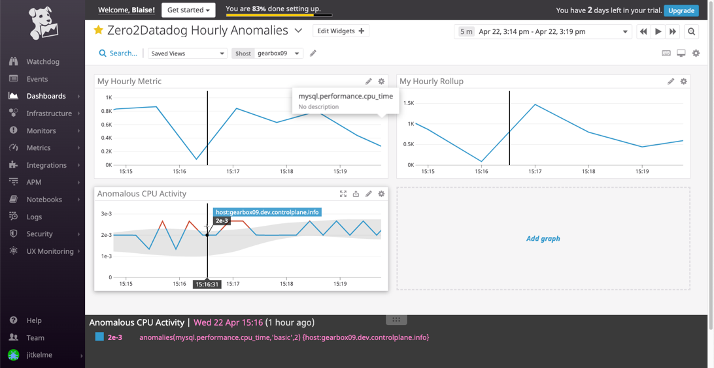
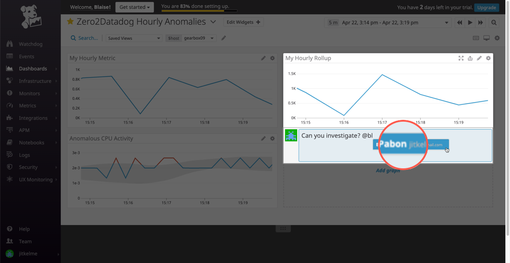
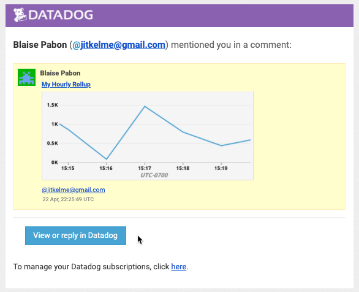
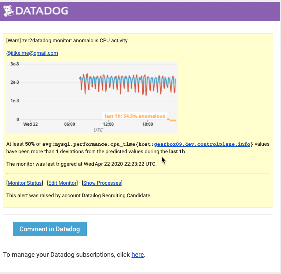

Visualize Data with the DataDog API
=====================================

Utilize the DataDog API to create a :term:`Timeboard`
----------------------------------------------------

Create timeboard with these features:
	* Your custom metric scoped over your host.
	* Any metric from the Integration on your Database with the anomaly function applied.
	* Your custom metric with the rollup function applied to sum up all the points for the past hour into one bucket
	* Include the script you've used to create the board

This board was created using the PostMan API editor using the content of this curl command.

.. literalinclude:: ./timeboard_hourly.txt

Visualize Data with the Web UI
=================================

Once this is created, access the Dashboard from your Dashboard List in the UI:

	* Set the Timeboard's timeframe to the past 5 minutes
	* Take a snapshot of this graph and use the ``@`` notation to send it to yourself.

	Timeboard with five-minute intervals

When you receive an email notice of the snapshot, it includes a thumbnail, and also buttons that take you directly to
the item in the DataDog panel.

Bonus: What is the Anomaly graph displaying?
---------------------------------------------

The anomaly graph is displaying observations that are more than two standard deviations from the norm. It is using the
:term:`basic` algorithm, based on a lagging rolling quantile.

In fact, when an anomaly alert is triggered, the email notification automatically describes  some of these details, as you
can see in this image:

